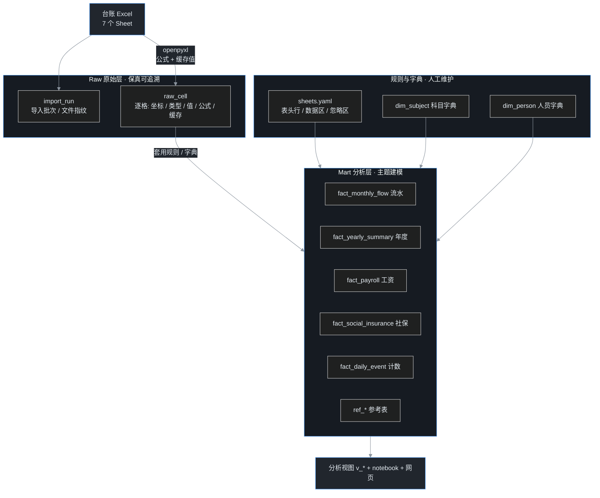

## 先交底

先把这一篇要讲的摊开：

1. 叶扬有一份持续记了快十年的**个人综合台账**——全在一个 Excel 文件里，七个 Sheet，什么都往里塞：收支流水、工资社保、人际往来、计数打卡、参考资料，外加一堆随手演算。
2. 记到后面，Excel 开始顶不住了：Sheet 名没有语义、列全是私人缩写、公式和硬编码混在一起，想用一句 SQL 跨表跨年分析？门都没有。
3. 于是叶扬做了件事：把这份 Excel **保真地搬进 SQLite**，再在上面按主题建模，最后顺手给它套了个网页——浏览器里每张表一个页签，能增删改查。
4. 这篇讲的是**整个过程和选型**，不是某段代码讲解：为什么先读公式、为什么要分两层、表怎么设计、字段增减怎么办、为什么最后没选「让数据库直接跑在浏览器里」。
5. 结论先说：最大的收益不是「分析变快」，而是——**开工前就知道每一格数据归谁管、改了会不会丢、从哪一步开始算权威**。翻车也死在最便宜的那一步。

> 一句隐私前提：台账里是真实的个人财务和健康数据，所以这篇只讲**工程方法**，所有金额、姓名、具体记录都做了脱敏，出现的数字只有工具版本和行数这类不敏感信息。

## 一、Excel 到底卡在哪

在外人看来，Excel 好好的，双击就能看。真把它当数据库用，问题全冒出来：

- **Sheet 名无语义**：有几个 Sheet 直接叫 `+`、`-`、`51`。三个月后连叶扬自己都要愣一下——这谁跟谁。
- **列是私人缩写**：`cb`、`bt`、`乾`、`s`，年度表的列头干脆是一串数字编号。不查字典根本读不懂。
- **公式和硬编码混排**：同一个区域，有的格子是公式算出来的，有的是手敲的数。你不知道哪个值是最新、哪个已经过期。
- **草稿和正式数据混居**：有一个 Sheet 基本就是演算纸，误差试算、日期缩写、随手代码全在里头。
- **没法跨表分析**：想回答「这几年总收入怎么变、钱主要花哪了」，得在七个 Sheet 之间手动来回拼，SQL 一句都写不了。

一句话——**Excel 是很好的录入工具，但不是分析底座。** 叶扬要做的，是把「录入」和「分析」拆开。

## 二、第一步不是建表，是先把公式读出来

很多人导 Excel 的第一反应是：读格子的值，往库里塞。叶扬没这么干——**先读公式。**

原因很朴素：一个列到底是什么意思，光看数字会猜错，看公式才知道它的真实身份。`openpyxl` 支持把同一个工作簿用两种方式打开：

```python
from openpyxl import load_workbook

wb_f = load_workbook(path, data_only=False)   # 取公式原文
wb_v = load_workbook(path, data_only=True)    # 取 Excel 算好的缓存值
```

- `data_only=False`：拿到的是公式文本，比如某个格子是 `SUM(...)`，某个是 `=W/5`；
- `data_only=True`：拿到的是 Excel 上次保存时算好的缓存值。前提是文件真被 Excel 打开计算过——openpyxl 自己不算公式。

> 类比一下：公式就像函数的**调用链**，缓存值只是某次运行的返回值。只看返回值你猜不出这函数干嘛的，看调用链才明白。

这一步后来救了叶扬两次——后面踩坑那段会讲，叶扬差点把两列数字误判成体重和账户余额，全靠翻公式才翻了案。

## 三、为什么是两层：raw 保真，mart 建模

整体架构从第一天就定成两层，不是事后补的：



**Raw 层——一个字都不许解释。**

每个非空单元格原样落一行：坐标、行号列号、值类型、文本值、数值、公式文本、缓存值，外加它属于哪个导入批次。raw 层只追加、不覆盖。为什么要这么"笨"？因为它是**后悔药**——哪怕 mart 建错了，只要 raw 在，随时能完整重算，不用回去求那份 Excel。

**Mart 层——按业务主题说话。**

raw 是给机器回溯的，mart 才是给人分析的。这一层套用规则和字典，把杂乱的格子清洗成「流水、工资、社保、事件」这些主题表。关键性质：**mart 的事实表每次都整表删除、从头重灌**，所以永远能由 raw 重建，天然幂等。

> 为什么不让 mart 直接覆盖 raw？这是数据库版的「读写分离」——raw 是只追加的日志（相当于 WAL），mart 是从日志回放出来的物化视图。日志不能改，视图随便重建。

## 四、建模里的四个关键决策

光分两层还不够，表怎么设计有讲究。这几个决策让后面省了大量麻烦。

### 1. 事实表用长表，别给每个科目建一列

最容易想到的设计是：每个科目一列，每月一行。但科目是会增减的——今天九个，明天冒出第十个，就得改表结构。叶扬改用**长表（EAV，实体-属性-值）**：

```sql
fact_monthly_flow(
    month        TEXT,    -- 时间
    subject_code TEXT,    -- 哪个科目
    amount       REAL,    -- 金额
    source_sheet TEXT,    -- 来自哪个 Sheet
    source_col   TEXT     -- 来自哪一列
)
```

一行就是「某个月、某个科目、一笔金额」。新增科目？多插几行就行，**表结构一个字都不用动**。代价是查询要 GROUP BY，但这对分析反而是顺手的事。

### 2. 元数据驱动，规则只写一份

七个 Sheet 各自的表头行、数据区、忽略区、日期格式，全集中在一个 `config/sheets.yaml` 里——这是**唯一手写的事实源**。库里还有一张 `meta_mapping` 映射表，在建模时由这个 YAML 自动派生，记录「哪个 Sheet 的哪一列，落到哪张表」。

好处是不写第三份手工文档——YAML 一改，映射和 ETL 一起跟着动，永远不会各说各话。在 DB Browser 里还能直接查这张映射表对账。

### 3. 字段增减：轻量自动迁移，只增不删

「会不会改个字段就得重建表、把数据弄没」是最常见的担心。叶扬写了个 `ensure_columns`：以 DDL 文件为事实源，比对实际表结构，**只加列、不改不删**。

- 缺一列？自动 `ALTER TABLE ADD COLUMN` 补上，存量数据一行不丢；
- 绝不 DROP、不改名、不删列——这些危险动作不在自动范围里；
- 真遇到列改名的场景，才明确地 DROP 那张表、从 raw 重建。

> 迁移的铁律是**单向、保守**：能加的自动加，可能丢数据的操作一律停下来让人确认。

### 4. 字典只补不覆盖

科目名、收支方向这些「需要人来填」的内容，放在 `dim_subject` 字典里。建模时对字典只做 `INSERT OR IGNORE`——遇到新代号补一个占位，但**绝不覆盖叶扬已经填好的名称**。这样字典越用越全，又不会被每次重灌冲掉。人员字典 `dim_person` 也是同一套策略。

## 五、分析层：让视图去重，别在代码里硬算

主题表有了，分析怎么落地？叶扬把它分成两层出口：

- **SQL 视图**：十几个分析视图单独放在 `views.sql`，建模时 DROP 掉重建。科目流水、年度结构、工资社保、计数事件各一组。视图有个好处——逻辑就在数据库里，改一句 SQL 立刻生效，不用动 Python。
- **Notebook**：一个分析笔记本，按主题出表出图，中文显示提前配好字体。

这里有个实打实的教训：工资数据有**两个来源**，一个 Sheet 是长期连续的，另一个只覆盖最近一小段，两段还约有一个月的错位。最初直接 `SUM` 相加，结果某年月数翻了倍、应发实发比算出 2 这种荒唐值。

修法是建一个「每月一行、两源并列」的去重视图：净工资优先取连续那个源，另一个源并排展示，**绝不擅自相加**。多源数据到底哪段可信，留给分析的人判断——工具不替你做这个主。

## 六、顺手套了个网页：每张表一个页签

库建好了，叶扬想要个更顺手的入口——能不能在浏览器里像 Excel 一样，一个 Sheet 一个页签，直接增删改查？

答案是 `xlsx2db serve`：起一个**只绑本机 127.0.0.1** 的服务，浏览器打开就是页签栏，十三张基表加十几个视图各占一个。

技术上刻意做成**零构建**：

- 后端 FastAPI，但核心 CRUD 写成**不依赖任何框架的纯函数**（一个 `crud.py`），命令行、测试、网页都能复用，HTTP 只是它的一层壳；
- 前端不用 React、不引 npm 工程，一个 HTML 配上表格库 **Tabulator**（下载到本地 vendor，离线可用），原生支持远程分页、排序——哪怕最大那张四万六千行的逐格表，翻页搜索也不卡；
- 改一个格子，发一个 **PATCH 单格**请求即时保存，失败就把格子回滚。之所以改单格而不是整行提交，是因为多标签页同时编辑时，单格影响面最小；
- 新增行不立即写库——先在前端放一行空白暂存，点行内「保存」才真正插入，免得空值撞上 NOT NULL 报错。

**但写回有个必须记住的语义**，网页里用横幅标了出来：

| 表 | 能改吗 | 改完之后 |
|---|---|---|
| `dim_subject`、`dim_person` | 能 | **长期保留**——字典只补不覆盖 |
| 各种 `fact_*`、参考表 | 能 | 下次重建 mart 会**整表清空、改动丢失**（红色横幅警告） |
| `v_*` 视图 | 只读 | — |

> 想长期改的东西改字典，在事实上的临时改动，心里得清楚它会被下一轮重建带走。这不是 bug，是「raw 为权威、mart 可重算」这套架构的直接结果。

## 七、选型之问：能不能让数据库直接上前端

做到这里，自然冒出一个问题：**前后端这么麻烦，有没有可能干脆不要后端，让数据库直接跑在浏览器里？**

叶扬认真调研了一圈。技术上确实可行——SQLite 能编译成 WebAssembly，浏览器里就能跑 SQL。但盘点完发现，这些方案**落不到磁盘上那个权威文件**：

| 方案 | 怎么存 | 数据落点 | 关键限制 |
|---|---|---|---|
| `sql.js` | SQLite 编译成 WASM，整库在内存 | 无内置持久化，得手动导出整库 | 每次写都要整库回写 |
| 官方 `SQLite Wasm` | 官方 WASM，多套文件系统 | localStorage、OPFS（浏览器沙盒） | 最快的档要跨源隔离（COOP/COEP + SharedArrayBuffer） |
| `wa-sqlite` | 非官方 WASM，可用 JS 写文件系统 | IndexedDB、OPFS、内存 | 偏底层，要自己组装 |
| `absurd-sql` | 在 sql.js 上把 IndexedDB 当磁盘分页 | IndexedDB | 必须跑在 Web Worker，生态小 |
| `PGlite` | **Postgres** 编译成 WASM | OPFS / IndexedDB | 是 Postgres，不是 SQLite，和现有栈不合 |
| File System Access API | 浏览器读写用户选定的文件 | 本地文件或 OPFS | **只有 Chrome/Edge 支持，Firefox、Safari 长期不支持** |

看明白了吗——**没有一个方案能把磁盘上那个 `.sqlite3` 当权威库做增量读写。** 唯一能碰到本地文件的 File System Access API，又是 Chromium 独占，等于把工具锁死在一个浏览器上。官方 SQLite Wasm 对外部文件只支持整库「导入/导出」，不是直连。

为什么「直连」对这个项目不成立，四条：

1. **权威文件归属**：浏览器能持久化的地方都在源沙盒（IndexedDB/OPFS），文件管理器里看不到，也不等于 Python 读写的那个文件；
2. **双写冲突**：重建 mart 时 Python 会随时整表重灌，浏览器若持有同一文件，两边没有可靠的锁协商，必然互相覆盖；
3. **可靠性**：沙盒存储受配额、清浏览器数据、隐身模式影响——官方文档甚至专门有一节讲「数据库神秘消失」，远不如一个能随时复制备份的 `.sqlite3`；
4. **收益不抵成本**：薄后端的核心就是一个纯函数 `crud.py`，直接复用 SQLite 的外键、事务、锁和类型处理；绑在 127.0.0.1 的本地后端，安全面上**等价于一个本地程序**，并不是真把数据暴露到网上。

至于「前后端分离」，在这个项目里的真实含义也不是微服务、不是跨机器——而是**同一台机器、一个本地进程内，用 HTTP/JSON 把界面和数据访问解耦**：前端只表达「哪张表哪行哪列改成什么」，不碰一句 SQL；后端是唯一接触数据库文件的一侧，负责白名单、参数化和事务。这么划的回报是，哪天想换个界面、套个桌面壳，数据层一行都不用动。

## 八、踩坑实录：差点被数字骗了

最后留几个真金白银换来的坑，都很典型。

### 坑 1：把演算列误判成体重和账户

早期叶扬看到两列数字，一列像是每日记录，一列像是多个资金池，差点当成「体重序列」和「账户余额」建了模。翻回第二步读的公式，当场翻案——

- 那一列开头是 `SUM(...)` 求和，是把后面一片区域加起来的**金额演算**，根本不是体重；
- 另一区域的公式是 `W=SUM(X:Y)`、`V=W/5`、`AD=AB/12` 这种折算和利息演算，也不是账户余额。

教训刻在墙上：**判定一列的语义，靠公式，不靠数字长得像什么。** 发现误判后，叶扬干脆把这两块从分析模型里整个移除，只对确实可靠的主题做分析——宁可少分析，不可分析错。

### 坑 2：数据库被自己锁了

重建 mart 时报「database is locked」。排查半天，是 **DB Browser for SQLite 还开着那个库**。后来每个连接都设了 `busy_timeout`、打开 WAL 模式，让读写能共存，这类「自己跟自己抢锁」的血案基本绝迹。

### 坑 3：多源数据相加，数字翻倍

就是前面讲的工资两源——不看清来源和时间错位就 `SUM`，某年月数直接翻倍。修法是并列去重、把「信哪个源」留给人。

### 坑 4：停止跟踪文件，文件却被删了

还有个 Git 的坑：想让一个敏感文件「停止纳入版本管理、但本地保留」，用了 `git rm --cached`。结果在分支合并、回主干、快进删除提交这一串操作之后，Git 把工作区里那个文件**物理删除**了。最后从历史里按 blob 完整恢复，核对哈希一致才算完。

> 正确姿势是：动这种操作前，先把文件复制到仓库外做备份，整条分支流程走完再放回来。`--cached` 只在当前分支的索引里移除，并不保证跨分支切换时工作区文件安全。

## 翻车急诊室 · 速查

- 想导 Excel 做分析 → **先读公式，别急着读值**，公式才是列的身份证；
- 怕建错模型没法回头 → **raw 只追加保真大，mart 整表重灌可重建**；
- 科目老增减 → **事实表做成长表**，增减只多几行、不改表结构；
- 怕加字段丢数据 → **自动迁移只增列**，危险操作停下来人工确认；
- 数据有多个来源 → **并列展示、标清来源，不擅自相加**；
- 想浏览器直连数据库 → 先想清楚**权威文件到底在磁盘还是浏览器沙盒**，多半你要的其实只是个薄后端。

## 收尾

整套东西搭完，叶扬最大的体会是：个人项目的「工程化」，往往不是为了快，而是为了**让边界清晰**——哪一层是不能碰的事实，哪一层可以随便重算，哪些改动能留一辈子，哪些一重启就没。这些问题在数据只有几百行时无所谓，等记到快十年、四万多个格子的时候，边界就是命。

至于浏览器里直接跑数据库这条路，方向是对的、也确实在变好；只是在「本地文件归属」和「浏览器支持」真正收敛之前，一个绑在本机的薄后端，依然是最省心、最不容易丢数据的那个选择。
