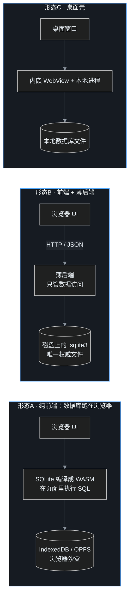
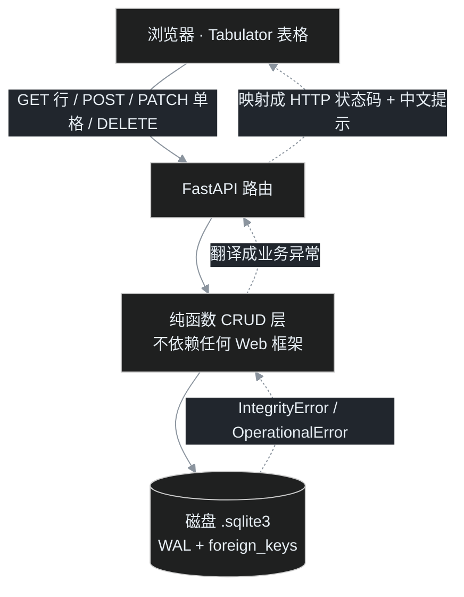

> 这是上一篇《[把Excel台账搬进SQLite](/drafts/2026%E5%B9%B410%E6%9C%8810%E6%97%A5-%E6%8A%8AExcel%E5%8F%B0%E8%B4%A6%E6%90%AC%E8%BF%9BSQLite.md)》的姊妹篇。上篇讲的是「一份记了快十年的 Excel 怎么保真地进数据库、怎么按主题建模」；这一篇讲的是数据库建好之后的事——**怎么在浏览器里像翻 Excel 页签一样，对这一个数据库文件做增删改查**。重点不在某段代码，而在选型是怎么推出来的、三层是怎么咬合的，以及一次非常曲折的真实排查。

## 先交底

这一篇要回答的问题，摊开说：

1. 手里已经有一个 SQLite 文件：**13 张基表 + 13 个视图**，最大的逐格表 4.6 万行。用 DB Browser 能查，但叶扬想要更顺手的东西——浏览器打开，每张表一个页签，随手改、随手存。
2. 第一反应不是写代码，而是一个选型之问：**能不能干脆不要后端，让数据库直接跑在浏览器里？**
3. 调研完一圈，结论是：技术上可行，但落不到「磁盘上那个权威文件」，于是回到一个**薄后端 + 零构建前端**的方案。
4. 方案落地后，页面却「有页签、没数据」。叶扬顺着浏览器报错一层层摸进第三方表格库的压缩源码，最后挖出一个反直觉的真相——这部分是本篇最值得看的。

照例先说结论：**这个项目里「前后端分离」不是为了上规模，而是为了在一台机器上，把「界面」和「唯一能碰数据库文件的那一侧」解耦。** 而真正的坑，几乎都不在自己写的代码里，在「以为自己了解、其实并不了解」的那个依赖里。

## 一、起点：一个好好的 SQLite，为什么还要上 Web

数据库本身已经能用了。DB Browser for SQLite 打开，写 SQL，看图，都行。那为什么还要多此一举起个网页？叶扬列了几个很实在的动机：

- **想要 Excel 式的页签手感**：13 张表挨个点，而不是在脑子里记表名、敲 SQL。
- **想随手改一个格子**：改个科目名、补一条记录，用 SQL 写 `UPDATE` 太重，用表格直接点格子最自然。
- **不想在手机或别的机器上装客户端**：浏览器谁都有，一个地址就能开。
- **想把「读」和「写」收口到一个地方**：省得各种脚本各连各的库。

需求边界也在开工前就划清楚，避免做着做着膨胀：

- **本机、单人**：服务只绑 `127.0.0.1`，不做公网、不做多人在线；
- **13 张基表都要能写**，13 个视图只读；
- **写回的就是磁盘上那同一个 `.sqlite3` 文件**，不是另起一份。

这几条边界看似不起眼，其实直接决定了后面的选型——尤其是「必须落回同一个权威文件」这一条。

## 二、先别急着写代码：数据库能不能直接上前端

程序员的本能是「加一层」，但叶扬先逼自己问一句：**这一层真的有必要吗？SQLite 能不能编译成 WebAssembly，直接在浏览器里跑，省掉后端？**

### 三种可能的形态



形态 A 听起来最性感——连服务器进程都不用起。于是叶扬认真盘点了一圈「浏览器里跑数据库」的方案：

| 方案 | 数据存哪 | 关键限制 |
|---|---|---|
| `sql.js` | 整库在内存，无内置持久化 | 每次写都得把整库导出回写 |
| 官方 SQLite Wasm | localStorage / OPFS 等多套文件系统 | 最快的档要跨源隔离（COOP/COEP） |
| `wa-sqlite` | IndexedDB / OPFS / 内存 | 偏底层，文件系统要自己组装 |
| `absurd-sql` | 在 sql.js 上把 IndexedDB 当磁盘分页 | 必须跑在 Web Worker 里 |
| `PGlite` | OPFS / IndexedDB | 那是 Postgres，不是 SQLite |
| File System Access API | 读写用户选定的本地文件 | **只有 Chrome/Edge 支持**，Firefox、Safari 长期不支持 |

### 为什么形态 A 在这个项目里不成立

盘点完，问题不在于「浏览器能不能跑 SQL」——能。问题在于**这些方案都够不到磁盘上那个权威文件**：

1. **权威文件归属对不上**：浏览器能持久化的地方都在源沙盒里（IndexedDB / OPFS），文件管理器里看不到，也不等于 Python 读写的那一个文件。
2. **双写必然冲突**：这套数据库的分析层是「整表删除、从头重灌」的，Python 随时可能重放一遍。浏览器要是也持有同一份，两边没有可靠的锁协商，注定互相覆盖。
3. **可靠性不如一个文件**：沙盒存储受配额、清浏览器数据、隐身模式影响——一个能随时复制备份的 `.sqlite3`，心里踏实得多。
4. **唯一能碰本地文件的那条路是浏览器独占**：File System Access API 只有 Chromium 支持，选了它等于把工具锁死在一个浏览器上。

一句话：**浏览器端数据库是个真实存在、也在变好的方向，但它给的是「浏览器沙盒里的另一份数据」，不是「磁盘权威文件的一个远程窗口」。** 而这个项目要的恰恰是后者。

那就只剩形态 B——加一个薄后端。注意，是**薄**后端。

## 三、为什么是 FastAPI + Tabulator，而且刻意零构建

形态定了，具体用什么？叶扬给前后端各立了一条原则：**后端要薄到几乎只是数据访问层的一层壳；前端不要工程化，不引入构建步骤。**

- **后端选 FastAPI**：写起来就是几个函数，自带请求校验和 API 文档，异常能干净地映射成 HTTP 状态码。实际跑在 Python 3.12 上，用 uvicorn 起服务。
- **前端选 Tabulator，而且下载到本地 vendor**：它是一个成熟的表格库，单文件引入，原生支持远程分页、排序、单元格编辑。不引 npm、不引 React、不需要打包——一个 HTML 就够。

为什么对「零构建」这么执着？因为这是个**单机小工具**，不是要长期迭代的产品。引入一套前端工程（依赖安装、打包、产物管理）带来的负担，远大于它解决的问题。把库文件下载到本地还有个附带好处：**离线可用**，不依赖 CDN。

这里要专门戳破一个词——**「前后端分离」**。在这个项目里，它不是微服务、不是跨机器、不是为了扛并发。它的确切含义是：

> 在同一台机器、一个本地进程内，用 HTTP/JSON 把「界面表达」和「数据访问」分开。前端只描述「哪张表、哪一行、哪一列、改成什么」，不写一句 SQL；后端是唯一接触数据库文件的一侧，负责白名单、参数化和事务。

这么划的回报是：哪天想换个前端、套个桌面壳、或者接个命令行，**数据层一行都不用改**。这正是下一节的设计出发点。

## 四、落地：三层是怎么咬合的

整体数据流不长这样：



注意中间那一层——**CRUD 被刻意写成不依赖 FastAPI 的纯函数**。这是整个后端结构里最关键的一个决定。

### 4.1 先有纯函数，后有 HTTP 外壳

所有数据库操作都收在一个 `crud.py` 里，签名就是普通函数：给连接、给表名、给参数，返回字典。它不知道 FastAPI 的存在，也不 import 任何 Web 框架。

这么写的好处很直接：

- **同一个核心，三种调用方式**：网页能调，命令行能调，测试也能直接调，不用起服务；
- **业务规则只有一份**：表能不能写、值怎么转换、错误怎么翻译，全在这一处；
- **HTTP 真的成了一层「壳」**：路由函数做的事，就是「收请求 → 调纯函数 → 把异常翻译成状态码」。

### 4.2 HTTP 只是一层壳

FastAPI 那边的路由薄得能一眼看穿，大致是这些：

| 方法 | 路径 | 干什么 |
|---|---|---|
| GET | `/api/tables` | 列出所有表和视图（带行数、警告） |
| GET | `/api/tables/{name}/rows` | 分页取行（带排序、搜索） |
| POST | `/api/tables/{name}/rows` | 插入一行 |
| PATCH | `/api/tables/{name}/rows/{rowid}/cells/{column}` | 改一个格子 |
| DELETE | `/api/tables/{name}/rows/{rowid}` | 删一行 |

纯函数层定义了一组业务异常（表不存在、列不存在、只读、行不存在、类型转换失败、完整性约束冲突、数据库忙），HTTP 外壳只负责把它们一一映射成 404 / 400 / 409 / 503 这类状态码，并带上中文提示。**业务逻辑绝不渗到路由里。**

### 4.3 没有主键，怎么定位一行

增删改都要回答一个问题：**改的、删的，到底是哪一行？**

这批建表时为了省事，很多表没有显式主键。好在 SQLite 的每张普通表都有一个隐藏的 **`rowid`**——每行自带的、唯一的 64 位整数标识，可以理解成数据库偷偷给每行发的门牌号。取行时把它一起查出来：

```sql
SELECT rowid AS __rowid, * FROM 表名 LIMIT ? OFFSET ?
```

前端就拿这个 `__rowid` 当行的身份证：改格子、删行，都带着它。还有个细节——如果某张表把 `INTEGER PRIMARY KEY` 设成了某一列，那一列其实就是 `rowid` 的别名，改了它行号会变。所以单格更新接口会把（可能变化后的）新 rowid 一并返回，前端据此回填，避免下次改错行。

### 4.4 远程分页与排序：一份字段契约

4.6 万行的表不可能一次全塞进浏览器，所以分页、排序都在**服务器端**做，前端只发意图。这里前后端必须约定好两套字段：

- **请求**：我要第几页、每页多大、按哪列排、往哪个方向、搜什么关键字；
- **响应**：这一页的行、总行数、总页数。

后端返回的一页数据长这样：

```python
# last_page：总页数（前端表格库远程分页读取的字段）；空表也至少有一页
last_page = max(1, (total + page_size - 1) // page_size)
return {
    "rows": rows,       # 这一页的行
    "total": total,     # 总行数
    "page": page,
    "page_size": page_size,
    "last_page": last_page,   # 总页数
}
```

请注意这里同时给了 `total`（总行数）和 `last_page`（总页数）。这个区别看着小，后来恰恰是整个排查的命门——先按下不表。

### 4.5 单格编辑即时存，新增行先暂存

交互上有两个刻意的设计：

- **改一个格子，发一个 PATCH**：编辑完一格立刻存，而不是攒着整行一起提交。失败了就把这一格回滚。多标签页同时编辑时，单格的影响面最小。
- **新增行先在前端暂存，不立刻写库**：点「新增行」先放一行带临时编号的空白行，用户填完、点行内「保存」才真正 POST。这是为了避免一堆空值直接撞进数据库的 `NOT NULL` 约束、报一串错。

### 4.6 写回的语义，以及安全底线

不是所有表都能随便改、改完都算数。这里贴着架构的真实性质，把表分了三类，页面用横幅标出来：

| 表 | 能改吗 | 改完之后 |
|---|---|---|
| `dim_subject`、`dim_person`（字典） | 能 | **长期保留**——重建时字典只补不覆盖 |
| 各种 `fact_*` 事实表、参考表 | 能 | 下次重建分析层会**整表清空，改动丢失**（红色警告） |
| `v_*` 视图 | 只读 | — |

这不是缺陷，是「原始层为权威、分析层可重算」这套架构的直接结果——**想长期留的改字典，临时改事实表，心里得清楚它会被下一轮重建带走。**

安全上则守着几条底线：表名、列名都走白名单（只认数据库里真实存在的），标识符用双引号包裹、值一律参数化（防注入）；每个连接打开外键约束、开 WAL、设忙等超时（让读写能共存、别自己锁自己）。

到这里，设计看着严丝合缝。然后——**页面翻了车。**

## 五、大戏：明明是 5.6，为什么页面有页签、没数据

服务起来，浏览器打开：页签一排都在，点进去——**列头也在，但数据区整页空白，分页器也不显示总页数。** 后端接口用 curl 单独测，明明返回了数据。问题出在前端，但纯靠猜是猜不出来的。叶扬用了一个笨办法但极有效的办法：**让真实浏览器自己开口说话。**

### 第一招：headless 截图 + 抓 console

本机自带 Edge，直接用它的无头模式截图、并把控制台日志打出来。报错非常明确：

```
Remote Pagination Error - Server response missing 'last_page' property
Remote Pagination Error - Server response missing 'data' property
Data Loading Error - Unable to process data due to invalid data type
```

表格库在抱怨：服务器响应里**找不到 `last_page` 和 `data` 这两个字段**。可后端明明返回了数据——只不过后端给的是 `rows` 和 `total`，不是 `data` 和 `last_page`。

叶扬一开始以为这只是个字段映射问题，先后试了 `dataReceived`、`paginationDataReceived` 这几个回调，想在里面把 `{rows,total}` 转成库要的 `{data,last_page}`。**结果全都没用，报错一模一样。** 这就奇怪了——回调明明写了，为什么库像没看见一样？

### 顺藤摸瓜，读压缩源码

想不通就只能去读库本身。好在是本地的 `tabulator.min.js`，虽然压成了一行，但字符串都还在。搜报错里的 `last_page`，找到读取响应的那段逻辑，几个关键发现依次冒出来：

**发现一：响应是先做「键名重命名」，再进处理链的。**

```js
// 响应对象按 dataReceiveParams 做键名映射，随后才进入 "data-loaded" 处理链
e = this.mapParams(e, this.objectInvert(this.table.options.dataReceiveParams));
```

而 `mapParams` 干的事，就是「映射表里有的就改名，没有的原样保留」：

```js
mapParams(e, t) { var i = {}; for (let s in e) i[t.hasOwnProperty(s) ? t[s] : s] = e[s]; return i; }
```

**这意味着：它只能「改字段名」，不能「算值」。** 想把「总行数 `total`」变「总页数 `last_page`」，靠这个映射根本做不到——必须后端直接把总页数给出来。

**发现二：分页器是「订阅」在处理链上的，订阅得比选项回调早。**

```js
this.subscribe("data-loaded", this._parseRemoteData.bind(this));
```

分页器处理远程数据的函数，是在模块初始化时就订阅到 `data-loaded` 链上的。它拿的是**原始响应**，叶扬写的那些接收回调转换出的东西，压根到不了分页器手里。这就解释了为什么前面试的回调全都石沉大海。

### 真相：自报 v5.6，内核却是 4.x

读到这里，叶扬起了疑心：`paginationDataSent`、`paginationDataReceived` 这些不都是 Tabulator 5.x 的标准 API 吗，怎么在这个文件里到处都搜不到？把相关选项名挨个搜一遍，结果是——

```
dataSendParams、dataReceiveParams、ajaxURLGenerator、replaceData    ← 这些都在
paginationDataSent、paginationDataReceived、reloadData              ← 一个都没有
```

**真相大白：这个文件开头自报「Tabulator v5.6.0」，但内部选项体系其实是 4.x。** 叶扬此前照着 5.x 文档写的 `paginationDataSent` 等配置，**全是从未生效的死配置**：

- 请求一直按 4.x 的默认格式发 `page`、`size`、`sort[0][field]`，而后端只认 `page_size`、`sort`——所以排序参数后端从来没收到过；
- 分页器直接从原始响应里读 `data` 和 `last_page`，后端给的却是 `rows`、`total`——所以拦截报错、数据全空；
- 搜索框那边更是直接抛了异常，控制台一行字把问题钉死：**`table.reloadData is not a function`**——这个 4.6+ 内核里，重新拉数据的方法早就改名 `replaceData` 了，叶扬写的 `reloadData()` 在表格实例上根本不存在，回调一执行就崩，搜索当然不发请求。

一个「标着新版本、装着旧内核」的库，配上一份照新文档写的代码——**每一行都写得符合文档，每一行都没在工作。** 这种坑最阴险，因为它不报错在你的代码上，报在一个你以为理所当然的前提上。

### 怎么修

既然摸清了这个内核的真实脾气，修法就落到它真正认的选项上：

**后端**：在一页数据的返回里补上 `last_page`（总页数），前面 4.4 已经这么做了。

**前端请求**：用 4.x 的 `ajaxURLGenerator`，把库内部的 `{page, size, sort:[{field,dir}]}` 拍平成后端认的字段：

```js
ajaxURLGenerator: function (url, config, params) {
  // 这个内核的远程约定：params = {page, size, sort:[{field,dir}]}，
  // 拍平成后端要的 page / page_size / sort / dir / q
  var qs = ["page=" + params.page, "page_size=" + params.size];
  var s = params.sort && params.sort[0];
  if (s && s.field) { qs.push("sort=" + enc(s.field), "dir=" + s.dir); }
  if (searchEl.value) qs.push("q=" + enc(searchEl.value));
  return url + "?" + qs.join("&");
},
```

**前端响应**：用 4.x 的 `dataReceiveParams` 把后端的 `rows` 改名成库要的 `data`，`last_page` 同名保留：

```js
// 响应键映射：后端 rows → 库要的 data；last_page 同名原样保留
dataReceiveParams: { data: "rows" },
```

**搜索刷新**：把不存在的 `reloadData()` 换成这个内核真正提供的 `replaceData()`。

### 深色主题也踩了同一个坑

修完数据，还有个视觉问题：表头和分页器是**白底**，深色主题没盖住。一查，又是新旧版本机制之别——

新版 Tabulator 的颜色走 CSS 变量（`--tabulator-*`），而这个 4.x 内核的样式表是**编译时写死的硬编码颜色，根本不读那些变量**。所以光覆盖变量，只能救表体（表体恰好吃到了一条通用背景），表头、页脚依然白。修法是追加一批显式选择器，把表头列、行、占位提示、页脚和分页按钮的底色一个个盖过去，这才凑成统一的深色。

### 怎么确认真修对了

「看着像是好了」不算数。叶扬用 Playwright 驱动本机 Edge，把关键交互跑了一遍闭环，并全程盯着控制台：

- **远程排序**：点列头，请求里确实带上了 `sort=weekday_idx&dir=asc`；
- **中文搜索**：搜「星期三」，后端返回 `total=478、last_page=10`，这一页的星期字段全是星期三；搜一个不存在的词，`total=0`；
- **只读视图**：切到视图，行内编辑按钮消失、新增按钮隐藏；
- **控制台零报错**；
- 再跑 `pytest`，Web CRUD 相关用例 **15 passed**，确认给返回结构加字段没有破坏既有断言。

至此，页签、数据、排序、搜索、只读、深色——全部坐实。

## 六、这套工程教会的几件事

抛开具体技术，这一趟有几条更通用的东西值得记下来：

1. **选型要对着「真实约束」推，不是对着潮流。** 这个项目否决「浏览器直连数据库」，不是因为那技术不成熟，而是因为一条很硬的约束：必须落回磁盘上那同一个权威文件。
2. **把能复用的核心收成纯函数，让 I/O 当外壳。** 一套 CRUD，网页、命令行、测试共用；换界面时数据层不动。这在小项目里同样值得做。
3. **最危险的 bug，藏在你「以为了解」的依赖里。** 一个标着 5.6、内核却是 4.x 的库，能让所有「符合官方文档」的代码静默失效。
4. **让运行时自己说话。** headless 截图 + 控制台日志，能把「有页签没数据」这种玄学问题，立刻变成一句具体的报错；顺着报错读源码，比盯着自己的代码瞎猜高效十倍。
5. **验证要覆盖真实链路。** 单测能过、curl 能通，都不等于浏览器里能用；用浏览器自动化把交互跑闭环，才算数。

## 翻车急诊室 · 速查

- 想在浏览器里直连 SQLite → 先问自己：**权威文件在磁盘还是浏览器沙盒？** 多半你要的其实只是个薄后端。
- 网页表格「有列头、没数据」→ 抓浏览器控制台，大概率是**远程分页要的字段名对不上**（很多库默认要 `data` + 总页数，不是 `rows` + 总行数）。
- 写了回调却不生效 → 去确认**你用的选项名，这个版本到底认不认**；同一个库大版本之间，选项名可能整套换掉。
- 调方法报 `is not a function` → 别怀疑拼写，先怀疑**版本对不对、方法是不是改名了**。
- 深色主题盖不住某块区域 → 看它是**读 CSS 变量还是硬编码颜色**，硬编码的就得用显式选择器覆盖。
- 怎么验证修好 → headless 截图 + 控制台 + 浏览器自动化跑交互，别只靠「我看着好了」。

## 收尾

给一个单机 SQLite 套网页，听起来是件「半天搞定」的小事，真做下来，选型、分层、踩坑、验证，一样不少。叶扬最大的感受是：**小工具也值得把边界划清楚**——哪一侧是唯一能碰数据库文件的、哪些改动能留一辈子、哪些一重建就没。这些在几百行时无所谓，等表到了二十多张、数据到了几万行，边界就是命。

至于浏览器里直接跑数据库那条路，方向没错、也一直在变好；只是在「本地文件归属」和「浏览器支持」真正收敛之前，一个绑在 `127.0.0.1` 的薄后端，配上一个不搞工程化的前端，依然是这种单机场景里最省心、也最不容易丢数据的选择。

—— 完 ——
