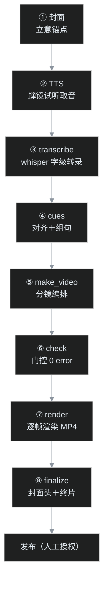
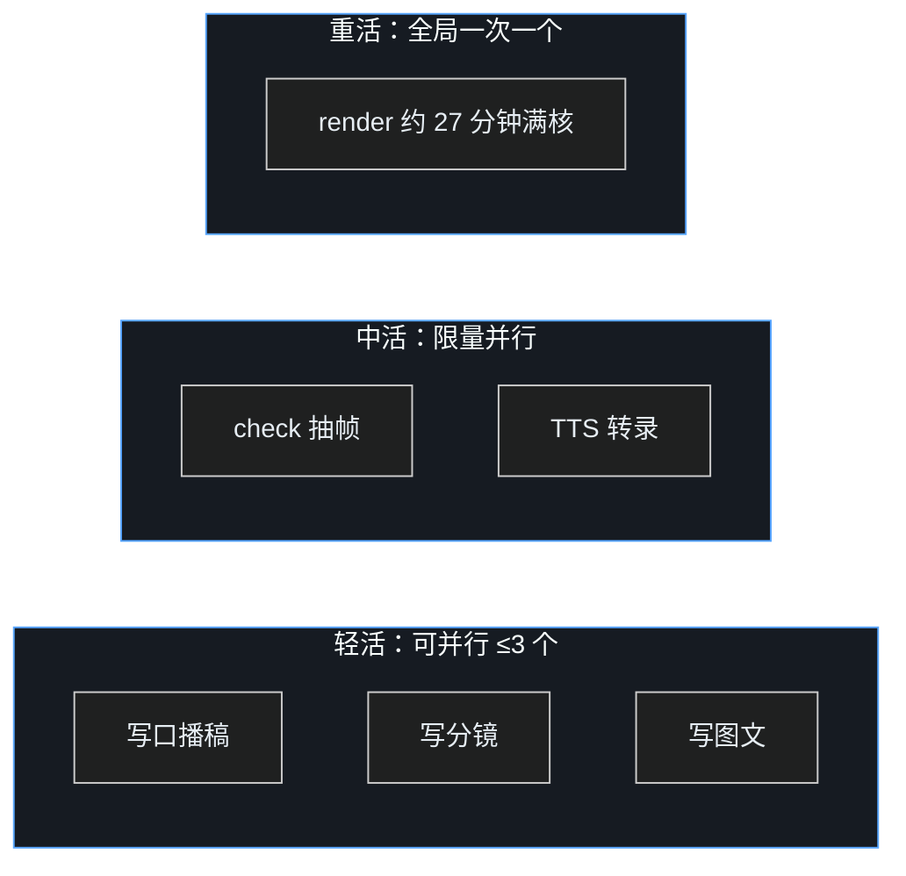

## 小白交底

先把这一篇要讲的摊开：

1. 叶扬用「写网页」的方式做视频已经做完六片了——佛教史系列四集，加上 HyperFrames 教程两集。做第一片的时候，流程是散的：先写动画再补封面，生成器脚本躺在临时目录里，哪一步该干什么全靠记忆。
2. 做第六片的时候，这条管线已经被固化成一条**八步流水线**：封面 → TTS → transcribe → cues → make_video → check → render → finalize。每一步吃前一步的产物，顺序不能乱。
3. 管线的公共逻辑收在一个叫 `videopipe` 的 Python 包里（十三篇讲过那次重构），这次讲的不是代码结构，而是**流程本身**：每一步产出什么、为什么是这个顺序、哪些地方最容易翻车。
4. 流程固化的终点，是让多个 AI agent 能同时干活——叶扬建 issue 派单，worker agent 在各自的 git worktree 里并行写稿，产出 PR 交回来；而渲染这种吃满整机的重活，仍然排队串行。
5. 结论先说：把流程固化下来的收益，不是「做得更快」这么简单——而是「开工前就知道这一集要经过哪些门、每一步的验收标准是什么」，翻车会死在最便宜的那一步，而不是渲染了二十七分钟之后。

## 一、八步流水线，为什么顺序长这样

先把整条链画出来：

这个顺序里最反直觉的是第一步——**封面先行**。

早几集叶扬是渲染完才做封面的。后来发现不对：封面是全片的一句话主张，配色、字体、母题都在封面上定调。更关键的是，它是最早的**验收锚点**——封面出来给人看一眼，立意歪没歪、风格对不对味，立刻有反馈。如果放到渲染之后才做，等于先花二十多分钟渲染，才发现整片的视觉方向从根上就错了。

第二步取音也有讲究。TTS 走蝉镜的「试听」通道——每次试听生成一条完整音频，不扣豆；铁律是绝不点「立即生成」。音频到手，第三步才能开工：用 faster-whisper 把整段音频转成**字级时间戳**，每个字（拉丁串是每个词）什么时候开始、什么时候结束，全部标出来。

第四步 cues 是整条链上最微妙的一步。口播稿上写的是正字——比如「版本 0.8.107」，TTS 念出来、whisper 听到的可能是「零点八点一零七」；稿面上写「十」，语音识别给个谐音「时」。对齐要干的，就是把稿子上的字和音频里的识别结果做一次 Needleman-Wunsch 序列比对（生物信息学里用来对 DNA 双链的那个算法），再按时间切成一条条字幕句。拉丁词、阿拉伯数字和汉字混在一起的时候最容易错位——这一步前阵子刚重写过一次，专门治混合 token 的对齐问题。

第五步才轮到大家熟悉的画面：写一个 Python 生成器，产出一个网页——HTML 排画面，GSAP 时间轴控制元素什么时候进、什么时候动。最后渲染成视频的，就是这个网页。

## 二、源驱动：进 git 的和不进 git 的

流程固化之后，每一集在仓库里都是同一个目录形状：

| 路径 | 进 git？ | 是什么 |
|---|---|---|
| `make_video.py` | ✅ | 分镜生成器，本片的画面全在这 |
| `make_cover.py` | ✅ | 封面生成器 |
| `src/` | ✅ | 口播正字稿、TTS 借音稿 |
| `cues/cues.json` | ✅ | 对齐后的字幕时间轴，评审版 |
| `oneoffs/` | ✅ | 本片专属的一次性脚本 |
| `index.html` | ❌ | 生成产物，随时能重建 |
| `media/` | ❌ | TTS 音频、录屏素材 |
| `renders/` | ❌ | 渲染母带，一集几百 MB |
| `snapshots/` | ❌ | 抽帧截图 |

这条界线是「源驱动」的核心：**进 git 的全是文本源文件，二进制产物一个不进**。

好处很实在：仓库体积可控（一集入库不到一万行文本），改动可以逐行 review；cues.json 入库还有个额外的保险——哪怕音频和模型都不在了，拿着稿子和时间轴也能把这一集重建出来。代价是：渲染母带丢了得重渲，所以「哪些东西能从零重建、哪些不能」心里要有账。

顺手记两个这一层踩过的坑，都属于「工具会默默帮你倒忙」那一类：

- **snapshot 会清空整个 `snapshots/` 目录**再写本次的帧。封面定稿如果放在里面，一抽帧就被删了。所以抽帧前先备份封面，或者把封面放到它碰不到的位置。
- **GSAP 的 `addClass` 在这条渲染管线下不能用**。渲染器不是一秒秒播放视频，而是反复「跳到第 t 秒、截图」；CSS 类名这种副作用在跳帧时没法可靠还原。解法朴素：不用类名切换，直接 `tl.set(el, {cssProp: val})` 写内联样式，跳到任意一秒画面都是对的。

## 三、版本钉死和确定性：同样的输入，必须出同样的画面

这条流水线有个工程上的执念——**确定性**。

HyperFrames 的版本被钉死在 `0.8.107`，所有命令统一走 `npx --yes hyperframes@0.8.107`。它自带的 doctor 命令会提示有新版本可升，不升。渲染是逐像素的活，版本一动，渲染器的实现细节变一变，画面就可能出现没法解释的微差——钉死版本，是为了让「我机器上渲出来的」和「仓库记录的」永远是一回事。

确定性还管到生成器内部：禁用 `Math.random()` 和 `Date.now()` 这类东西。分镜里的任何随机抖动，都会让「重渲一次想对比差异」变成不可能——因为连基准都在变。一切切点、一切动画参数固定写死。

字幕对齐也有同样的教训。叶扬一度靠耳朵调字幕的提前量，后来改成客观测量：在音频上做能量检测，量出每个句间停顿处字幕比真实发声早多少。两集量下来，提前量还不一样——第一集 **0.28 秒**，第二集 **0.37 秒**。原因是 whisper 会把句间停顿「吞」进后一段的开头，吞多吞少每集不同。所以流程里固定下来：先测偏移，再定平移量，禁止靠猜。

## 四、并行的真相：什么活儿能同时分给几个 agent

八步链是强串行——前一步的产物是后一步的输入，一集内部没有并行空间。那「多 agent 并行」并的是什么？并的是**相互独立的工作项**：比如让一个 agent 写第三集的分镜，同时让另一个 agent 写第二集的配套图文。

但不是所有步骤都适合往外派。边界按资源消耗划：

渲染这一步必须单独说。第二集全片 312 秒、9365 帧，单机渲染实测 **27 分 17 秒**，平均一秒钟出六帧，整段时间 CPU 是吃满的。这种活同时开两个，不是快一倍，是两个一起慢——还可能因为抢内存双双翻车。所以规则很死：**渲染全局一次一个，排队串行**，而且由编排者亲自跑，不交给 worker。

同理不交给 worker 的还有最后一步：发布。视频投稿是 outward-facing 的操作，一律人工授权后由编排者执行。worker 的产出永远是 PR，不是成片，更不是已发布的稿件。

## 五、Issue 契约＋工作树：多 agent 协作的形状

具体怎么派单？一个 GitHub issue 就是一份人机合同，缺项不派：

1. **目标**：要完成什么，一句话；
2. **文件边界**：允许动哪些路径——比如只准动 `videos/projects/hf-03/**`；
3. **依赖**：必须先合入主干的 PR，或者已经就位的素材；
4. **工作类型**：轻活、中活还是重活，决定它能不能并行；
5. **DoD**：完成定义，可勾验的清单——check 零错误、抽帧无溢出、字数落在区间里。

仓库里配了表单模板，建 issue 时直接填：

派单时，worker agent 用 git worktree 隔离——每个 worker 在专属的工作树、专属的分支上干活，基准是最新主干，互相之间完全不打架，也碰不到主工作区。还有一条公共文件保护线：`videopipe/**`、`.github/**`、`ideas/**` 这些跨项目共享的东西，worker 默认禁改。干到一半发现「非改公共文件不可」，停下来在 issue 里报告，不能自行扩边界——并行协作最怕的就是边界悄悄蔓延，等回收 PR 的时候才发现两个改动撞在一起。

回收之后，编排者逐个审查、跑门控，squash 合并成线性历史；等这一批 PR 都落地，再排队跑渲染和 finalize。整套规矩（包括 worker 的 prompt 模板、失败怎么处理）写在仓库的 `videos/parallel-playbook.md` 里，新一集开工照着走就行。

## 六、门控：让翻车死在最便宜的那一步

流水线的每一道门，都是为了把错误挡在成本升高之前：

- **check 零错误**：渲染前先让 HyperFrames 自己查一遍页面——clip 嵌套违规、时间倒挂、轨道过密，全部在这一步拦下来。跑一次几秒，渲染一次二十七分钟，这笔账不用算。
- **抽帧目检**：渲染前先用无头浏览器抽几幕静态帧看排版。文字有没有溢出底框、页面有没有长到互相覆盖，这种毛病第二集就实打实地抓到过两处，改 CSS 比重渲便宜太多。
- **self-verify**：渲染器自己会挑几个「地面真值帧」做像素核验，第二集的 PSNR 是 48.5——数值越高说明实际渲出的帧和浏览器里看到的越一致。
- **终片断言**：finalize 拼接封面头（静止两秒）和正片，断言总时长和预期差不过 0.1 秒，差了直接报错，不产出含糊的成片。

门控的设计哲学就一句：**错误的发现成本，离发布越近越贵**。拼写错误在写稿时发现是零成本，在二十七分钟渲染完、甚至发布之后才发现，代价就是整条链重来一遍。固化流程，本质上就是把这些门提前焊死。

## 完工验收清单

- [x] 八步顺序固定：封面先行，发布收尾，前一步不验收后一步不开工；
- [x] 源驱动界线清晰：文本源入 git，二进制产物全部排除；
- [x] 确定性手段到位：版本钉死 0.8.107、切点固定、字幕偏移先测后调；
- [x] 并行边界明确：轻活并行、重活排队，渲染全局一次一个；
- [x] Issue 契约＋worktree 隔离落地，公共文件有保护线；
- [x] 四道闸门把错误挡在渲染之前。

流程这东西，固化完不是结束——下一集开工，就是第一次照着新手册跑的实战。跑得不顺的地方，再回头修手册。
