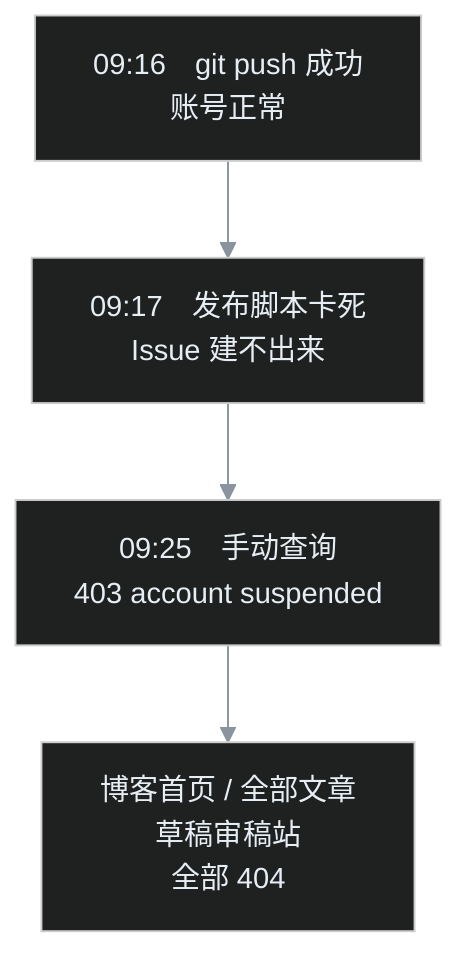
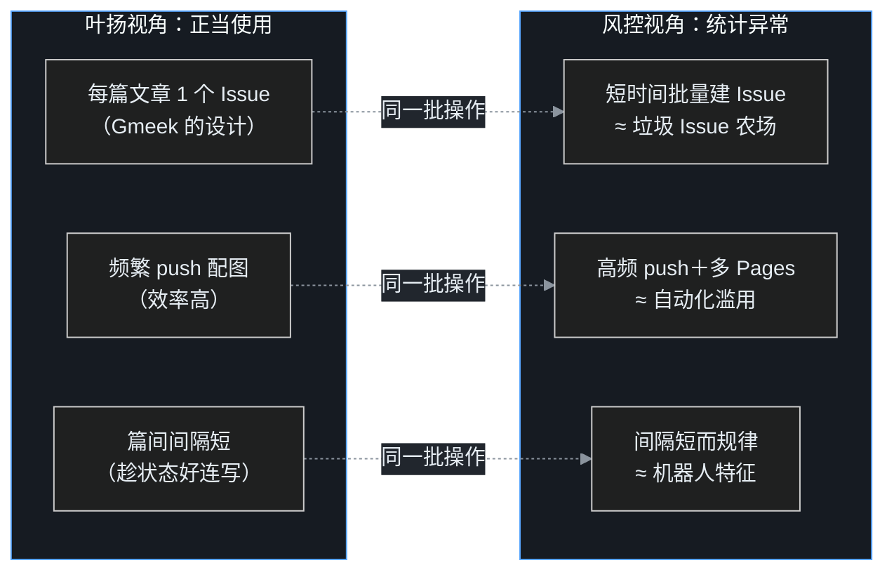

## 小白交底

先把这一篇要讲的摊开：

1. 9 月 30 日早上，叶扬正发布一篇新文章，发布脚本突然卡死。再一查——**GitHub 账号被暂停了**：博客首页、所有文章、草稿站，一夜之间全部 404。
2. 账号级暂停意味着什么？GitHub 不告诉你原因，只留下一句「违反服务条款，请联系支持团队」。
3. 申诉过程持续了 **5 天 16 小时**（约 136 个小时），和支持团队往来三封邮件，最后账号原样恢复，一篇文章都没丢。
4. 这一篇讲全程：怎么发现的、为什么数据零丢失、申诉信怎么写才有用，以及——**GitHub 自始至终没说封号原因，那我们能从中学到什么**。
5. 结论先说：这大概率不是「内容违规」，而是「自动化操作的形状太像刷号」。平台的风控看行为模式，不看主观意图。这个认知，值钱。

## 一、出事那天早上

先快速交代一下背景（详细的流水线故事在之前那篇[复盘](/)里）：叶扬这个博客没有数据库，每篇文章本质上是 GitHub 仓库里的一条 Issue，提交后由 GitHub Actions 自动构建、部署到 GitHub Pages。

9 月 30 日那天要发的，是中国佛教史系列的第 27 篇《辽·西夏·金》。早上的节奏一切正常：

| 时间（本地） | 正在做的事 |
|---|---|
| 08:47 | 开写，打点计时 |
| 约 09:05 | 双岗 AI 审稿意见收回，修稿、改正史实数字 |
| 09:16 | 三张配图 `git push` 成功——**此刻账号仍然正常** |
| 09:17 | 跑发布脚本，在「创建 Issue 触发构建」这一步长时间无响应 |
| 09:25 | 脚本超过 480 秒还没回来，手动查询，确认 **403：账号已被暂停** |

封号的判定，就发生在 09:16 到 09:25 这十分钟之间。上一秒代码还推得上去，下一秒人已经进不去门了。

## 二、一个账号被暂停，意味着什么

账号级暂停不是某一篇文章被下架，而是**整个账号名下的东西全部暂时下线**。叶扬把每个通道逐一查了一遍：

| 通道 | 状态 |
|---|---|
| `gh` 命令行 / REST API | 403，账号已暂停 |
| SSH（push / pull） | 同样被拒 |
| 公开仓库（不登录直接访问） | 404 |
| 博客首页、全部历史文章 | 404 |
| 刚 push 的中27 配图 | 404 |
| 私人草稿审稿站 | 404 |

更让人没底的是：**GitHub 不写明原因**。网页上只有一句模板话——「你的账号因违反服务条款被暂停，请联系支持团队了解更多信息」。至于是哪一条、哪一次操作、哪个仓库，一个字都没有。

这也是这类风控最磨人的地方：你连自己要为什么事情辩护都不知道。

## 三、整件事里最安心的部分：数据零丢失

慌了大概十分钟之后，叶扬意识到一件事：**其实什么都没丢**。

- 本地 `F:\Data` 下是一个完整的 git 仓库，全部提交历史都在，中27 的三张配图前一分钟刚推进去；
- Obsidian 里所有文章源稿完好；
- 草稿站虽然线上 404，本地有完整副本。

换句话说，GitHub 账号是「大门」，但不是「仓库本身」。最坏的情况——账号彻底要不回来——也可以把整个仓库推到新账号，或者换 Netlify、Vercel 这类平台，一篇不丢。

这个安全感不是运气，是之前无意中埋下的架构：**所有重要数据，本地永远有一份完整副本，云端从来不是单点**。 这一条平时不显山露水，出事的早上，它值回所有票价。

中27 那篇文章也已经全部就绪：定稿、配图齐全，只差一个「创建 Issue」的动作。门什么时候开，文章什么时候就能发。

## 四、申诉：三封邮件的五天半

冷静下来之后，动作其实很简单：申诉，然后等。

**第一封：提交申诉**。 不需要登录——无痕窗口打开 GitHub 支持页面（<https://support.github.com/contact>），分类选「Account access → 账号被暂停」，填邮箱直接提交。申诉信讲了三件事：我是谁（个人开发者、非商业用途）、我在做什么（原创技术博客，用的是开源框架 Gmeek）、我怀疑是什么触发了风控（近期高频自动化操作）。只提交一次，拿到工单号 **4807150**，不重复开单。

几个小时后收到自动确认，以及支持团队 Nadia 的回信（第二封）。她没有拒绝，而是问了一个问题：

> Some activity on your account was flagged by our abuse-detection systems for manual review... Could you please share a bit more about **how you plan to use GitHub**?
>（你的一些活动被滥用检测系统标记、进入人工复核。能否多介绍一下你打算怎么使用 GitHub？）

**这是整个申诉里最关键的一轮——她在给解释的机会，问得很具体，回信就必须对准问题答**。 叶扬的回信给了四层内容：

1. **解释机制，而不是喊冤**：这个博客用的开源项目 Gmeek，设计上就是「在自己仓库里，每篇文章开一个带特定标签的 Issue，Actions 据此生成页面」。附上项目地址。也就是说，批量 Issue 是框架的正当工作方式，不是垃圾 Issue；
2. **主动否认四类典型滥用**：从不去别人仓库发推广、不发垃圾信息或批量 @、不刷 star 和粉丝、不做商业广告或诈骗；
3. **声明内容原创**：编程教程和历史学习笔记，全部自己写的；
4. **给出承诺**：承认这段时间自动化活动看起来异常，今后大幅降速。

回信的策略可以总结成一句话：**别让支持团队自己去猜「这是不是滥用」，把「为什么不是」的证据整理好递过去**。

然后就是等。这期间没有任何捷径——不能催、不能重新注册账号（会有关联封禁的嫌疑）、没有任何绕过的意义。

**第三封邮件在 10 月 5 日下午到达**（UTC 时间 17:33，本地已是 10 月 6 日凌晨）。来信的是另一位支持人员 Ciro：

> Sometimes our abuse detecting systems highlight accounts that need to be manually reviewed. We've **cleared the restrictions** from your account, so you have full access to GitHub again.
>（我们的滥用检测系统有时会标记出需要人工复核的账号。我们已经清除了你账号上的限制，你恢复完整访问权限了。）

账号原样回来：仓库、Pages、历史 Issue，全部恢复。凭据仍然有效，甚至不用重新登录。

从 9 月 30 日早上到 10 月 6 日凌晨，挂钟 **5 天 16 小时，约 136 个小时**。其中真正能做的事，在第一封回信发出的那一刻就做完了；剩下的时间，全是等待。

## 五、那么，到底为什么被封？

复盘到这里，必须诚实面对一个事实：**GitHub 自始至终没有告知具体原因**。 三封邮件，没有一封点过名——哪个操作、哪个仓库、哪条规则，都没有。

所以下面只能写推断。但推断也分强弱，叶扬把证据摆出来：

**先排除「内容违规」**。 所有文章都是原创，没有任何侵权投诉记录；解封是无条件清除限制，没有要求删除任何内容。如果真是内容违法侵权，平台不会原样放行。

**再看时间点**。 判定发生在密集自动化操作期间。9 月下旬系列文章批量产出，发布节奏是：短时间连续创建 Issue（每个都触发一次 Actions 构建）、频繁 push 配图和日志、名下还有多个 GitHub Pages 在部署。

把这些操作放到 GitHub 的视角，形状是这样的：

这是整件事最值得记住的一个认知：

> **风控系统判定的是行为模式和统计异常，不看主观意图**。 「Issue 是开源框架的正当设计」「内容全是原创」，在平台侧不构成豁免——正当用途，也可以跑出滥用的形状。

这跟做软件是同一个道理：判断一个请求像不像攻击，靠的是频率、来源、行为指纹，而不是请求方内心怎么想。理解了这一点，就不会觉得封号是「冤枉」，而是「形状确实像」。

## 六、这五天里，什么做对了，什么要改

**做对了的：**

- **数据本地有底，账号不是单点**。 这是整个事件里最关键的一步，而且是事前就完成的。五天里再慌，也知道自己一篇没丢；
- **申诉克制、专业**。 一个工单不重复、不催；对 Nadia 的具体提问，给机制解释＋逐条否认滥用＋合规承诺，而不是泛泛喊冤；
- **封号期间不添乱**。 不注册新号、不尝试绕过；
- **写作没有停**。 本地审稿通道（docsify 和飞书）完全不依赖 GitHub，这五天里叶扬反而把系列后面的四篇文章全部定稿了——把被迫等待，过成了批量生产窗口。

**要改的：**

- **发布前对风控边界毫无意识**。 自动化的便利用满，却从没站在平台视角想过「这串操作像不像刷号」。高频 Issue、高频 push、多个 Pages 三个信号叠在一起，被标记是迟早的事；
- **节奏太像机器**。 多篇连发、间隔短而均匀、常卡整点，全是机器流量的典型特征；
- **Plan B 只有概念**。 虽然知道能迁移到别的平台，但具体路径没提前走过一遍。

## 七、换来的发布规矩

事件之后，发布流程定了新规矩，核心是十二个字：**写作批量化，发布低速化，push 合并化**。

| 项 | 新规矩 |
|---|---|
| 写作、审稿 | 全部本地完成，不碰 GitHub——零风险期，随便快 |
| 发布速度 | 每天 1–2 篇封顶；篇间留几分钟随机间隔，避开整点 |
| 串行门控 | 「等构建双绿才发下一篇」保留，这本身就是天然限流 |
| 配图、杂项 | 攒到每篇发布前一次入库；日志类文件每批末尾合并同步 |
| 异常信号 | 出现 403、异常限速，立刻停手排查，绝不硬闯 |
| 对外操作 | 脚本一律 dry-run 先行；发不发、什么时候发，人说了算 |

注意一个反直觉的点：**不攒着 N 篇集中连发**。 每篇文章该建的 Issue 一个都不会少，攒在一起只会在短时间制造一个更尖的 burst，对风控更敏感。均匀、低速地摊开，比集中、快速地冲，安全得多。

## 八、沉淀下来的几条原则

1. **重要数据，本地必须有完整副本**。 云端服务默认是「别人的电脑」，账号、政策、风控都在你控制之外。本地有底，出事时你才有的选；

2. **平台看行为模式，不看你的意图**。 用任何有风控的平台，都值得定期切换到平台视角问一句：我这批操作，统计形状像不像滥用？意图正当不代表形状安全；

3. **申诉要对准问题递证据**。 支持人员问什么就答什么，把机制解释清楚、把否认滥用的条目列具体、把合规承诺给明白。让复核的人最省事地得出「这是正常用户」的结论；

4. **等待期的唯一正确动作是不添乱**。 不重复开单、不注册小号、不绕过——这些动作只会制造新的风险信号；

5. **把被迫等待变成生产窗口**。 风控、审核、排队这类不可控的等待，最好的用法是把不依赖该平台的工作批量做掉。五天出四篇定稿，等待就没白费；

6. **自动化的尽头是节奏管理**。 自动化让「做事」变便宜之后，瓶颈会变成「以什么频率做事才不被当成攻击」。这个瓶颈只能由人来管。

## 写在最后

账号恢复那天，叶扬没有急着把积压的文章一口气发出去——这正是这次封号教会的事。

这五天半表面上是一场虚惊：账号回来了，文章没丢，什么实质损失都没有。但「没损失」不等于「没发生」。如果恢复之后照旧高频连发，那这五天就真的只是白白等了一趟；只有把「平台视角」和「低速规矩」真的焊进流程里，这一趟才算没有白走。

自动化工具能帮你把事情做得飞快。而懂得什么时候该慢一点，是用好它的另一半功课。

## 术语表

| 术语 | 一句话解释 |
|---|---|
| 账号暂停（suspension） | 账号级风控：名下仓库和 Pages 全部暂时下线，需申诉恢复 |
| GitHub Pages | GitHub 的静态网页托管，这个博客就部署在上面 |
| GitHub Actions | GitHub 的自动构建服务；每发一篇文章就触发一次构建 |
| Issue | 本博客里「一篇文章」的真身，建 Issue 即触发发布 |
| Gmeek | 本博客用的开源框架，机制就是「用 Issue 写文章」 |
| 反滥用检测（abuse detection） | 平台按行为模式自动识别垃圾、刷量等异常操作的系统 |
| 风控 / 人工复核 | 自动系统标记可疑账号后，由人工判断是否放行的流程 |
| 申诉（appeal） | 通过支持渠道请求复核、恢复账号的过程 |
| 工单（ticket） | 每次支持请求的编号；本次为 4807150 |
| SSH | 一种向 GitHub 推送、拉取代码的通道 |
| 403 / 404 | 网页状态码：403 是被拒绝，404 是页面不存在 |
| burst（突发流量） | 短时间内大量操作集中出现，最容易触发风控的形状 |
| 单点（single point of failure） | 系统里一旦失效就全盘皆输的环节；本地副本正是为了消除它 |
| dry-run | 只预演、不真正执行的模式，用来在动手前核对意图 |
