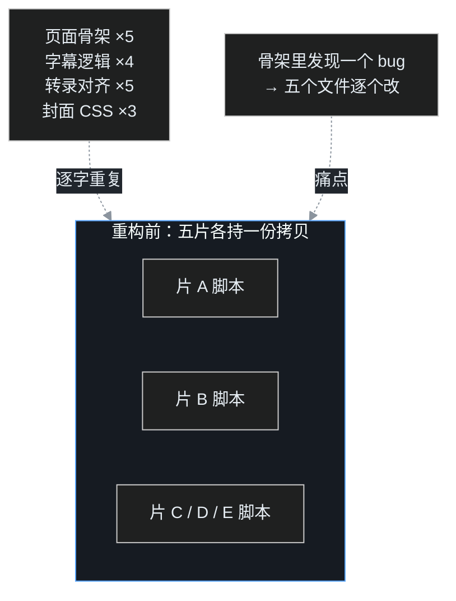
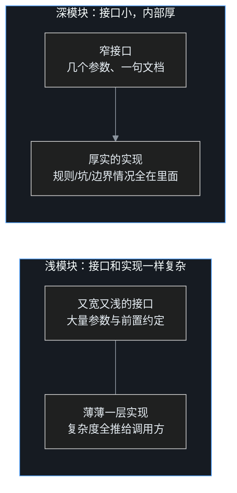
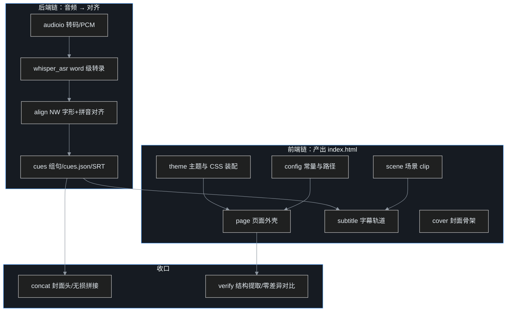
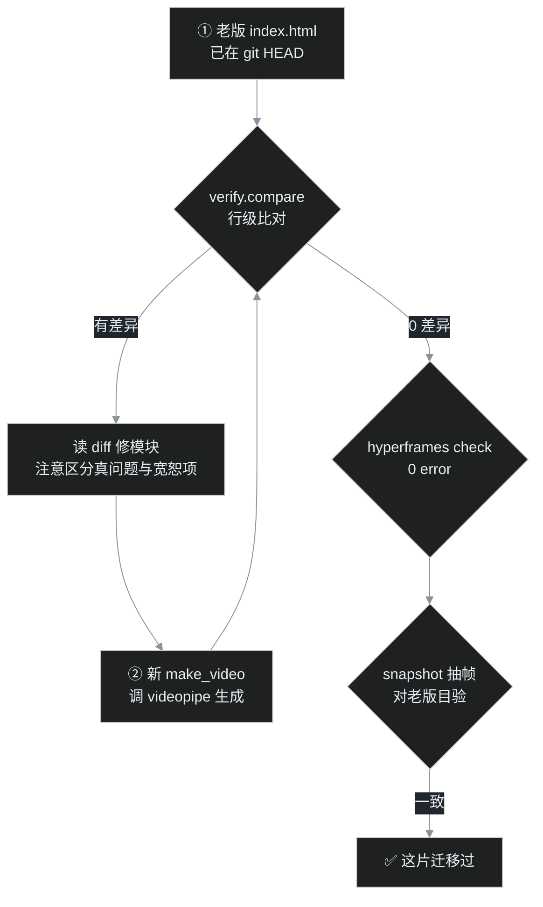

## 小白交底

先把这一篇要讲的摊开：

1. 叶扬用 HTML + GSAP 做视频动画、用 Python 处理音频和对齐，已经做出五部成片。可那五部片的「源代码」一共是 **19 个独立脚本、约 3868 行，其中八块逻辑逐字重复**——HTML 骨架抄五遍、字幕逻辑抄四遍，改一处要改五个文件。
2. 这次花约 7 小时做了一次重构：把公共逻辑收敛成一个 1500 行的公共包 `videopipe`，按管线阶段分成 13 个模块，每个模块「接口小、内部厚」——调用方只需知道几个参数，复杂规则全藏在模块里。
3. 这一篇讲清楚：什么是深模块，怎么判断一段逻辑该不该下沉，13 个模块的真实接口长什么样，以及最重要的——**怎么保证重构完，已渲染的成片一个像素都没变**。
4. 重构在本地分支上完成，采用「零差异迁移」：每部片新生成的页面与重构前存入 git 的老版做行级对比，必须 0 差异才放行，再加 check 和抽帧目验三重门控。
5. 结论先说：深模块的收益不是「少写了多少行」，而是「以后做新片，起点被抬高了」——现在起新片只需一条命令起骨架，只写本片独有的分镜内容。

## 一、痛点：五部视频，19 个脚本，3868 行

先快速交代这个视频管线是什么：每部视频本质上是一个网页——HTML 排画面，GSAP（一个前端动画库）按时间轴控制元素动起来，最后用 HyperFrames（一个把网页渲染成视频的工具）渲染成 MP4。音频侧则用 Python：语音转文字、拼音对齐、拼接。

五部成片做下来，工程上攒下三个问题。

**第一个问题，重复代码量大**。19 个脚本约 3868 行，其中八块逻辑在多部片之间逐字拷贝：页面外壳、字幕逐字高亮、场景 clip 拼装、GSAP 时间轴初始化、whisper 转录、Needleman-Wunsch 对齐、封面 CSS……每开一部新片就复制一份老脚本，然后改掉内容。



**第二个问题，目录散乱**。成片有的放在项目根目录，有的放在 `renders/`；音频命名有的带版本号有的不带；最要命的是生成器、封面 HTML、字体这些真正的「源代码」，全部散落在被 git 忽略的临时目录里——没有版本管理，哪个脚本对应哪部片，全靠文件 docstring 和记忆。

**第三个问题，流程顺序反了**——封面是全片渲染完之后才做的。可封面本该是全片最早的验收锚点：它一句话锁死立意、配色、母题。渲染一部长片要约 12 分钟，渲染完才发现视觉方向错了，返工成本极高。

这三个问题里，重复代码是主干问题——解决它，目录布局和流程顺序也会跟着被重新定义。

## 二、什么是「深模块」

这次重构的理论工具来自 John Ousterhout 的《A Philosophy of Software Design》（《软件设计的哲学》）里「深模块」的概念。

一个模块可以分成两部分看：**接口**和**实现**。接口是调用方必须知道的东西——函数名、参数、返回值；实现是模块内部怎么完成任务。所谓深模块，就是**接口尽量简单，实现尽量厚实**：调用方用很少的信息，撬动模块内部大量的复杂逻辑。

书里举的经典例子是编程语言的文件操作：程序员调用一个 `open`、`read`、`write`，完全不需要知道磁盘扇区、文件系统缓存、权限检查这些东西——它们全藏在实现里。接口浅，实现深。



与之相对的是**浅模块**：接口和实现一样复杂，抽了等于没抽。最典型的浅模块是给两三行代码套一层函数，却要求调用方理解同样多的背景。

落到这次重构上，判断一段逻辑有没有抽成深模块，有个朴素的自检：**调用方写出来的代码，是不是已经看不到那些坑了**。比如 HyperFrames 有个 StaticGuard 规则——带 `clip` class 的元素不能直接做透明度动画，必须里面再包一层。重构后这条规则被固化在场景模块内部，调用方写 `Scene(...)` 就行，连 StaticGuard 这回事都不需要知道。坑消失了，模块才算够深。

还要区分一对概念：抽走的是**机制**，留下的是**内容与策略**。字幕「怎么按时间轴逐字变色」是机制，该进包；「这一幕画面上摆什么」是内容，必须留在片内。这就是下一节要讲的。

## 二点五？不，三、第一步不是写代码，是分清什么该下沉

重构启动时最容易犯的错，是上来就写公共包，边写边想「这个要不要放进去」。正确的动作是先花时间列两张清单：五片之间**逐字相同**的是什么，五片**本来就想不一样**的是什么。

| 该下沉（机制：改一次，五片都得跟着改） | 不该下沉（内容：五片本来就想不一样） |
|---|---|
| HTML 页面外壳（doctype/head/GSAP 注册） | 每幕的画面 body（标题、卡片、SVG 内容） |
| 场景 clip 外壳与淡变规则 | 场景专属 CSS（每幕元素的定位与样式） |
| 底部字幕轨道、逐字高亮机制 | 主视觉 SVG（封面插画，每部片手绘） |
| 主题通用骨架 CSS、字体装配 | 场景动画 JS（元素具体怎么动） |
| 转码、whisper 转录、NW 对齐 | TTS 文稿与正字稿 |
| 封面静帧头、无损拼接 | —— |
| 新旧对比工具 | —— |

判据一句话：**「改一次，五片都要改」的东西下沉；「五片本来就想不一样」的东西留下**。

这里有个反向陷阱值得点破：看到每幕都有标题和卡片，就忍不住设计一个超通用的「通用场景配置」，用十几个参数描述画面。那不是深模块，是把片内内容强行参数化——接口会变得又宽又浅，调用方填参数的工夫不比写 HTML 少。画面内容天然是声明式的，让它老老实实以 HTML 字符串留在片内，反而最清楚。

## 四、13 个模块长什么样

公共包 `videopipe` 按管线阶段组织，前端链负责产出 HTML，后端链负责音频与对齐，最后由拼接和校验收口。



下面挑几个有代表性的接口，看「接口小、内部厚」具体是怎么落地的。

**config——魔法数字的唯一来源**。画布尺寸、帧率、轨道编号、字幕淡入淡出的时间常数、x264/AAC 编码规格，全部定义在一个模块里。以前这些数字散落在各脚本里，谁也说不清某部片的字幕到底提前几秒淡出；现在统一从 config 取，还附一个 `ProjectPaths` 约定每个项目的标准目录，路径不再各写各的。

**page.render_page——只出文本，不写盘**。它把每个成片逐字相同的部分（doctype、head、GSAP CDN、`#root`、paused 时间轴注册）拼成完整 HTML 字符串返回。注意它不直接落盘——这是刻意的：文本留在内存里，立刻就能做对比和测试，落盘反而是调用方一行代码的事。

**Scene 四元组＋render_scenes**。一部片的分镜就是一个 Scene 列表，每个场景只有四个字段：

```python
Scene("sc-jie", 37.40, 57.70, """……画面 HTML……""")
#        id        开始   结束    body
```

调用方把列表交给 `render_scenes`，clip 外壳怎么写、StaticGuard 要求的 `.scene-inner` 怎么包，全在模块内部。场景淡入淡出也只需一行 `scene_fade_js(场景id, in_at=..., out_at=...)`，时间显式给，不靠调用顺序隐式推导。

**char_track——双输入带断言**。底部字幕要实现「整句淡入淡出、句内逐字到点高亮」，输入是两份数据：组好的句子 cues 和逐字的时间信息 chars。函数内部第一件事是断言两者逐字对得上，对得上才生成 HTML 和动画 JS——对齐数据一旦错位，宁可当场报错，也不许产出「字幕和声音对不上」的片子。

**Theme——frozen dataclass**。主题是不可变数据：背景色、字体栈、逐字高亮色、字幕底栏位置与大小……项目侧选定一套主题（比如宣纸主题 `XUANZHI`），再传进一段「场景专属 CSS」，通用骨架与片内样式由 `assemble_css` 按固定顺序拼出。项目方不需要知道 reset、字体面、字幕条这些通用规则长什么样。

**align 与 verify——一个干活，一个兜底**。`align` 把正字稿和 whisper 转录结果做 Needleman-Wunsch 对齐，字形和拼音双重打分，容忍同音字；`verify.compare` 则是这次迁移的安全网，下一节细讲。

项目侧的代码因此只剩「声明本片内容」。以《猪八戒》的生成器开头为例：

```python
from videopipe import (ProjectPaths, load_cues, Scene, render_scenes,
                       char_track, assemble_css, render_page, audio_tag,
                       XUANZHI)

P = ProjectPaths.at(Path(__file__).resolve().parent)
P.ensure()
data = load_cues(P.cues_json)
cues, chars, TOTAL = data["cues"], data["chars"], data["duration"]
THEME = XUANZHI

SCENES = [
    Scene("sc-hook", 0.00, 5.70, """……"""),
    Scene("sc-flaw", 5.70, 17.60, """……"""),
    # ……共 15 幕，每幕只写画面
]
```

要诚实地说一句：迁移后五部片的 `make_video.py` 仍有 182 到 815 行。这并不丢人——那些行几乎全是片内独有的画面 body 和专属 CSS，本来就该有这么多；真正消失的是骨架、规则和坑，那部分以前是靠拷贝叠上去的虚胖。

## 五、安全地换心脏：零差异迁移法

这次重构最大的风险不在「写不出公共包」，而在**换了心脏之后，五部已经渲染好的成片对不上了**。动画时间轴、字幕节奏处处是细节，凭「看着差不多」验收，迟早埋雷。

对策是一套「零差异迁移」流程，每部片都过三重门控：



**第一重，行级零差异**。每部片的老版页面都已在 git 历史里，新版生成后与老版逐行对比，要求差异为 0。唯一被「宽恕」的差异是资源路径的目录前缀——老版用裸文件名、新版规范到 `media/` 目录下，对比时统一取 basename 再比。宽恕规则也写进了对比工具里，而不是靠人眼判断「这个差异应该没事」。

**第二重，hyperframes check**。lint、运行时、布局五段门控必须 0 error；warning 则与该片老基线逐个对照，只接受老版本来就有的同源项。

**第三重，snapshot 抽帧目验**。在每幕中点用 SwiftShader（CPU 渲染，保证结果确定）抽帧，与老版实拍并排目验。

执行顺序也有讲究：**先打样一部片，用它定型全部公共接口**。第一部选的是朱士行素版——结构标准、变体少。打样过程中把 `render_page`、Scene、字幕轨道这些接口磨对，后面四部片才是迁移，而不是边迁边改地基。主题也是增量加入的：每加一部片就带着验证加一套主题，而不是凭记忆一次性把四套主题全写出来——凭记忆写全，四套里必有三套带着没被测过的错。

最终结果：五部片都在一到两轮内归零，成片一个像素没动。

## 六、为变体扩接口，而不是偷偷特殊化

五部片并非一个模子，迁移中不断遇到「这一片不一样」。处理这种差异有个原则：**属于通用变体的，扩成接口的显式参数；属于片内独有的，留在片内**。最怕的是第三种做法——在公共模块里写 `if 片名 == ...` 的偷偷特殊化，那会让模块内部很快烂掉。

下面是这次真实扩出来的几组变体参数。

- **心经的中央逐字轨**：标准片字幕都在底部，心经却要在画面中央放 76px 大字、逐字到点变金并带光晕。于是新增 `center_char_clips`（中央轨）和 `sentence_track`（底部整句轨）两个显式函数，而不是给底部字幕函数塞一个 `位置=中央` 的开关再内部分叉。
- **Pro 版跨片复用 cues**：Pro demo 用的音频是从素版同一段里切出来的，需要整体平移时间。字幕函数因此有了显式的 `time_offset` 参数，对齐数据复用同一份，时间偏移在调用处一眼可见。
- **心经的两个「零差异」小参数**：老版 root 标签后没空行，`render_page` 加了 `body_lead_blank`；整句淡出常数与标准片不同，config 里单列 `XJ_TAIL`。这些参数存在的唯一目的，是让新版能对老版逐字复现。
- **《猪八戒》的紧凑代码风格**：老生成器的 head 区写得紧凑，主题里用 `head_style` 显式选「spaced / compact」双轨，不为「统一好看」抹平差异。

还有一个反向例子值得专门写：**素版朱士行的 blur 被刻意保留**。从渲染性能看，`filter:blur` 会让 HyperFrames 从快速捕获路径回退到慢速截图，其他片都已零 blur，顺手「优化」掉简直顺理成章。但那是老片刻意做的视觉效果——模块可以提供快路径，却不该替所有片做「什么是更好」的决定。重构的天职是保持行为，审美改造另找时间、另走验收。

## 七、确定性：深模块的隐形合同

深模块要被信任，还有一份隐形合同：**同样的输入，必须产出逐字节相同的输出**。如果生成结果今天和明天不一样，零差异对比、成片不动都无从谈起。

这份合同在这次重构里落成四条硬规矩：

1. 生成脚本禁用 `Math.random`、`Date.now` 一类不确定来源，需要随机感的地方由系统抽样或固定切点决定；
2. 动画时间全部以显式秒数参数给出，不依赖「这行代码先写所以先发生」的调用顺序；
3. 抽帧固定切点并加 `--no-browser-gpu`，走 SwiftShader 而不是显卡——GPU 渲染在不同机器甚至不同时刻都可能有细微差异；
4. 每个生成器都要在无并发下连续生成两遍，逐字节 SAME 才算幂等。

第 4 条是踩坑换来的：第一次做两遍比对时，后台还跑着一个 hyperframes check，check 会读写同一个 `index.html`，结果比对报了一堆 DIFF——不是生成器不确定，是两个进程在抢文件。串行重跑后五片全 SAME。**重新生成与 check 绝不能并发**，这条已经写进作业记忆。

## 八、结果与账

- **代码**：19 个脚本约 3868 行的旧世界，变成 1500 行的公共包＋五部片只含自身内容的生成器；公共逻辑从「拷贝五遍」变成「定义一遍」。
- **新片成本**：一条命令起标准骨架——`python new_project.py my-video`，目录、配置、占位文件全部就位，随后按九步流程填内容：①封面 ②TTS 音频 ③转录 ④对齐 ⑤分镜 ⑥check 与抽帧 ⑦渲染 ⑧拼接封面 ⑨验收。
- **封面先行**：流程第①步就是封面，最早、最便宜的验收锚点被提到了昂贵渲染之前，第三个老问题顺手解决。
- **成片**：五部已渲染的 MP4 全部沿用，未重渲染、未重拼接，一个像素没动。
- **耗时**：实际作业约 6.5 到 7 小时（跨两个夜间会话，含每部片的零差异调试、截图目验和全量验收）。

## 写在最后

回头看，深模块带来的东西里，「少写代码」反而是最不值钱的那一项。真正值钱的是两件事：一是**「改一处」的范围缩小了**——以前修一个骨架 bug 要翻五个文件，现在只改公共包；二是**「做新东西」的起点抬高了**——下一部片的第一步不再是复制老脚本，而是直接开始想这部片独有的画面。

还有一条方法论层面的收获：接口不是坐在那儿想出来的，是**打样一部真实项目、再拿零差异对比网兜出来的**。先让一部片跑通，把坑暴露在接口上，后面的路才会平。

模块的边界，本质上是「变化会在哪里发生」的判断。把注定一起变的东西拢到一处，把注定分道扬镳的东西留在各自的片里——好的架构，不过如此。

## 术语表

| 术语 | 一句话解释 |
|---|---|
| 深模块 | 接口简单、实现厚实的模块，调用方用少量信息撬动内部复杂逻辑 |
| 浅模块 | 接口和实现一样复杂，抽象了但没省事 |
| 接口 | 调用方使用模块时必须知道的信息：函数名、参数、返回值 |
| HyperFrames | 把网页按时间轴渲染成 MP4 的工具，本管线的渲染器 |
| GSAP | 前端动画库，页面上的元素由它按时间轴驱动 |
| StaticGuard | HyperFrames 的静态守卫检查；本管线里 clip 元素须内包 `.scene-inner` |
| Scene（场景） | 分镜的最小单位，含 id、开始、结束、画面 body 四要素 |
| clip | HyperFrames 中占一段时间轨道的页面元素，场景与字幕都以 clip 形式存在 |
| cue | 一句对齐好时间的字幕单元，含文字与起止秒数 |
| Needleman-Wunsch（NW） | 一种全局序列对齐算法，这里用字形加拼音双打分对齐转录与正字稿 |
| word 级转录 | whisper 输出的每个字（词）各自带起止时间的转录结果 |
| 零差异迁移 | 新版输出与 git 里的老版行级比对，0 差异才放行的迁移方法 |
| SwiftShader | 纯 CPU 的渲染器，抽帧时用它保证结果可复现 |
| 幂等 | 同样输入跑任意遍，输出逐字节一致 |
| dry-run | 只预演不真正执行的模式，动手前用它核对意图 |
