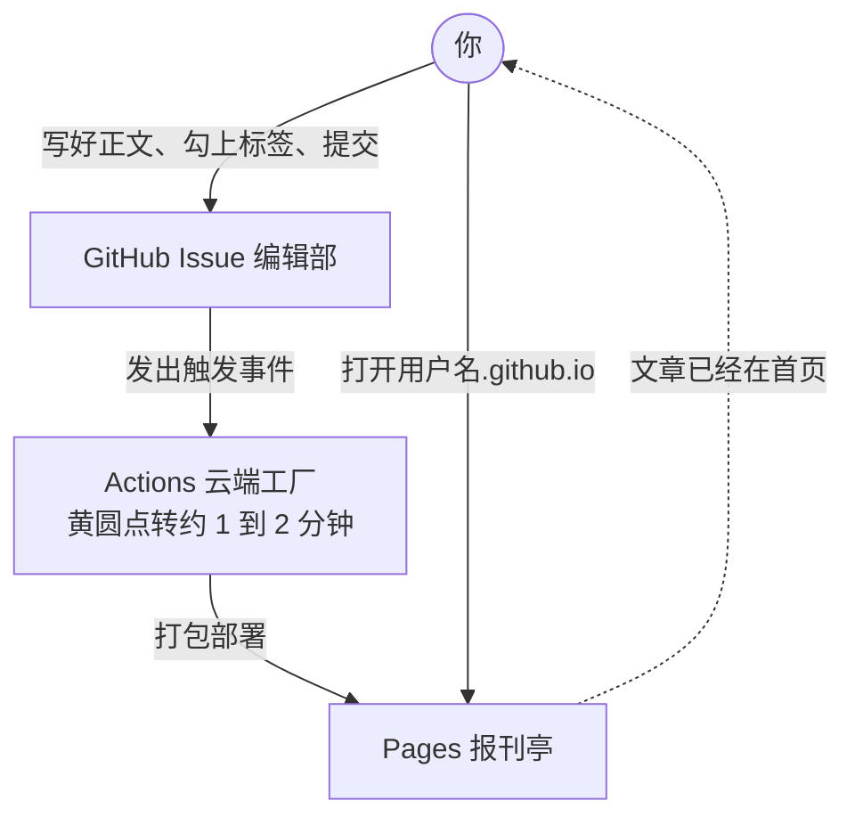

建一个网站要多久？

放在十年前，没点技术根本别想：租服务器、配环境，再加上动辄一两周的备案，前前后后能磨掉小一个月。

叶扬前几天实测了一次：18秒。准确说，点鼠标18秒，云端自动干活两分钟，网站上线。全程没在自己电脑上装任何东西，一个浏览器，0元。

## 一、先说清楚：这是什么，不是什么

这个东西叫个人博客，说白了就是一个只属于你的网页。叶扬自己的地址长这样：https://yeyangchen2009.github.io 。

打个比方，以前建网站像在荒地上自己盖房，地要租、水电要通、物业要请。现在的玩法像领一套精装房，钥匙当场给你，地皮和物业全免费。

照例戳破这个类比的洞：

- 免费地皮是 GitHub 提供的，人家改规矩，你得跟着走；
- 精装房只能住人，不能改造成商场，它适合写字发文章，做不了带后台的复杂网站；
- 但你写的每个字都存在自己名下的仓库里，随时能整体打包搬走，不存在平台封号、几年文章一夜归零的事。

## 二、18秒背后是谁在干活

不用懂技术，知道有三个零件在配合就够了：

- 模板：别人把博客的骨架做好，你一键复制，等于毛坯房交付；
- Actions：云端的免费工人，你一发稿它就开工印刷；
- Pages：免费报刊亭，印好的网页摆在这里，全世界打开浏览器都能看。

你要做的只有四步。

## 三、四步走，跟着点就行

**第1步：注册一个 GitHub 账号**

GitHub 是全球最大的代码托管网站，注册免费。只有一件事要认真对待：用户名就是你未来的网址。你叫 abc123，地址就是 abc123.github.io。建议起一个你愿意用很多年的名字，将来改名牵一发动全身。

**第2步：用模板建仓库，18秒主要花在这**

复制下面这个链接到浏览器打开，它直接带着模板参数：

https://github.com/new?template_name=Gmeek-template&template_owner=Meekdai

模板仓库长这样，一个博客要的东西都备齐了：

打开链接后是建仓表单，只需要认真填一处：仓库名必须是「你的用户名.github.io」，一个字符都不能差。保持公开，点创建。

为什么这么死板？因为 GitHub 有条硬规矩，只有叫这个名字的仓库才能直接占用根域名。起错名字，网址会矮一级，后面处处别扭。

**第3步：打开发布开关，最容易忘的一步**

进入新仓库的 Settings，左侧菜单找到 Pages，把 Source 从默认项切成 GitHub Actions。

这一步不做的后果极其迷惑：后台显示一切成功，网址打开却是 404。新手踩的第一个大坑基本都是它。设一次，以后不用再碰。

**第4步：写第一篇稿子**

回到仓库首页，点 Issues，新建一条 issue。两个要点：

- 标题就是文章标题，正文直接写，截图可以 Ctrl+V 粘贴，网站会自动传图；
- 必须给这条 issue 贴一个标签。标签就像出版许可证，没贴标签的稿子只是一条备忘，不会变成网页。第一次用要先手动建一个标签，名字随便起，叫「博客」就行。

点提交，收工。

## 四、两分钟后见

提交的瞬间，整条链路是这样运转的：

打开 Actions 页面，能看到一条新的运行记录，先是一个黄圆点在转，大约40秒到2分钟，圆点变成绿对勾，文章就上线了。

这时访问「你的用户名.github.io」，文章已经躺在首页。把网址发给任何人，对方不用注册、不用登录，点开就能读。

## 五、翻车急诊室

真上手一定会遇到状况，叶扬把高频的几种列在这里：

- **打开网址是 404**：先查第3步，发布开关没切。切完再到 Actions 页面手动跑一次构建。
- **提交稿子后毫无反应**：先检查标签，没贴标签的稿子不会触发印刷。
- **绿对勾了却看不到文章**：等一两分钟，用浏览器无痕窗口再打开，排除本地缓存。
- **构建记录是红叉**：点进记录看红色日志，把报错信息搜一搜；实在看不懂就手动重建，系统每天凌晨还会自动重建一次兜底。

手动重建的位置顺便记一下：Actions 页面左侧选 build Gmeek，右侧点 Run workflow。记住一个口诀，以后任何「改了东西没生效」，先来一发手动重建，往往药到病除。

## 六、为什么叶扬劝你早点弄一个

做内容的人多半有过这种隐忧：平台说限流就限流，说封号就封号，几年心血系在一套别人给的账号密码上。

个人博客是内容的根据地。它不涨粉、不推流，看着笨，但地址永远有效，文章永远在线，你在任何平台的简介里都能挂上它。

18秒，0元，换一个自己说了算的角落。这笔账怎么算都值。

你在搭建时卡在哪一步，把卡住的画面截图发给叶扬，下一篇就从问得最多的那个坑里挑。下一篇讲：博客建好之后，怎么把站名、头像、副标题统统换成你自己的。

---

<!-- 以下内容发布前删除，仅供选标题用 -->

备选标题：

1. 18秒0元，搭一个自己说了算的网站
2. 我用18秒建了个网站，0成本，不用写一行代码
3. 建网站这件事，被 GitHub 干到了18秒
4. 不想被平台封号？先花18秒给自己留条后路
5. 18秒，一个浏览器，普通人也能拥有自己的网站
6. 做内容的人，都该有个自己说了算的角落
7. 0元18秒，这可能是今年性价比最高的一次点击
8. 别再把几年心血押在平台身上了
