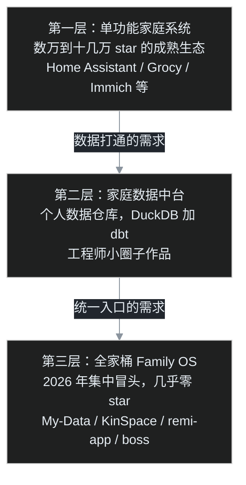

叶扬在公司写了多年大数据，对一件事熟到麻木：销售有 CRM，库存有 ERP，报销有财务系统，设备有监控平台。公司运转的每一环都有一套系统在背后默默收集数据，最后汇总成报表，变成决策和收入。

他突然冒出一个问题：一家公司这么干，那一个家庭呢？家里同样有账本、有证件、有冰箱库存、有老人的体检报告、有孩子的成长记录，为什么这些东西至今散落在微信群、Excel 和抽屉里？家庭能不能也搭一套系统，全家人一起用？

这个念头值不值得动手，他没急着下结论，先去 GitHub 上做了一圈调研。这篇是完整调研笔记。

## 一、先说结论

**这个创意不仅已经有大量实现，而且在 2026 年正在明显起势。** 现状可以概括成三层：单功能家庭系统已经非常成熟，个人数据仓库在技术人圈子里跑通了原型，直接以「家庭操作系统」命名的全家桶产品在 2026 年夏天集中出现，但还没有跑出赢家。

换句话说，这是一个「需求被反复验证、龙头尚未出现」的方向。

## 二、调研方法

叶扬用的工具很简单，就是 `gh` 命令行。几组关键词轮着搜：

```bash
gh search repos "family operating system" --sort stars
gh search repos "family command center"
gh search repos "personal data warehouse"
gh search repos "homelab dashboard"
```

再对命中的仓库逐个用 `gh repo view` 看 star 数和创建时间，用 `gh api` 拉 README 和顶层目录结构。判断的标准只有两个：项目是不是真的在解决「家庭共同使用」这件事，以及它成熟到什么程度。

## 三、一张图看懂三层生态



下面逐层拆。

## 四、第一层：公司的每个部门，都能在家庭里找到对应系统

这一层最让叶扬吃惊。他原本以为是空白，结果发现公司里有什么系统，自托管生态里就有一个家庭版本，而且不少项目体量惊人。

| 公司里的系统 | 家庭对应项目 | star | 管什么 |
|---|---|---|---|
| IoT 数据平台 | Home Assistant | 9.1 万 | 全屋传感器、用电、设备状态 |
| ERP 资源计划 | Grocy | 0.95 万 | 冰箱库存、采购、家务、设备台账 |
| 财务系统 | Firefly III | 2.5 万 | 家庭账本、账单、收支分析 |
| 档案系统 | Paperless-ngx | 4.6 万 | 扫描票据合同病历，自动分类检索 |
| CRM 关系管理 | Monica | 2.5 万 | 记录家人朋友的生日、往来、关系 |
| 资产管理 | Homebox | 0.7 万 | 登记家中物品、保修、存放位置 |
| 数字资产库 | Immich | 11.5 万 | 全家照片视频备份、人脸聚类 |
| 企业网盘 | Nextcloud | 3.7 万 | 全家共享文件、日历、通讯录 |
| 食堂管理 | Mealie | 1.3 万 | 菜谱、膳食计划、采购清单 |

挑三个值得细看的项目展开。

### 4.1 Grocy：官方口号就是「冰箱之外的 ERP」

Grocy 创建于 2017 年，是一个 PHP 写的网页应用，作者 Bernd Bestel 的动机很朴素：一个家庭也需要被管理，他在做 Grocy 之前用了将近十年的自制软件加一堆 Excel，实在受够了。

它的项目结构是典型的朴素 MVC，没有任何花架子：

```
grocy/
├── app.php              # 入口
├── config-dist.php      # 配置模板
├── controllers/         # 控制器
├── services/            # 业务逻辑
├── views/               # 页面模板
├── migrations/          # 数据库迁移
├── data/                # SQLite 数据目录
└── grocy.openapi.json   # 完整 API 描述
```

技术栈是 PHP 8.5 加 SQLite，意味着它不需要单独的数据库服务器，一个数据文件就是全部家当。它还提供完整的 OpenAPI 描述，意味着家里的库存数据可以被任何程序读写，这是它和普通手机 App 最本质的区别：数据是你的，接口是开的。

最快的体验方式是 Docker：

```bash
docker run -d \
  --name=grocy \
  -p 9283:80 \
  -v grocy-config:/config \
  lscr.io/linuxserver/grocy:latest
```

打开 `http://localhost:9283`，默认账号密码都是 `admin`，第一件事记得改密码。不想折腾服务器的话，作者还提供了 Grocy Desktop，Windows 上像普通软件一样双击安装，应用商店里也有。

### 4.2 Homebox：给家里所有物品建台账

Homebox 的定位是家庭物品清单与组织系统。大件家电的保修截止日、说明书、购买价格，小件物品放在哪个柜子，全部登记在案。它的 Docker 启动方式简单到只有两行：

```bash
docker run -d \
  -p 7745:7745 \
  -v homebox-data:/data \
  ghcr.io/sysadminsmedia/homebox:latest
```

### 4.3 Firefly III 与 Mealie：管钱的和管饭的

Firefly III 是一个功能完整的家庭财务经理，支持双账户、转账、定期账单和各种收支报表，官方提供 Docker 镜像，安装文档在 `docs.firefly-iii.org`。

Mealie 管的是另一个高频场景：今晚吃什么。它内置菜谱库，可以排一周的膳食计划，再自动把缺的食材汇总成采购清单，这和公司里食堂管理系统的逻辑一模一样。

这一层的共同特征是：**每个项目都只解决一个部门的问题，但都解决得极深，而且全部自托管，数据在自己手里。**

## 五、第二层：真正的家庭数据中台

单功能系统有个明显问题：财务数据在 Firefly 里，健康数据在手环厂商手里，库存数据在 Grocy 里，互不相通。公司里解决这个问题靠数据中台，于是有人开始给个人和家庭造数据仓库。

叶扬搜到一个名字就叫 `personal-data-warehouse` 的项目，作者 beillo。项目还很年轻，2026 年 9 月 16 日创建，没有 README，但仓库里有一份 `BUILD_PLAN.md`，把整个路线图摊开写了六个阶段。他的目录结构一眼就能看出是正经数仓路子：

```
personal-data-warehouse/
├── src/brain/
│   ├── connectors/      # 数据源连接器
│   ├── load/            # DuckDB 装载
│   └── models.py        # Pydantic 数据模型
├── dbt/                 # dbt 分析工程
├── dashboard/           # Plotly 仪表盘
├── notebooks/           # 探索分析
├── scripts/             # ETL 入口
└── docker/
```

六阶段路线是这样的：

1. 阶段 0：搭骨架，连接器协议、DuckDB 装载器、可跑的空架子
2. 阶段 1：纵向切片，先接通一个数据源，让一张图表能显示真实数据
3. 阶段 2：铺开连接器，接入 Garmin 运动健康、时间记录表、习惯打卡、Instagram 使用记录共五个源
4. 阶段 3：用 dbt 正式建模，staging 到 intermediate 到 marts，带数据测试和血缘图
5. 阶段 4：分析，用 scikit-learn 做相关性和聚类，回答「什么样的日子睡得好、刷手机少」
6. 阶段 5：仪表盘、合成数据演示和作品打磨

这套架构对叶扬来说几乎不用解释，就是公司数据平台的缩小版：数据源换成了银行流水、运动手环和社交 App，数据仓库从 Hive 换成了单机 DuckDB，调度和建模思想一模一样。

项目里还有一个细节体现了大数据工程师才有的敏感度：阶段 5 专门安排了合成数据生成器，真实数据绝不上公开仓库，对外演示一律用假数据。

## 六、第三层：家庭操作系统，2026 年夏天集体开工

如果说第二层还只是把数据攒起来，第三层瞄准的就是叶扬最初的问题：一个全家人共同使用的完整系统。

直接以 Family Operating System 命名或自述为 FamilyOS 的项目，几乎全部创建于 2026 年 7 到 8 月。互不相识的人在两个月内各自开工同一件事，这是需求到达临界点的典型信号。他重点看了两个。

### 6.1 My-Data：整个应用就叫 FamilyOS

仓库 `Sanjaybnarayan/My-Data` 是完成度最高的一个。它要管的东西列出来几乎是一个家庭的全部：身份、家庭成员、钱、投资、证件、健康、保险、车辆、房产、教育、任务、日历、笔记、密码、数字遗产和紧急信息。

它的 quickstart 出乎意料地简单：

```bash
git clone https://github.com/Sanjaybnarayan/My-Data.git
cd My-Data
npm start          # 打开 http://localhost:8080
```

不需要 `npm install`，也没有构建步骤，整个应用是原生 ES 模块直接当文件提供。还可以 `npm run build` 把整个系统折叠成单个自包含的 HTML 文件，丢到任何地方都能跑。

它的架构核心是一份 schema，叶扬认为这是整个项目最值得抄的设计：

```
js/data/schema.js     # 34 个实体只描述一次
js/domain/            # 规则：钱、投资、账单、分类、提醒
js/modules/           # 界面，15 个屏幕读同一份 schema
js/security/          # 密钥、字段加密、角色、会话
js/sync/              # 发件箱、冲突解决
apps-script/          # 跑在用户自己 Google 账号里的后端
```

34 个实体只描述一次，存储、索引、表单、校验、加密、同步表格、AI 助手词汇全部从这份 schema 派生。这正是「面向对象创作」在工程上的样子：描述一次，处处生成。

这个项目在安全上的取舍也想得很清楚，叶扬逐条记了下来：

- 离线优先，所有读写先在本地，同步只是后台对账
- 敏感字段加密，身份证号、账号、保单号、密码、诊断用随机 256 位密钥加密；非敏感字段明文存储，因为密文上建不了搜索和排序
- 备份用用户自己 Google Drive 里的一张多页表格，一列一名字，停用软件后数据照样能被任何工具打开
- 运行时零依赖，没有框架、没有图表库、连 PDF 解析都是从零写的，因为「一个离开网络就启动不了的离线应用不配叫离线优先」
- 测试有 625 项无浏览器检查加 134 项真实浏览器检查

README 开头还有一段警告让叶扬印象很深：你的真实记录绝不能进这个仓库，Git 会永久保存一切且不加密，一条财务记录提交一次，任何拿到仓库副本的人都读得到，删除也没用。这句话值得每一个打算公开个人项目的人抄走。

### 6.2 KinSpace：六边形架构的家庭空间

另一个项目 `Fabien-Halaby/kinspace` 走的是正规工程路线，Go 加 React Native 加 PostgreSQL。它的后端是六边形分层架构，依赖方向朝内：传输层、应用层、领域层，领域层对框架和数据库零依赖。

它已经实现的功能包括：注册登录、通过邀请码组建家庭、成员档案、双向类型化的家庭关系图（父母、子女、配偶、兄弟姐妹），以及服务端按 `family_id` 强制的租户隔离。规划中的功能有家庭日历、加密证件库、实时消息和基于家庭成员技能的互助网络。

本地启动分三步：

```bash
docker compose up -d postgres     # 起数据库
cd backend && cp .env.example .env && make run   # API 跑在 8080
cd mobile && npm install && npx expo start       # 手机端
```

它的 API 版本统一在 `/api/v1` 下，从认证、建家庭、加入家庭到关系边的增查，一张表列得整整齐齐，文档完成度对一个单人项目来说相当罕见。

两个项目的共同短板也很明显：star 都是个位数，都还没有经过真实家庭的长期使用检验。它们证明的是方向，而不是答案。

## 七、家庭系统和公司系统，到底有什么不同

调研下来，叶扬认为「把公司系统搬回家」这个类比方向对，但不能照搬。两者至少有四点根本差异。

第一，目的不同。公司收集数据为了创收，家庭系统不直接产生收入，它的回报是省钱、避险和减少内耗。库存数据减少重复采购，账单数据发现被遗忘的订阅，体检数据提供趋势预警。

第二，用户不同。公司系统的用户有培训、有 KPI 逼着用，家庭系统的用户是父母、伴侣和孩子，任何需要看说明书的功能都会在三天内被弃用。这决定了家庭系统的界面必须比公司系统简单一个数量级。

第三，有一个公司没有的维度：传承。照片、家史、保单和资产信息结构化地留给家人，在意外发生时就是家人能找到一切的地图。这是家庭系统独有的重量。

第四，维护者不同。公司有运维，家庭系统只有一个人在下班之后维护。所以自托管、低资源、能自动备份，比功能丰富重要得多。

## 八、空白点

把三层放在一起看，缺口非常清楚。

第一层的九个系统全是孤岛，数据模型各搞各的；第二层数仓够硬核，但是工程师的玩具，家人根本碰不了；第三层全家桶刚有人开工，远未成熟。没有人同时做到三件事：统一的数据模型、全家人零门槛的协作界面、以及能直接回答「我们家这个月钱花哪了」的 AI 问答层。

这个缺口恰好卡在两类能力的交叉点上：懂数据建模和 ETL，又懂怎么把复杂系统包成普通人能用的界面。

## 九、叶扬的动手计划

笔记最后，他给自己留了一条现实路径，不贪大：

1. 先在一台旧机器上用 Docker 跑起 Grocy 和 Firefly III，自己一个人先用一个月，验证真实价值
2. 再用 DuckDB 打通财务、运动和家庭库存三类数据，做一个只回答三个问题的最小数仓
3. 最后才考虑给家人包一层界面，第一个界面只做一件事：全家日历加待办

每一步都自带真实数据和真实用户，跑通一步再走下一步，这和他做内容自动化的原则一致：先让管道纵向通水，再谈横向铺开。

至于这件事能不能变成内容甚至产品，他的判断是：先自用，再记录，最后才谈教别人。「我给家里搭了一套数据中台」这个题材不缺读者，缺的是真正搭过、踩过坑的人。

## 参考链接

- Home Assistant：https://github.com/home-assistant/core
- Grocy：https://github.com/grocy/grocy ，试用 https://demo.grocy.info
- Firefly III：https://github.com/firefly-iii/firefly-iii
- Paperless-ngx：https://github.com/paperless-ngx/paperless-ngx
- Monica：https://github.com/monicahq/monica
- Homebox：https://github.com/sysadminsmedia/homebox
- Immich：https://github.com/immich-app/immich
- Nextcloud：https://github.com/nextcloud/server
- Mealie：https://github.com/hay-kot/mealie
- 个人数据仓库：https://github.com/beillo/personal-data-warehouse
- FamilyOS（My-Data）：https://github.com/Sanjaybnarayan/My-Data
- KinSpace：https://github.com/Fabien-Halaby/kinspace
- 自托管生态总目录：https://github.com/awesome-selfhosted/awesome-selfhosted
