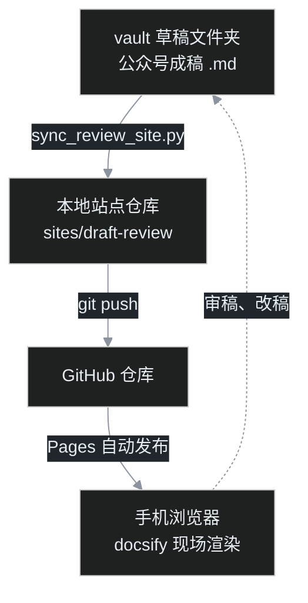

叶扬写公众号草稿有个习惯，稿子在电脑上写完，人就想瘫到沙发上，举着手机慢慢审。可草稿存在本地的知识库文件夹里，手机够不着；用微信文件传输助手发过去，格式全乱，配图还得一张张发。

叶扬想要的东西很简单：一个网址，手机点开就是全部草稿，默认暗色，图能正常看。

这篇教程记录叶扬从零搭这座审稿站的全过程，主角是 docsify。照例先说清楚它的脾气：docsify 不会把 Markdown 编译成静态文件，它是在浏览器打开网页时，才现场把 md 文件渲染成页面。所以不用打包、不用构建、不用跑任何编译命令，丢一个 index.html 上去，网站就成立了。

## 一、先看整体架构

开工前，叶扬先用 `gh repo list` 翻了自己的旧仓库，发现两个 docsify 项目可以抄作业：一个是吟诵教程文档，一个是破局直播稿站。后者把 docsify 的库文件本地化到了 lib 目录，手机加载不依赖 CDN，这个做法被叶扬沿用。

整条链路是这样的：



记住三个零件的分工：本地的 Python 脚本负责搬运和生成目录，GitHub 负责存文件和发布网页，手机上的 docsify 负责把 md 渲染成能读的页面。

## 二、建一个仓库

叶扬给审稿站起名 draft-review，用 gh 直接建公开仓库，再克隆到本地：

```bash
gh repo create yeyangchen2009/draft-review --public --description "草稿审稿站"
git clone https://github.com/yeyangchen2009/draft-review.git sites/draft-review
```

克隆下来后先建两个目录：drafts 放同步过来的草稿，lib 放 docsify 的库文件。再建一个空的 .nojekyll 文件，作用是告诉 GitHub Pages 不要用 Jekyll 处理这个仓库，否则下划线开头的 _sidebar.md 这类文件会被忽略。

## 三、把库下载到本地 lib

这是和官方教程不一样的一步。官方文档默认走 CDN 链接，手机上加载要反复去请求外网；叶扬把所有库文件下载到 lib 目录，网页只加载自己仓库里的东西，稳。

```bash
curl -o lib/docsify@4.js "https://cdn.jsdelivr.net/npm/docsify@4/lib/docsify.min.js"
curl -o lib/search.min.js "https://cdn.jsdelivr.net/npm/docsify@4/lib/plugins/search.min.js"
curl -o lib/docsify-pagination.min.js "https://cdn.jsdelivr.net/npm/docsify-pagination/dist/docsify-pagination.min.js"
curl -o lib/zoom-image.min.js "https://cdn.jsdelivr.net/npm/docsify@4/lib/plugins/zoom-image.min.js"
curl -o lib/mermaid.min.js "https://cdn.jsdelivr.net/npm/mermaid@10/dist/mermaid.min.js"
```

五个文件各司其职：docsify 是核心，search 提供跨草稿搜索，pagination 在文章末尾放上一篇、下一篇按钮，zoom-image 让配图可以点开放大，mermaid 负责渲染流程图。

## 四、写 index.html，重头戏

整个网站所有的样式和逻辑都在这一个文件里。叶扬把它拆成几块来讲，每一块都对应一个真实需求。

### 4.1 默认暗色，用 CSS 变量做两套主题

叶扬没有去引第三方暗色主题，而是自己定义了两套 CSS 变量。暗色用 GitHub Dark 的配色：画布 `#0d1117`，侧边栏 `#161b22`，正文 `#e6edf3`。亮色就是普通的白底深字。

```css
:root {
  --bg: #0d1117;
  --sidebar-bg: #161b22;
  --text: #e6edf3;
  --text-muted: #8b949e;
  --link: #58a6ff;
  --border: #30363d;
}
html[data-theme="light"] {
  --bg: #ffffff;
  --sidebar-bg: #f6f8fa;
  --text: #1f2328;
  --link: #1f6feb;
  --border: #d0d7de;
}
```

页面里所有元素只引用变量，比如 `background: var(--bg)`。切换主题时，只要改掉 html 标签上的 data-theme 属性，整站颜色瞬间全部跟着变。这比准备两套 CSS 文件干净得多。

### 4.2 一个切换按钮，记住选择

右上角放一个按钮，里面是月亮和太阳两个 SVG 图标，靠主题属性决定显示哪一个。点击时在暗色和亮色之间来回切，并把结果写进 localStorage：

```javascript
function applyTheme(theme) {
  document.documentElement.setAttribute('data-theme', theme);
  localStorage.setItem('review-theme', theme);
}
toggle.addEventListener('click', function () {
  var next = currentTheme() === 'dark' ? 'light' : 'dark';
  applyTheme(next);
});
```

默认值要注意：读取 localStorage 时只要不是明确的 light，一律按暗色处理，保证第一次打开就是深色。

### 4.3 让 mermaid 跟着站点走，最费心思的一块

这是踩坑最深的地方，值得慢慢说。

叶扬的草稿里本来就有 mermaid 图，而且每个图开头都带着一句 `%%{init}%%` 指令，强制暗色。问题来了：如果用户在审稿站切到亮色，这些图还是硬套着深色底，像几块黑膏药贴在白纸上。

解法分三层。

第一层，渲染前把稿子里内嵌的 init 指令全部剥掉，主题改由站点统一决定：

```javascript
function stripInit(src) {
  return src.replace(/%%\{[\s\S]*?\}%%\s*/g, '').trim();
}
```

第二层，写一个 docsify 插件，在每次页面加载完成后，找到 mermaid 代码块，按当前主题重新渲染。暗色用 dark 主题配上 GitHub Dark 变量，亮色用 default 主题：

```javascript
mermaid.initialize({
  startOnLoad: false,
  securityLevel: 'loose',
  theme: theme === 'light' ? 'default' : 'dark',
  themeVariables: theme === 'light' ? undefined : darkVars
});
```

这里有个细节，插件要把图的原始代码也存一份在页面里。否则切主题时原来的代码块已经被替换成了 SVG，没法回头重新渲染。叶扬用一个隐藏的 script 标签把源码留住。

第三层，切换主题时遍历页面上所有图，用存下来的源码重新渲染一遍：

```javascript
function rerenderAllMermaid(theme) {
  document.querySelectorAll('.mermaid-wrap').forEach(function (wrap) {
    var src = wrap.querySelector('script[type="text/mermaid-src"]').textContent;
    renderInto(wrap.querySelector('.mermaid-holder'), src, theme);
  });
}
```

把这三层接到 applyTheme 里，点一下按钮，连字带图一起变色。

### 4.4 顺手剥掉 frontmatter，一个不剥就露馅的坑

第一次在手机上打开文章，叶扬愣住了：文章开头明明白白显示着 `title: ...`、`date: ...`、`tags: ...` 一大片。

原因是 docsify 不认识 YAML frontmatter，它把开头那两条 `---` 当成了普通的分隔线，中间的配置全当正文印了出来。解法是加一个 beforeEach 钩子，在 Markdown 交给解析器之前就把 frontmatter 整段删掉：

```javascript
hook.beforeEach(function (content) {
  return content.replace(/^---\s*\n[\s\S]*?\n---\s*\n?/, '');
});
```

这个钩子和前面 mermaid 的 doneEach 钩子一起放在 docsify 的 plugins 数组里。beforeEach 管文字进解析器之前，doneEach 管页面渲染之后，两个时机别搞反。

### 4.5 移动端适配，为审稿这件事专门调

手机审稿有几个具体的别扭，逐个解决：正文 16px 防止 iOS 自动放大字体，表格和代码块允许横向滚动而不是把整页撑宽，窄屏下侧边栏默认藏到屏幕外、点汉堡按钮才滑出来。

```css
@media screen and (max-width: 768px) {
  .sidebar { transform: translateX(-300px); }
  body:not(.close) .sidebar { transform: translateX(0); }
  .markdown-section { padding: 0 16px 60px; }
}
```

汉堡目录按钮叶扬放在了右下角，这是叶扬用 Gmeek 养成的肌肉记忆，悬浮卡片加一点阴影，距底部留出 `env(safe-area-inset-bottom)` 的安全区，不贴 iPhone 的 Home 指示条。

## 五、写一个一键同步脚本

网站能看了，但不能每加一篇草稿就手动复制、手写目录。叶扬写了一个 Python 脚本 sync_review_site.py，一条命令四件事：扫描草稿文件夹，把 md 复制到站点的 drafts 目录，生成 _sidebar.md 和首页 README.md，最后 git 提交推送。

生成侧边栏时，标题取 frontmatter 里的 title，链接要做 URL 编码，中文文件名才能正确跳转：

```python
def write_sidebar(items):
    lines = ["* [首页](/README.md)", "", "## 草稿目录（{}篇）".format(len(items)), ""]
    for it in items:
        link = "drafts/" + quote(it["file"])
        lines.append("* [{}]({})".format(it["title"], link))
    open(os.path.join(SITE, "_sidebar.md"), "w", encoding="utf-8").write("\n".join(lines))
```

首页 README.md 用同样的数据生成一张文章列表表格，带上日期和发布状态。脚本末尾调 subprocess 跑 git，提交信息里写明这次同步了几篇、什么时间。

以后的日常就缩成一句话：

```bash
python scripts/sync_review_site.py
```

手机刷新，新草稿已经在了。加 `--no-push` 参数可以只在本地生成、先预览再决定推不推。

## 六、开启 GitHub Pages

文件推上去，最后一步是告诉 GitHub 把这个仓库当成网站发布。在仓库 Settings 的 Pages 页面，Source 选 main 分支、根目录，等大约一分钟，网址就通了：

```
https://yeyangchen2009.github.io/draft-review/
```

也可以用 gh 一行搞定，省得点网页：

```bash
gh api -X POST repos/yeyangchen2009/draft-review/pages \
  -f "source[branch]=main" -f "source[path]=/"
```

## 七、翻车急诊室

这一路踩的坑，叶扬原样列在这里，读者大概率会撞上其中一两个。

| 症状 | 病因 | 处方 |
|---|---|---|
| 打开文章是 404，但文件明明在 | 手敲链接时漏了文件名里的字，请求了一个不存在的名字 | 用脚本做 URL 编码，别手拼；先 curl 测链接 |
| 配图全部裂掉 | 图片在仓库里的真实路径和猜的不一样，叶扬这次实际路径是 docs/screenshots 而非根目录 | 用仓库文件树查实际路径，再拼 raw 链接 |
| 文章开头显示 title、date 一堆配置 | docsify 不识别 frontmatter，被当正文渲染 | beforeEach 钩子里用正则剥掉 |
| 亮色模式下流程图还是黑底 | 稿内嵌的 init 指令强制了暗色 | 渲染前剥 init，由站点主题统一注入 |
| 电脑无头截图里右下角按钮看不见 | 系统显示缩放导致截图物理宽度和 CSS 视口宽度对不上 | 这是测试环境问题，真机正常；用计算样式确认按钮位置 |

最后一条多解释一句，因为它耗了叶扬不少时间。用无头浏览器截图验收时，窗口设成 400 宽，页面里读出来的视口却是 492，右下角的按钮因此落在截图画面之外。再用一个完全空白的页面做对照，同样是这个错位，才确认是系统 DPI 缩放惹的祸，和代码无关。**无头截图能验证布局逻辑，但点按钮、看真机位置这种事，还是要在真手机上最后确认一眼。**

## 八、完工验收清单

全部走完，对照打勾：

- 仓库里 index.html、.nojekyll、drafts、lib 四样齐备；
- 手机打开网址，默认就是暗色；
- 右上角按钮能切亮色，刷新后选择还在；
- 文章开头不显示 frontmatter；
- mermaid 图在两种主题下都配色正常；
- 文章末尾能翻上一篇、下一篇，搜索能跨草稿找到内容；
- 跑一次同步脚本，新草稿能自动出现在手机上。

## 小结

这座审稿站的本质，是把三件成熟的小事拼起来：docsify 负责在浏览器里现场渲染 Markdown，CSS 变量加一个按钮负责明暗双主题，一个 Python 脚本负责把草稿从知识库搬进仓库。

它不涨粉、不推流，纯粹是个自用工具。但写完稿子能瘫在沙发上、举着手机顺顺当当审稿，这件事本身就值得花一个晚上搭好。

## 参考链接

- docsify 官方文档：https://docsify.js.org
- docsify 主题与配置：https://docsify.js.org/#/configuration
- mermaid 官方文档：https://mermaid.js.org
- GitHub Pages 文档：https://docs.github.com/pages
- 叶扬的审稿站：https://yeyangchen2009.github.io/draft-review/
