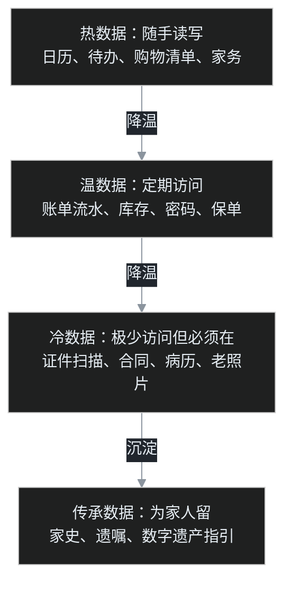

上一篇调研完家庭操作系统，叶扬动手做的第一件事不是装软件，而是把家里的抽屉、文件夹和手机翻了一遍。叶扬想先搞清楚一个更基础的问题：一个普通家庭，到底产生了哪些数据，其中哪些值得专门用系统存起来？

翻完有点意外，家里的数据远比想象中多，而且大部分处在一种尴尬状态：明明很重要，却要么躺在纸质抽屉里，要么散在七八个 App 里，真要用的时候得翻半天。

这篇就是叶扬整理出来的完整清单，也是以后搭家庭系统的字段底稿。

## 一、财务金钱，最该结构化的一类

这是叶扬列的第一类，因为钱的数据最怕两件事：忘，和乱。

| 数据 | 值得存的理由 |
|---|---|
| 银行账户、卡号、开户行清单 | 账户多了自己都会忘，挂失和继承时是救命清单 |
| 收支流水 | 攒够一年才看得出钱去哪了，临时记没用 |
| 信用卡账单日、还款日 | 逾期一次就上征信 |
| 水电煤、物业、宽带、话费账单 | 发现异常扣费、换房过户时要用 |
| 借款往来 | 亲兄弟明算账，避免家庭矛盾 |
| 投资持仓与收益 | 跨平台资产汇总起来，才知道真实身家 |
| 保险保单、保额、缴费日、受益人 | 续期提醒、理赔时翻得到 |
| 个税申报、专项附加扣除 | 退税、补税、落户都要查 |

叶扬自己都承认，保单这一项最典型。不少人买了好几份保险，真被问起保了什么、受益人写的谁，得翻半天柜子。这种信息就该是一张随时能查的表，而不是一摞纸质合同。

## 二、证件与法律，补办成本最高的一类

- 身份证、护照、通行证、出生证明、结婚证、户口本、驾照、行驶证的扫描件和到期日
- 房产证、购房合同、贷款合同
- 车辆登记证、年检记录
- 各种合同协议、公证、遗嘱授权
- 学历学位、职业资格证书

这一类数据有个共同脾气：平时几乎不看，但用的时候找不到就是灾难。护照临出门才发现过期，卖房子时翻不到购房合同，都是真事。所以叶扬给每一项都加了一个关键字段：到期日。存扫描件是为了随时调阅，记到期日是为了提前三个月收到提醒。

## 三、健康医疗，越存越值钱的一类

- 历年体检报告：单年看没感觉，连看五年才是趋势预警
- 病历、诊断、处方、手术住院记录
- 过敏史、长期用药
- 疫苗接种、牙科眼科档案
- 血压、血糖等慢病自测指标
- 手环手表的睡眠、心率、运动数据
- 家族病史

叶扬在这一类旁边写了一句判断：健康数据的价值完全靠时间累积，今年开始和三年后开始，差别是天壤之别。单一体检报告上的箭头没人当回事，但同一个指标连续五年的走向，往往比任何一次单点数据都说明问题。

## 四、家庭物品与库存

- 家电家具台账：购买日期、价格、保修期、说明书
- 贵重物品存放位置
- 食品和日用品库存、保质期
- 装修记录、用漆型号、维修历史

家电过保一周就坏是很多人的共同经历，一张购买日期台账就能避免。装修记录叶扬原本没想到，是翻资料时意识到的：墙上用的什么漆、水电怎么走的管，下次维修或者卖房时，这些记录能省掉砸墙找线的钱。

## 五、记忆与知识

- 全家照片视频，自动备份加人脸聚类
- 家庭大事记、日记、回忆录
- 族谱家史，以及老人讲述的记录
- 孩子的成长记录、作品、奖状
- 收藏的食谱和生活窍门

叶扬把给老人录讲述单独标了出来，因为这是一类有截止日期的数据。老人记得的家史和旧事不趁现在录下来，以后就永远没有了。

## 六、日程与协作

- 家庭日历：生日、纪念日、学校活动，以及各类缴费日
- 家务分工和待办
- 共享购物清单
- 旅行计划、证件办理进度
- 亲友关系网和往来记录

这一类的重点不是存，是全家人共同读写。购物清单一个人添、另一个人在超市里勾掉，这种高频协作才是家庭系统区别于个人备忘录的地方。

## 七、数字资产与遗产，最容易被漏掉的一类

- 密码库和双因素恢复码
- 邮箱、社交、云盘账号清单
- 域名、个人网站、GitHub
- 加密钱包助记词
- 自动续费的订阅清单
- 紧急联系人和「万一出事家人去哪找东西」的指引

叶扬说这一类是整张清单里最沉重但最不能跳过的。很多家庭的真实困境不是没有资产，而是资产都在某个人的手机和账号里，一旦人出意外，家人连钱在哪、保险找谁、密码是多少都不知道。一页写清资产位置和账号指引的紧急信息页，是给家人留的后路。

## 八、换个视角：按访问温度分层

列完七类，叶扬发现还可以按「多久用一次」重新分层，这对以后选工具很有用。

不同温度适配不同存法。热数据要的是手机端秒开，慢一秒都懒得用；温数据要能定期汇总出报表；冷数据重在加密和备份，访问慢一点没关系；传承数据要专门想一个问题，自己不在场的时候，家人怎么打开。

## 九、如果只先存三样

清单很长，但叶扬没打算一上来就全填，给自己排了优先级。

1. **证件扫描件和到期日**：一次扫描，终身受用，投入产出比最高
2. **财务账户和保单清单**：账号、机构、缴费日，这是家庭的资产底账
3. **密码库加紧急信息页**：一页纸写清资产和账号位置，密封留存

这三样解决的都是同一种场景：平时没用，出事时没有就完蛋。第二梯队是健康和财务流水，因为价值靠时间累积，越早开始越好。照片则建议立刻开自动备份，硬盘坏掉从来不打招呼。

## 十、两条安全底线

最后叶扬给自己定了两条规矩。

第一，证件、病历、财务这类数据，本地或自托管加密存储，绝不明文放进公开网盘和 Git 仓库。叶扬在上一篇调研里记住了 My-Data 项目 README 开头那句话：Git 永久保存一切且不加密，一条财务记录提交一次就收不回来。

第二，密码和助记词用专门的密码管理器，恢复码和主密码分开存放。而且任何系统都是先验证备份真的能恢复，再往里填真实数据，存了却取不出来的备份比没有更危险，因为它会让人误以为自己安全。

## 下一步

清单有了，接下来才是选工具：哪些数据交给 Grocy 这类成熟系统，哪些自己用 DuckDB 建底表，哪些只需要一个加密文件夹。叶扬打算先从证件扫描和资产底账这三样动手，边填边验证。

这张清单叶扬也会做成可勾选的模板，填一项勾一项。对家庭数据这件事来说，知道自己有什么，比买什么软件都重要。

## 相关文章

- 上一篇：公司靠一套套系统收集数据赚钱，一个家庭能不能也有自己的操作系统
- 自托管生态总目录：https://github.com/awesome-selfhosted/awesome-selfhosted
