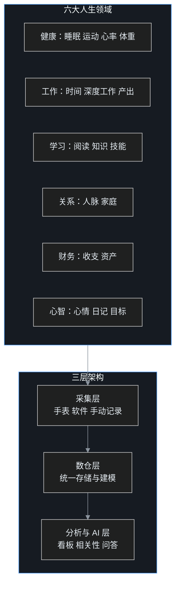

前面三篇调研，叶扬先后看了家庭操作系统、家庭数据清单、孩子从小学到大学的成长数仓。调研到这里，他把镜头转了回来，对准了最熟悉的对象：他自己。

一个成年人的生活同样分成好几块：身体和健康、本职工作、学习成长、家庭关系、财务、情绪与心境。每一块都在产生数据，但这些数据散落在手表厂商、时间记录 App、日记本、银行和脑子里。到了年底想认真回答「我这一年到底过得怎么样」，手里一个能看的东西都没有，只能写一篇凭感觉的年终总结。

他想搞清楚三件事：个人成长各领域有哪些值得记录的数据？GitHub 上有没有成熟的软件和人生数据仓库方案？以及，作为一个做内容的人，这个方向能挖出哪些选题？

又一个晚上的调研，这篇是完整笔记。

## 一、先说结论

1. **单点采集工具已经非常成熟**，时间、习惯、体重、手环、任务、阅读、心情，每一个领域都有开源且数据自有的项目，零成本就能开始。
2. **把所有数据整合到一起的「人生数据仓库」在 2025 到 2026 年集中出现，而且分出了三条清晰的技术路线**：全栈应用派、现代数据栈派、纯文本加 AI Agent 派。没有赢家，但范式已经定型。
3. **人生数据最独特的价值不是单点看板，而是跨领域相关性**：睡够八小时是不是真的写代码更快，运动多了心情是不是真的好。这种问题只有把数据放在一张表里才算得出来，也恰好是数据工程师的本行。
4. 对做内容的人来说，这是一座远未被开采的选题矿，「用数据观察自己一年」这个母题可以长出一整个系列。

## 二、一张全景图：六大领域，三层结构



记住这三层，后面所有项目都能放进对应位置。

## 三、采集层：每个领域都有成熟工具

叶扬按领域把单点工具过了一遍，这是零门槛、今天就能开始的一层。

### 3.1 时间与工作：ActivityWatch

ActivityWatch 有 1.9 万 star，是最好的开源自动时间追踪器。它在后台自动记录你在每个应用、每个窗口、每个网页上花了多少时间，跨平台、可扩展、注重隐私，数据存在本地。生态还包括浏览器记录器（564 star）、键鼠活跃度记录器（170 star）、安卓端和 Rust 版高性能服务器。

它解决的是一个朴素问题：一天下来以为自己忙了很久，到底时间花在了哪，数据说了算。

### 3.2 健康：手环、体重、习惯

| 项目 | star | 管什么 |
|---|---|---|
| Gadgetbridge | 4600+ | 把各种手环手表的数据抓进手机本地，不经过厂商云端，主仓库在 Codeberg |
| openScale | 2554 | 蓝牙体重秤，记录体重和各项身体指标 |
| Loop Habit Tracker | 1 万 | 长期习惯养成，纯本地，用走势图而不是打卡积分衡量习惯 |
| HealthWallet.me | 70 | 开源的患者自主健康档案，端上 AI，聚合各处医疗数据 |

### 3.3 任务、学习与财务

- Vikunja（5494 star）：你真正拥有的任务管理器
- Super Productivity（2.2 万 star）：高级待办应用，内置时间盒和时间追踪
- Actual Budget：本地优先的个人财务软件，社区有人用 AI 自动给交易分类
- Khoj（3.7 万 star）：可自托管的 AI 第二大脑，能从你的文档和网页里找答案

这些工具的共同优点是数据自有、可导出、开放格式；共同缺点是各管一摊，互不通气。这就引出了下一层。

## 四、数仓层：三条已经定型的技术路线

这是调研的重头戏。想把六大领域数据整合到一起的人，在 2025 到 2026 年走出了三条截然不同的路。

### 4.1 路线一：全栈应用派，Sycamore

`jiumigu/sycamore` 是一个覆盖人生七大维度的私人管理系统：时间感知、目标达成、财富管理、关系维护、健康追踪、知识沉淀、自我认知。后端 Django 加 DRF，前端 Vue 3 加 ECharts，MySQL 存储，Docker 一键部署。

它最值得看的是后端结构，Django App 直接按人生维度划分：

```
apps/
├── temporal/   # 时间感知：日记、时间统计、活动追踪
├── health/     # 健康管理
├── wealth/     # 财务：收支热力图、月度日历
├── relation/   # 关系：能量分、关系质量诊断
├── goals/      # 目标：Goal 到 Milestone 到 Action 三级
├── book/       # 书籍阅读
├── travel/     # 旅行
├── dams/       # 数字资产管理
├── inbox/      # 收件箱：大脑的缓冲区
└── summary/    # 跨模块进度聚合
```

叶扬特别欣赏两个设计。一个是 `inbox` 收件箱，任何想法先随手丢进去，再分流到目标或行动，这正是 GTD 的核心，给大脑留缓冲区。另一个是 `summary` 跨模块聚合，它不是让你逐个 App 去翻，而是自动把各维度进度汇总成一张图。

这条路线的优点是开箱即用、界面完整；代价是传统全栈架构，数据锁在自己搭的系统里，分析自由度一般。

### 4.2 路线二：现代数据栈派，Obsidian Insights

`mattiasthalen/obsidian-insights` 走的是数据工程师看了会会心一笑的路线。它用三件现代工具搭个人数据平台：dlt 负责抽取装载，SQLMesh 负责转换，DuckDB 或 MotherDuck 作为仓库，GitHub Actions 做每日定时 ELT。

分层是标准的 bronze、silver、gold：bronze 存原始快照，silver 按 Hook 模型组织，gold 层建成统一星型模型。它还把传统的桥表改造成事件桥，让所有度量可以堆叠在同一张图、共用一个日期维度。

quickstart 体现了这套栈的轻：

```bash
pip install uv && uv sync
# .env 里 gateway=duckdb，duckdb_path=your_db.duckdb
bash init_warehouse.sh
bash elt.sh        # 想刷新数据时随时跑
```

作者对「什么叫度量」有一个很严谨的定义，叶扬认为值得所有自建者记住：度量是一个原始的、可量化的值，必须带一个时间锚点，指明它对应的确切时间点或时间段。一个度量如果没有日期，就不该进仓库。

这条路线分析能力最强、最接近公司数据平台，但需要使用者懂数据工程。这也是叶扬自己最倾向的形态。

### 4.3 路线三：纯文本加 Agent 派，LifeOS-OSS

`kcwoodfield/LifeOS-OSS` 的定位最有野心：它不认为自己是生产力工具，而是「未来四十年人生的基础设施」。整个系统建在纯文本 Markdown 上，为人类和 AI 的长期协作设计。

它的结构几乎是叶扬当前 vault 的强化版：

```
LifeOS/
├── CLAUDE.md              # Claude Code 的系统指南
├── _inbox_.md             # 快速捕获，主入口
├── databases/             # 结构化数据
│   ├── tasks/             # 所有任务，单一事实来源
│   ├── expenses/          # 每月账单和定期支出
│   ├── books/             # 阅读清单
│   ├── meetings/          # 会议记录
│   ├── cabinet/           # 内阁会议记录
│   └── journal/           # 每日日记
└── .system/agents/        # 14 个专门的 AI 角色，组成「内阁」
```

它的核心哲学有五条：把 Markdown 当基础设施（可版本管理、永不过时），AI 原生设计，上下文互联不留孤岛，基于专门的 AI Agent 分工，用系统而非意志力做决策。查询和仪表盘靠 Obsidian 的 Dataview 插件动态生成。

「内阁」这个设计是它最大的特色：14 个 AI 角色各管一个领域，需要财务意见就请出财务角色，需要健康判断就请出健康角色，像给自己配了一个私人智囊团。

### 4.4 三条路线怎么选

| 路线 | 代表 | 适合谁 | 对叶扬 |
|---|---|---|---|
| 全栈应用 | Sycamore | 想要现成界面的普通用户 | 可参考它的维度划分 |
| 现代数据栈 | obsidian-insights | 懂工程、重分析 | 最契合本行 |
| 纯文本加 Agent | LifeOS-OSS | 深度 Obsidian 加 Claude Code 用户 | 与现有玩法一致 |

他的判断是：自己的 vault 已经是路线三，只需要补上路线二的数据建模能力，用 DuckDB 在 vault 背后建一层分析底座，两者合体就是最适合自己的形态。

## 五、最有价值的一层：跨领域相关性

如果说前面所有项目都还能在商业产品里找到影子，那这一节是人生数据仓库独有的、商业产品绝不会做的部分。

### 5.1 LifeGraph：把人生当数据集来分析

`Evermaple/life-graph` 的口号是「像开发者一样量化你的人生」。它自动收集 Garmin 数据、GitHub 活动、心情、深度工作和睡眠，全部进 SQLite，再自动生成跨领域的关联分析。

它生成的洞察清单本身就是最好的示范：

- 睡眠对编码生产力
- 步数对心情
- GitHub 提交对睡眠
- 深度工作对心情

它让你能回答的不是「我这周走了多少步」，而是「睡够八小时，我是不是真的写代码更快」「多运动，心情是不是真的变好」「多走路，生产力是不是真的提高」。架构是 FastAPI 后端加 Telegram 机器人记录，不依赖 Grafana，自带图表。

### 5.2 为什么跨域分析是数据工程师的主场

叶扬把这件事的逻辑拆得很清楚。单个 App 只能看到自己那一类数据，手环厂商不知道你的工作产出，时间追踪软件不知道你的睡眠。要回答「睡眠怎样影响工作」，必须先把两边的数据各自抽取、对齐到同一天、再算相关性。

这正是标准的数据工程流程：多源采集、按日期对齐、建模、统计分析。对普通人是无从下手，对他是写过无数遍的套路。而人生数据仓库真正的回报也在这里，它让那些流传了很多年、其实从未被自己验证过的说法，第一次有了个人化的答案。

## 六、AI 层：从看仪表盘到直接发问

2026 年出现的新变化，是数据消费方式从看板变成了对话。

### 6.1 Quantified Self MCP

`Thecimal/quantified-self-mcp` 是一个本地优先的 MCP 服务器，给 AI 代理提供个人健康数据的结构化接口，数据在本地 SQLite。它明确说自己的目标不是再造一个健康仪表盘，而是做「你的健康史和 AI 之间值得信任的接口」。

接上之后可以直接问：我的 HRV 最近为什么变了？过去三十天睡眠有什么变化？运动量增加后静息心率怎么样了？这个月哪些指标变化最大？AI 通过 MCP 取回相关数据再分析。

它在设计上有两个点让叶扬看重。一是证据与溯源内置，每个结论背后能追到原始数据，而不是 AI 凭空说。二是全本地链路可行：健康数据到本地 SQLite，到 MCP，到本地大模型，全程不出机器；用云端模型时它也明确告诉你哪些数据会被发出去。

### 6.2 目标与复盘层

- AnandChowdhary/okrs（50 star）：把个人 OKR 直接放在 GitHub 仓库里追踪
- SoloOKRs：专门给一人公司创始人设计的精简 OKR
- annual-review：个人年度复盘和目标进度记录

把目标系统和数据仓库连起来，年终复盘就从「凭感觉写」变成「对着数据写」：年初定的关键结果，仓库里自动算出完成度。

## 七、给内容创作者：这是一张选题地图

调研到这里，叶扬切换到内容视角。他意识到这个方向不只是自用工具，更是一座选题富矿，因为它同时踩中他的三条主线：AI、数据、普通人可复制的方法。

他把能挖的选题按母题列成一张图。

### 7.1 工具实操类

1. 我用 ActivityWatch 记录了一个月的电脑时间，结果有点扎心
2. 手环数据不想给厂商？Gadgetbridge 把健康数据还给你
3. 普通人的第一个人生数据仓库：DuckDB 加 dlt，周末就能搭好
4. 年终别再凭感觉写总结，用数据给自己出一份年报

### 7.2 跨域洞察类

5. 睡够八小时真的能提高工作效率吗，我用自己的数据算了算
6. 运动、睡眠、心情、产出，我的四个指标是怎么互相影响的
7. 我把一年的生活当成一个数据集，发现了三件反直觉的事

### 7.3 系列连载类

8. 「数据观察自己一整年」系列：每月一篇，记录身体、工作、学习、情绪的变化
9. 「给人生建中台」系列：从家庭财务到健康到孩子成长，逐篇搭
10. AI 个人分析师系列：接上 MCP，让 AI 每月给我出一份人生月报

### 7.4 为什么这个选题方向成立

叶扬给自己总结了三条理由。第一，真实数据驱动，所有结论来自自己的记录，脚本可复核，符合他一贯的工程纪律，也天然去 AI 味。第二，有持续的时间纵深，这个系列可以写很多年，数据越积越厚，复利明显。第三，卡位精准，市面上讲自我提升的多是讲心法和习惯，很少有人用数据工程的方法做个人成长，这是他独有的工程师视角。

## 八、人生数仓的设计建议

如果动手，叶扬打算沿用最省力的组合：Markdown vault 存原始记录，DuckDB 做分析底座，dbt 或 SQLMesh 建模，MCP 加 AI 做问答。

数据模型遵循一个核心：一切事实带日期。事实表按六类组织，健康、工作、学习、关系、财务、心智，每条记录都对齐到某一天；维度只保留日期、领域和具体项目。这样跨领域相关性就是一句简单的按日期连接。

节奏上他建议三个固定动作：日记或心情随手记，每周一次汇总，每年一次年度画像和复盘。数据不靠意志力硬攒，而是靠固定的最小动作自然累积。

## 九、边界和警惕

1. **警惕数据拜物教。** 记录是为了更好地决策和生活，不是为了把人生变成考核。能被量化的东西有限，幸福感、意义感、关系的深浅，装进表格就会失真。
2. **相关性不是因果。** 睡眠和产出相关不等于睡得多就一定产出高，可能还有第三个因素。数据给的是线索和验证，不是判决。
3. **健康数据要保护。** 健康、财务、日记都是高敏感数据，全程本地加密，不进公开仓库和外部托管；任何备份先验证能恢复。
4. **别在工具上拖延。** 这类项目最大的陷阱是不停换工具、调系统，却迟迟不开始记录。先用最简单的方式攒数据，工具以后随时能换，没攒下来的时间补不回来。

## 十、这一系列调研的总判断

从家庭操作系统、家庭数据清单、孩子成长数仓，到这篇个人人生数据仓库，叶扬最后把四篇收成一句话：

**无论一个家庭还是一个人，本质上都在产生数据资产，机构不会替你管，商业公司管不长久，最可靠的方式是自己建。** 而这套东西真正的门槛不是软件，是懂数据建模、愿意把自己的生活长期如实记录下来。这恰好是数据工程师最顺手、也最稀缺的位置。

## 参考链接

- ActivityWatch：https://github.com/ActivityWatch/activitywatch
- Gadgetbridge：https://github.com/Freeyourgadget/Gadgetbridge （主仓库在 Codeberg）
- openScale：https://github.com/oliexdev/openScale
- Loop Habit Tracker：https://github.com/iSoron/uhabits
- Vikunja：https://github.com/go-vikunja/vikunja
- Super Productivity：https://github.com/super-productivity/super-productivity
- Sycamore 人生管理系统：https://github.com/jiumigu/sycamore
- Obsidian Insights：https://github.com/mattiasthalen/obsidian-insights
- LifeOS-OSS：https://github.com/kcwoodfield/LifeOS-OSS
- LifeGraph：https://github.com/Evermaple/life-graph
- Open Everything App：https://github.com/ChrisQGeorge/Open-Everything-App
- Quantified Self MCP：https://github.com/Thecimal/quantified-self-mcp
- HealthWallet：https://github.com/LifeValue/HealthWallet.me
- 个人 OKR：https://github.com/AnandChowdhary/okrs
- Khoj 第二大脑：https://github.com/khoj-ai/khoj
- BlazorData 个人数仓：https://github.com/BlazorData-Net/PersonalDataWarehouse
- Oura 戒指 ETL：https://github.com/stevenschmatz/oura-ring-api-etl
- 相关调研：家庭操作系统、家庭数据清单、孩子上学成长数仓（见草稿目录）
