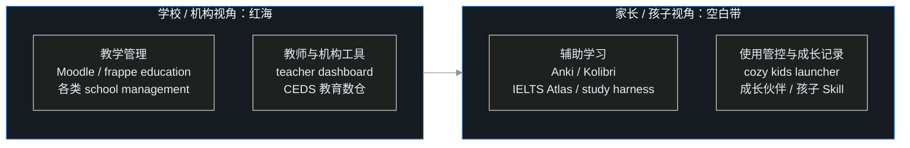
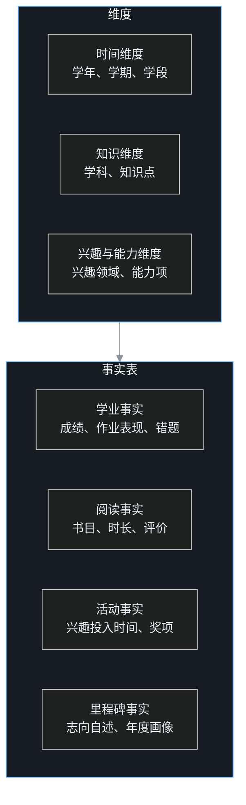

家里一旦有小朋友上学，家长很快会陷入一种熟悉的混乱。作业发在家长群和各种打卡小程序里，试卷考完拿回来一堆，老师通知要反复确认别漏看，课外阅读要统计，老师布置的背诵要签字。一学期下来，孩子到底学了什么、哪里弱、哪类题反复错，全凭家长脑子里那点模糊印象。

再往远想一步，问题更大。孩子今年喜欢画画，明年喜欢机器人，这些变化没人记；数学时好时坏，弱在哪几个知识点说不清；等到了初中文理分流、高中选科、高考填志愿这种真正影响一生的关口，家长手里一个能参考的数据都没有，只能拍脑袋或者听别人一句话。

叶扬想搞清楚两件事：围绕孩子上学，GitHub 上有没有值得一个家庭用的系统？以及，从小学到大学这十几年，学习、兴趣、志向和培养方向，值不值得自己开发一套系统，结合数据仓库来记录和分析？

他花了两个晚上做调研，这篇是完整笔记。

## 一、先说结论

三句话：

1. **学校和老师视角的系统已经挤成红海，家长和单个孩子视角的系统几乎是空白。**
2. **「从学前到大学到就业」的纵向教育数据仓库，国家级标准已经存在（美国 CEDS），但它服务的是政府和学区，不是家庭；国内同类东西全在商业公司手里，数据不是你的。**
3. **对普通家庭没必要从零造一个软件产品，但对叶扬这种懂数仓的家长，给自己孩子建一个轻量成长数据仓库，既可行，又有不可替代的价值。** 它不是一个提分工具，而是一份十几年的成长底账，和在关键节点做决策的依据。

## 二、调研方法

用 `gh api` 调 GitHub 仓库搜索，按 star 排序，中英文关键词轮着来：

```bash
gh api "search/repositories?q=kids+math+practice&sort=stars"
gh api "search/repositories?q=错题本+in:name"
gh api "search/repositories?q=education+data+warehouse&sort=stars"
gh api "search/repositories?q=child+development+tracker+longitudinal&sort=stars"
gh api "search/repositories?q=成长档案+孩子&sort=stars"
```

每组结果取前七个，再逐个抓 README 和顶层目录细看。判断标准有两个：这套东西是谁的视角，以及它管不管多年的纵向数据。

## 三、全景图：两个维度，四个象限



下面按象限拆，先讲现状，再讲最重头的纵向数仓。

## 四、学校视角：拥挤的红海

### 4.1 学校管理系统，多到同质化

搜索 school management system，翻几页都翻不完：Django 版、Laravel 版、MERN 版、JavaFX 桌面版，功能大同小异，学生档案、排课、考勤、成绩、缴费。相对正规的是 `frappe/education`，基于 Frappe 框架的开源教育管理系统，645 star。

这类项目有两个共同特点：一是大量是编程培训班学员的毕业作品，代码质量参差；二是它们的用户是学校行政人员和老师，不是家长，功能再全也帮不上一个普通家庭。

### 4.2 Moodle：学校级学习平台，家庭用太重

Moodle 是全球最大的开源学习平台，7400 多 star，课程、测验、作业、论坛一应俱全。但它为学校和培训机构设计，部署维护对一个家庭来说太重，相当于为了送孩子上学自己修了一所学校。

### 4.3 老师的小工具箱

也有人站在老师角度做轻量工具，比如 `mihozip/teacher-daily-dashboard`，用 Google Sheets 加 Apps Script 管理每日任务、作业追踪、学生记录和课堂看板。思路轻巧，但服务的还是讲台那一端。

## 五、家庭视角·学习：真正有价值的少数项目

### 5.1 Anki：唯一成熟到可以全家直接用的工具

Anki 有 3.1 万 star，是间隔重复记忆卡片的事实标准。它背后是科学的遗忘曲线，在你快忘掉的时候安排复习，用最少的时间把知识长期记住。孩子背单词、背古诗、记公式都适用，全平台免费，数据是本地卡片库。

围绕它已经长出完整生态：Obsidian 里有 2500 多 star 的间隔重复插件，还有人做了 489 star 的 Anki MCP 服务器，让 AI 可以直接操作卡片库。叶扬认为最后这个组合特别值得关注，因为它意味着「错题自动变卡片」技术上已经拼齐了一半。

### 5.2 IELTS Atlas：一个人能把备考系统做到什么程度

最让叶扬意外的项目是 `sallowayma-git/IELTS-practice`，1600 多 star。虽然做的是雅思备考，但它的完整度对所有个人学习系统都有参考价值。

它是一个纯前端系统，数据默认存在浏览器本地，双击 index.html 就能用，不依赖后端。功能几乎覆盖学习全过程：题库浏览检索、套题练习、练习记录、成绩统计、错题分析、数据备份导入导出、词汇辅助，外加成就系统。题库索引不靠手写维护，由脚本扫描题库目录自动生成。

项目维护着三个分支，这个路线图本身就值得抄：

| 分支 | 面向场景 | 技术形态 |
|---|---|---|
| main | 静态网页版，几乎所有设备兼容 | 纯前端 |
| multi-device 分支 | 多设备数据同步 | Node.js 服务器版 |
| AI 分支 | 写作评分、阅读教练等 AI 协作 | AI Agent |

README 里还有一段郑重声明：项目可以自己部署、个人使用，但不要把带题源的站点公开分发，更不能拿去卖付费社群，因为题源有第三方版权。作者把「自己用」和「传播」的边界划得非常清楚。

### 5.3 study-harness：用评估模型的方式评估孩子有没有学会

另一个思路清奇的项目叫 learn（仓库 study-harness）。核心主张是：像评估机器学习模型一样评估一个人是不是真的学会了。

用法是把一份课程大纲写成 YAML，每条「学完之后你应该能做什么」都变成一次打字自测。答题前先拖滑块说自己有几成把握，然后关掉粘贴和自动补全，凭记忆作答并冻结答案，参考答案这时才显示，自己对照打分。

它最有价值的设计是**置信度校准**：你说自己有九成把握，实际只答对六成，这种偏差会被记录下来，而这恰恰是学生最危险的状态，以为自己懂了。答错的内容会在第 2、7、21、60 天重新出现。所有记录都是 Markdown 和 YAML，存在你自己的 git 仓库里，没有打卡、没有积分、没有徽章。

### 5.4 Kolibri：为没有网络的地方造的离线学校

Kolibri 有 1100 多 star，是离线学习平台，初衷是给网络条件差的地区提供完整课程库，内容打包后本地运行。对家庭来说，它的意义是孩子用平板学习时不必依赖外网和各种在线账号，内容可控。

## 六、家庭视角·管控：2025 年开始的新一波小项目

这一类解决的是「怎么管孩子用电脑」，项目都非常年轻，但方向感很强。

### 6.1 Cozy Kids Launcher：旧笔记本变孩子学习机

`cozy-kids-launcher` 的口号很打动人：把一台旧 Linux 笔记本变成对孩子友好的学习和媒体电脑，同时不夺走家长自己的桌面。

它是本地优先的全屏启动器，大磁贴、多页面，支持多个孩子的独立档案，每个孩子有自己的收藏、最近使用和播放进度。家长侧有 PIN 码、屏幕时间定时器、按周和按应用的使用计划、时间用完前的提醒和锁定界面。quickstart 一行脚本：

```bash
curl -fsSL https://raw.githubusercontent.com/TrissyGE/cozy-kids-launcher/main/scripts/install.sh | bash
```

技术栈非常朴素：Python、HTML、CSS、JavaScript 和 shell，没有框架构建步骤。更新机制是 GitHub Release 不可变安装包，SHA-256 校验、防降级、支持回滚。一个 10 star 的项目在工程纪律上做到这个程度，比很多千 star 项目都规范。

### 6.2 Omarchy Kids Mode：每个孩子一个真实账户

`omarchy-kids-mode` 走得更底层。家长保留自己的账户和完整桌面，每个孩子在系统里拥有一个真实的独立账户，屏幕时间账本由 root 持有，浏览器策略由家长掌握，再加上登录门户和家长面板。

这个项目最难得的是诚实。README 明确区分什么是提醒、什么是围栏：熄灯时间到了会弹出全屏覆盖层，但对会用终端的大孩子一条命令就能关掉，所以在机制移进 root 账本之前，睡觉时间只能算劝导。它给自己定的规矩也值得记下：不收集任何关于孩子的数据，任何东西都不离开这台机器，孩子能绕过的管控算漏洞。

## 七、重头戏：从小学到大学的纵向成长记录，别人做到哪了

这一节回答最初那个更大的问题：有没有系统能横跨十几年，记录一个孩子的学习、兴趣、志向和培养方向？

### 7.1 CEDS：国家级的「学前到就业」纵向数据仓库

调研中最大的发现是美国的 CEDS，Common Education Data Standards，Common Education Data Standards，即通用教育数据标准。其中 `CEDS-Data-Warehouse` 项目只有 34 star，但它的官方定位一句话就回答了问题：为 **P-20W** 数据的纵向存储和报表而设计。

P-20W 是 Preschool through age 20 and Workforce 的缩写，意思是从学前教育、中小学、大学一直管到进入职场。它采用星型模型的数据仓库规范化技术来优化查询性能，跑在 SQL Server 上，当前版本 V14.1，Apache 2.0 协议。安装方式是执行仓库里的建库 DDL 脚本，再灌入维度表的标准选项值。

CEDS 不是一个孤立项目，而是一整套标准家族：

| 项目 | 角色 |
|---|---|
| CEDS Elements | 统一数据词汇表：标准元素名、定义、选项集，覆盖所有教育利益相关方 |
| CEDS Data Warehouse | 纵向星型数仓，面向报表 |
| CEDS Integrated Data Store | 集成数据存储，面向事务 |
| CEDS Ontology | 本体，描述数据之间的语义关系 |
| CEDS DW Parquet | 数仓的 Parquet 版本，面向现代数据湖 |

它给叶扬的启发有三点。第一，「一个人十几年的教育数据用星型模型存」不是设想，是被官方反复实施的成熟做法。第二，它有一个可以直接参考的统一词汇表，学科、年级、成绩、出勤、课程、评估结果怎么命名，不用自己闭门造。第三，也是最现实的一点：**CEDS 是给州政府和学区用的，一个家庭不可能也没必要去部署 SQL Server 上那一整套东西，但可以借鉴它的模型，做一个单机缩小版。**

### 7.2 IntelliBoard 和小型教育数仓：机构视角的数据分析

学习分析方向，`intelliboard` 提供面向教育社区的分析和报表服务。GitHub 上还能搜到几个个人项目：把多来源学生数据集成进 PostgreSQL 的 education-analytics，以及用 MySQL、Python ETL 加 Streamlit 的教育中心数仓。它们体量都很小，但验证了「教育数据 + 数仓 + 看板」这条链在个人项目里的可行性。

### 7.3 成长伙伴：中文世界里最完整的三端成长平台

中文项目里，`Origin2049/LearnGuide-Mate`（内部名「成长伙伴」）完成度最高，虽然它目前只面向 8 到 9 岁儿童。它提供学生端、家长端、教师端三侧：

| 端 | 平台 | 核心功能 |
|---|---|---|
| 教师端 | React Web | 班级驾驶舱、作业批改、学情可视化、AI 备课、关怀预警 |
| 家长端 | 微信小程序 | 孩子成长周报、AI 育儿问答、家庭约定、学习动态 |
| 学生端 | Flutter App | AI 学伴对话、错题练习、任务卡、成就徽章、心情记录 |

后端是 FastAPI 加 PostgreSQL 16 加 pgvector，Celery 负责异步和定时任务，Docker Compose 一键起。它甚至配了 Prometheus 和 Grafana，LLM 网关做多模型主备切换和成本追踪，日志里做敏感信息脱敏。

叶扬对它的评价是：工程上像一个小型商业产品，把「成长记录」做成了学校和家庭之间的桥。但它有两个边界：一是年龄只覆盖小学低年级，二是它仍然是机构和学校驱动的系统，孩子的数据最终在平台和学校手里。

### 7.4 把孩子装进 AI：两个更个人化的尝试

`aituli/primary-schooler-skill` 的思路最大胆：上传孩子的作业、试卷、聊天记录，生成一个能「像孩子一样思考」的 AI Skill。它由两部分组成，Ability Skill 描述学习能力、解题思路和知识盲区，Persona 描述性格特点、情绪模式和表达方式。持续追加新材料，这个 Skill 会跟着孩子一起「成长」。

叶扬认为这个方向和他的「个人自传 + 风格样本库」是同一个逻辑：先让 AI 认识一个人，再谈辅助。但它也带来一个必须正视的问题，把一个孩子的完整行为模型数字化，隐私和伦理分量比成人数据重得多，这种东西只能完全自建私有，绝不能托管给外部。

另一个 18 star 的小项目 `oldratlee/lifelong-learning` 做的是成人自己的终身学习记录：结构化地记录知识结构以发现短板，非结构化地记录学习日志以聚焦当下。思路朴素，但恰好补上了「孩子长大之后谁来继续记录」这个问题：系统的终点应该是孩子接管它，从家长记录过渡到自我记录。

## 八、有没有必要自己开发：叶扬的判断

这是调研的核心问题，他的结论分两层。

### 8.1 没有必要开发一个「软件产品」

理由很实在：

1. 教育系统是机构的刚需，所以红海，但家庭成长记录不是大众付费市场，个人做产品没有用户
2. 商业成长类 App 已经很多，拍照打卡、成长手册、学情报告都有，重复造轮子没有意义
3. 单人维护一个产品十几年不现实，连商业公司的产品都活不了那么久

### 8.2 非常有必要建一个「自家孩子的数据仓库」

注意措辞，不是开发软件，而是建系统。他列了五个理由：

1. **时间跨度问题，没有商业产品配得上。** 从 6 岁到 22 岁是 16 年，任何 App 都可能停服、改版、收费。只有数据以 Markdown、CSV、Parquet 这类开放格式存在自己手里，才真正能放 16 年。
2. **数据归属问题。** 孩子的成绩、作品、心理和成长数据极度敏感，存在商业平台上等于把一个人最脆弱的阶段交给别人。CEDS 是政府的，成长伙伴是学校的，只有自建的是自己的。
3. **商业产品只服务提分，不回答培养方向。** 「兴趣投入时间的分布与漂移」「跨年度的能力变化」「志向是怎么一步步形成的」，这些没有任何商业 App 会做，因为它们不直接提分。
4. **关键时刻需要依据，而不是运气。** 文理分科、选科、选专业、判断孩子适不适合走某条路，这些决策一旦做错成本极高。有一份十几年的纵向数据，决策质量完全不同。
5. **这件事对别人是天书，对他是本行。** 数据建模、ETL、分析正是他的专业，周末项目的工作量，产出却是自己孩子的成长底账。

## 九、如果动手：成长数仓的设计草图

他把系统的形态想得很清楚：不追求界面，先追求模型。

### 9.1 技术栈

- 存储：单机 DuckDB（一个文件，零运维，SQL 齐全），原始材料用 Markdown 和照片文件保存
- 建模：dbt-duckdb，分层从 staging 到 marts
- 采集：手工录入加小脚本，试卷和成绩定期批量导入
- 展示：一个简单网页看板即可，自用不对外，部署在本地

### 9.2 数据模型：三个维度群，一组事实表



维度包括：时间（学年、学期、学段，学段即小学、初中、高中、大学）、学科与知识点、兴趣领域、能力项、学校与教师。

事实表按四类组织：学业事实记录成绩、作业表现和错题，阅读事实记录书目、时长和评价，活动事实记录各类兴趣的投入时间和奖项，里程碑事实每年至少一条，记录孩子当年的志向自述和家长的年度观察画像。

志向和培养方向这样落地：**每年固定一次「年度画像」**，孩子自己回答三个问题：今年最喜欢什么，以后想做什么，觉得自己哪里最厉害。家长另写一份观察。连续记录十几年，就能看到一个人的兴趣和志向是怎么漂移和收敛的，这是任何一次性测评都给不了的东西。

### 9.3 分析场景

1. 学业：知识点掌握趋势，错题按知识点聚类，回答「到底弱在哪」而不是「数学不好」
2. 兴趣：各类活动投入时间的年度分布与变化，画出兴趣漂移图
3. 能力：跨年度能力雷达，看长期走向而不是单期起伏
4. 决策：在选科和选专业节点，把历史数据汇总成一页报告，辅助而不是替代判断

## 十、边界：哪些事情绝不能做

叶扬给自己留了几条红线，他说这部分比技术设计更重要。

1. **不量化一切。** 不是所有成长都能进表，性格、情感、人际关系不该被打分，硬量化只会失真。
2. **数据是参考，不是判决。** 趋势图说明概率，不说明命运，一次兴趣漂移不等于孩子没常性，一个知识点连续薄弱不等于孩子笨。
3. **不给孩子贴标签，尤其不能让孩子看到自己被数据定义。** 系统是家长的辅助工具，不是悬在孩子头上的考核板。
4. **孩子大了要交权。** 成长数据的所有权属于孩子，进入中学后应逐步让孩子知情并参与，最终由孩子接管，这也呼应 lifelong-learning 那种自我记录的形态。
5. **安全底线不变：** 全库私有加密，不进公开仓库，不使用外部托管服务；任何备份先验证能恢复再填真实数据。

## 十一、空白点汇总

把所有项目摊开，缺口非常具体：

1. 没有家长视角的整合系统，作业在群里、试卷在抽屉、错题在孩子脑子里
2. 中文场景没有像样的开源错题本，商业 App 的数据锁在平台上
3. **横跨小学到大学的家庭级成长档案完全空白**，机构级的 CEDS 在天上，商业成长 App 在地上且只管几年
4. 兴趣、志向这种长期慢变量，全世界都没有好的记录工具，因为它不产生即时商业价值
5. Anki 管记忆，CEDS 管报表，两者之间缺一座面向家庭的桥

而 AI 时代恰好让补桥的成本变得很低：试卷拍照识别错题，按知识点归档，自动生成 Anki 卡片，每年自动汇总成长报告。每块拼图都有了。

## 十二、动手计划

叶扬给自己排了一条不贪大的路径，先服务自己家：

1. 近期：Anki 用起来，给孩子建单词和古诗卡片库，零成本立刻见效
2. 一学期内：在 vault 里建错题目录，试卷拍照加文字按学科和知识点归档，手工跑通分类逻辑
3. 一年内：搭好 DuckDB 成长数仓的最小版本，录入学业和阅读数据，完成第一次「年度画像」
4. 持续：每学期灌数据、每年一张画像；攒够数据后再做看板和自动制卡
5. 按需：旧笔记本装 Cozy Kids Launcher，给孩子一个干净可控的学习机环境

每一步先解决真问题，再考虑通用化。他对这件事的最终判断是：**孩子的成长数据，和家庭财务、健康数据一样，本质是家庭数据资产，机构不会替你管，商业公司管不长久，只能自己建。** 而这套东西真正的回报，要到十几年后那个关键决策时刻才会兑现。

## 参考链接

- CEDS 数据仓库：https://github.com/CEDStandards/CEDS-Data-Warehouse
- CEDS 元素词汇表：https://github.com/CEDStandards/CEDS-Elements
- CEDS Parquet 数仓：https://github.com/CEDStandards/CEDS-Data-Warehouse-Parquet
- IntelliBoard：https://github.com/intelliboard/intelliboard
- 成长伙伴：https://github.com/Origin2049/LearnGuide-Mate
- 小学生 Skill：https://github.com/aituli/primary-schooler-skill
- lifelong-learning：https://github.com/oldratlee/lifelong-learning
- Anki：https://github.com/ankitects/anki
- Anki MCP 服务器：https://github.com/ankimcp/anki-mcp-server
- Obsidian 间隔重复：https://github.com/st3v3nmw/obsidian-spaced-repetition
- IELTS Atlas：https://github.com/sallowayma-git/IELTS-practice
- study-harness：https://github.com/Ihjas-tk/study-harness
- Kolibri：https://github.com/learningequality/kolibri
- Cozy Kids Launcher：https://github.com/TrissyGE/cozy-kids-launcher
- Omarchy Kids Mode：https://github.com/markcuda/omarchy-kids-mode
- homework-hero：https://github.com/CareyH554400/homework-hero
- frappe education：https://github.com/frappe/education
- Moodle：https://github.com/moodle/moodle
- 相关调研：家庭操作系统、家庭数据清单（见草稿目录）
