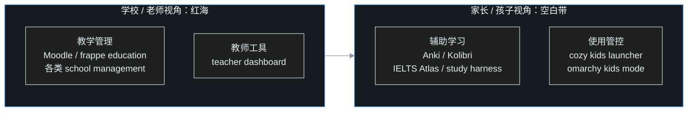

家里一旦有小朋友上学，家长很快会陷入一种熟悉的混乱。作业发在家长群和各种打卡小程序里，试卷考完拿回来一堆，老师通知要反复确认别漏看，课外阅读要统计，老师布置的背诵要签字。一学期下来，孩子到底学了什么、哪里弱、哪类题反复错，全凭家长脑子里那点模糊印象。

叶扬想搞清楚一个问题：公司里员工培训有学习平台，销售有客户系统，那一个家庭能不能也有一套围绕「孩子上学」的系统？GitHub 上有没有人已经做出来了？

他花了一个晚上做调研，这篇是完整笔记。

## 一、先说结论

**孩子上学这个场景，学校和老师视角的系统已经挤成红海，但家长和单个孩子视角的系统几乎是空白。**

目前真正能让一个家庭直接用起来的成熟工具，只有记忆卡片类的 Anki。2025 年开始，围绕孩子使用电脑的儿童模式和家长控制方向冒出一批极早期的新项目，但都还是个位数 star。而家长最想要的那几样：作业、错题、成绩趋势、阅读记录、成长档案的整合系统，基本没人做。

## 二、调研方法

还是老办法，用 `gh api` 调 GitHub 的仓库搜索，按 star 排序，关键词中英轮着来：

```bash
gh api "search/repositories?q=kids+math+practice&sort=stars"
gh api "search/repositories?q=错题本+in:name"
gh api "search/repositories?q=kids+launcher+linux&sort=stars"
gh api "search/repositories?q=student+progress+parent&sort=stars"
```

每组结果取前七个，再逐个抓 README 和顶层目录细看。判断标准是：这套东西到底是给学校用的，还是给一个家长管自己孩子用的。

## 三、一张全景图：两个维度，四个象限

把搜到的项目按「谁的视角」和「管什么」摆开，格局立刻清楚了。



左上的学校视角项目多到看不完，右下的家庭视角寥寥无几。下面按象限拆。

## 四、学校视角：拥挤的红海

### 4.1 学校管理系统，多到同质化

搜索 "school management system"，翻几页都翻不完：Django 版、Laravel 版、MERN 版、JavaFX 桌面版，功能大同小异，学生档案、排课、考勤、成绩、缴费。其中相对正规的是 `frappe/education`，基于 Frappe 框架的开源教育管理系统，645 star。

这类项目有两个共同特点：一是大量是编程培训班学员的毕业作品，代码质量参差；二是它们的用户是学校行政人员和老师，不是家长，功能再全也帮不上一个普通家庭。

### 4.2 Moodle：学校级学习平台，家庭用太重

Moodle 是全球最大的开源学习平台，7400 多 star，课程、测验、作业、论坛一应俱全。但它是为学校和培训机构设计的，部署和维护对一个家庭来说太重，相当于为了送孩子上学自己修了一所学校。

### 4.3 老师的小工具箱

也有人站在老师角度做轻量工具，比如 `mihozip/teacher-daily-dashboard`，用 Google Sheets 加 Apps Script 管理每日任务、作业追踪、学生记录和课堂看板。思路轻巧，但服务的还是讲台那一端。

## 五、家庭视角·学习：真正有价值的少数项目

这一象限才是家长该看的，项目不多但各有亮点。

### 5.1 Anki：唯一成熟到可以全家直接用的工具

Anki 有 3.1 万 star，是间隔重复记忆卡片的事实标准。它背后的原理是科学的遗忘曲线，在你快忘掉的时候安排复习，用最少的时间把知识长期记住。孩子背单词、背古诗、记公式都适用，全平台免费，数据是本地的卡片库。

围绕它已经长出了完整生态：Obsidian 里有 2500 多 star 的间隔重复插件，还有人做了 489 star 的 Anki MCP 服务器，让 AI 可以直接操作卡片库。叶扬认为最后这个组合特别值得关注，因为它意味着「错题自动变卡片」在技术上已经拼齐了一半。

### 5.2 IELTS Atlas：一个人能把备考系统做到什么程度

最让叶扬意外的项目是 `sallowayma-git/IELTS-practice`，1600 多 star。虽然做的是雅思备考，但它的完整度对所有「个人学习系统」都有参考价值。

它是一个纯前端系统，数据默认存在浏览器本地，双击 index.html 就能用，不依赖后端。功能列表几乎覆盖了学习的全过程：题库浏览和检索、套题练习、练习记录、成绩统计、错题分析、数据备份导入导出、词汇辅助，外加成就系统。它的题库索引不靠手写维护，由脚本扫描题库目录自动生成。

项目维护着三个分支，这个路线图本身就值得抄：

| 分支 | 面向场景 | 技术形态 |
|---|---|---|
| main | 静态网页版，几乎所有设备兼容 | 纯前端 |
| multi-device 分支 | 多设备数据同步 | Node.js 服务器版 |
| AI 分支 | 写作评分、阅读教练等 AI 协作 | AI Agent |

README 里还有一段郑重声明让叶扬印象很深：项目可以自己部署、个人使用，但不要把带题源的站点公开分发，更不能拿去卖付费社群，因为题源有第三方版权。作者把「自己用」和「传播」的边界划得非常清楚。这种版权敏感度在个人项目里很少见。

### 5.3 study-harness：用评估模型的方式评估孩子有没有学会

另一个思路清奇的项目叫 `learn`（仓库 study-harness）。它的核心主张是：像评估机器学习模型一样评估一个人是不是真的学会了。

用法是把一份课程大纲写成 YAML，每条「学完之后你应该能做什么」都变成一次打字自测。答题前先拖滑块说自己有几成把握，然后关掉粘贴和自动补全，凭记忆作答并冻结答案。这时参考答案才显示出来，自己对照打分。

它最有价值的设计是**置信度校准**：你说自己有九成把握，实际只答对六成，这种偏差会被记录下来，而这恰恰是大多数学生最危险的状态，以为自己懂了。

答错的内容会在第 2、7、21、60 天重新出现。所有记录都是 Markdown 和 YAML，存在一个你自己的 git 仓库里，没有打卡、没有积分、没有徽章。作者还专门引用研究解释为什么不做连续打卡：打卡衡量的是出勤，不是掌握。

### 5.4 Kolibri：为没有网络的地方造的离线学校

Kolibri 有 1100 多 star，是一个离线学习平台，初衷是给网络条件差的地区提供完整的课程库。课程内容打包后本地运行，不连网也能学。对家庭来说，它的意义是孩子用平板学习时不必依赖外网和各种在线账号，内容可控。

## 六、家庭视角·管控：2025 年开始的新一波小项目

如果说上面解决的是「学什么」，这一类解决的是「怎么管孩子用电脑」。它们都非常年轻，但是方向感很强。

### 6.1 Cozy Kids Launcher：旧笔记本变孩子学习机

`cozy-kids-launcher` 的口号很打动人：把一台旧 Linux 笔记本变成对孩子友好的学习和媒体电脑，同时不夺走家长自己的桌面。

它是一个本地优先的全屏启动器，大磁贴、多页面，支持多个孩子的独立档案，每个孩子有自己的收藏、最近使用和播放进度。家长侧有 PIN 码、屏幕时间定时器、按周和按应用的使用计划、时间用完前的提醒和锁定界面。

它的 quickstart 一行脚本：

```bash
curl -fsSL https://raw.githubusercontent.com/TrissyGE/cozy-kids-launcher/main/scripts/install.sh | bash
```

技术栈出乎意料地朴素：Python、HTML、CSS、JavaScript 和 shell，没有框架构建步骤。架构是浏览器里的孩子界面只走 localhost，连到一个 Python 启动服务器，由它拉起本地应用、网页和播放器，家长设置和计时器都在本地。

叶扬特别欣赏它的更新机制：通过 GitHub Release 发布不可变安装包，SHA-256 校验、防降级、支持回滚。一个 10 star 的项目在工程纪律上做到这个程度，文档还从安装、隐私、架构到发布流程写了十几篇，比很多千 star 项目都规范。

### 6.2 Omarchy Kids Mode：每个孩子一个真实账户

`omarchy-kids-mode` 走得更底层。家长保留自己的账户和完整桌面，每个孩子在系统里拥有一个真实的独立账户，屏幕时间账本由 root 持有，浏览器策略由家长掌握，再加上登录门户和家长面板。

这个项目最难得的是诚实。README 明确区分什么是「提醒」、什么是「围栏」：熄灯时间到了会弹出全屏覆盖层，但对于会用终端的大孩子，一条命令就能关掉它，所以在相关机制移进 root 账本之前，睡觉时间只能算劝导，不是强制。项目还坦诚记录了哪个实验功能验证失败、因此没做。

它给自己定的规矩也值得记下：不收集任何关于孩子的数据，任何东西都不离开这台机器；孩子能绕过的管控算漏洞，可以私下报告。

### 6.3 更细的小尝试

同一方向还有几个更小的项目：专门管 Roblox 的家长启动器，给不认字的孩子做的会说话的图片网格系统，以及给孩子用的安全浏览器。每个都只有零星 star，但拼在一起能看出，家长控制这件事正在从商业闭源软件向个人自建工具迁移。

## 七、作业和练习的小工具

- `homework-hero`：一个作业规划器，能从 .ics 日历导入作业，Canvas、Schoology、Google Calendar 布置的任务自动进清单，Next.js 加 Supabase，数据库表带行级权限
- 数学练习方向有一堆小项目，口算小游戏、乘法练习、网页冒险闯关，star 都不高；其中有个出题生成器，直接生成练习题给孩子练基本功，思路实用

它们单独看都不起眼，但对应了家长每天真实的小需求。

## 八、空白点：家长真正想要的，没人做完整

把所有项目摊开，缺口非常具体。

第一，**没有家长视角的整合系统**。作业在群里，试卷在抽屉，错题在孩子脑子里，阅读打卡在小程序里，没有一个地方能让家长看到全貌。学校系统不管这些，因为那不是学校的职能。

第二，**中文场景的错题本几乎没有像样的开源项目**。商业 App 不少，但数据锁在别人平台上。拍照收卷、按知识点归档错题、自动统计哪类题反复错，这条链在 GitHub 上基本是空的。

第三，**成长档案是空白**。搜 child portfolio，出来的大多是学生论文和求职作品集，没有人为普通家庭做一个记录孩子历年作品、奖状、身高、阅读和里程碑的系统。

第四，**记忆工具和家长视角之间缺一座桥**。Anki 极擅长记单个知识点，但它回答不了「我孩子这学期数学到底哪里弱」。AI 时代恰好可以补上这座桥：试卷拍照识别错题，按知识点归档，自动生成 Anki 卡片，再按学期汇总趋势。拼图的每一块都有了，没人拼起来。

## 九、叶扬的动手计划

和家庭数据系统一样，他给自己排了一条不贪大的路径：

1. 先用起来 Anki，给孩子建单词和古诗卡片库，零成本立刻见效
2. 在 vault 里建一个错题目录，试卷错题拍照加文字按学科和知识点归档，先手工跑通分类逻辑
3. 等数据攒够一学期，再用脚本做统计和自动制卡，对接 Anki 的 MCP 服务器，把「错题到复习卡」这段自动化
4. 旧笔记本装一个 Cozy Kids Launcher，给孩子一个干净可控的学习机环境

每一步都先解决自己家的真问题，再考虑通用化。他对这类项目的判断也更清楚了：孩子上学的数据，和家庭财务、健康数据一样，本质是家庭数据资产，机构不会替你管，只能自己建。

## 参考链接

- Anki：https://github.com/ankitects/anki
- Anki MCP 服务器：https://github.com/ankimcp/anki-mcp-server
- Obsidian 间隔重复：https://github.com/st3v3nmw/obsidian-spaced-repetition
- IELTS Atlas：https://github.com/sallowayma-git/IELTS-practice
- study-harness（learn）：https://github.com/Ihjas-tk/study-harness
- Kolibri：https://github.com/learningequality/kolibri
- Cozy Kids Launcher：https://github.com/TrissyGE/cozy-kids-launcher
- Omarchy Kids Mode：https://github.com/markcuda/omarchy-kids-mode
- homework-hero：https://github.com/CareyH554400/homework-hero
- frappe education：https://github.com/frappe/education
- Moodle：https://github.com/moodle/moodle
- 相关调研：家庭操作系统、家庭数据清单（见草稿目录）
