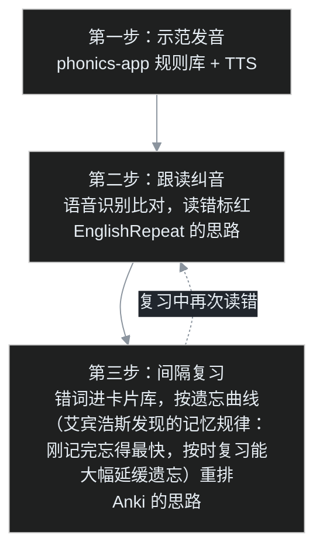

小朋友学到英语发音这一段，家长很快会撞上两个长得很像、其实完全不同的词：一个叫「音标」，一个叫「自然拼读」。校内老师让背 48 个国际音标，课外机构又在宣传「见词能读、听音能写」的自然拼读，两边都声称自己才是正道。

叶扬没急着站队，先去 GitHub 上做了一圈调研，想搞清楚开源世界里这两条路线分别有什么项目、成熟到什么程度。这篇是完整笔记。

## 一、先分清两条路线

这是整个调研里最值得先讲清楚的一件事，因为两条路线的项目几乎没有交集。

**第一条：48 国际音标（IPA，全称 International Phonetic Alphabet，国际语音字母表——一套专门给发音注音的符号体系）。** 中国中小学教的体系，20 个元音加 28 个辅音，学的是「符号对应发音」。孩子看到单词要先查词典、拿到音标，才能读出来。

**第二条：自然拼读（Phonics，本义就是「与声音有关的方法」）。** 英语母语国家孩子学认字的方法，根本不碰音标符号，学的是「字母和字母组合怎么发音」。比如知道 sh 念一个音、ee 念长音，见到生词就能直接拼。目标就是那句宣传语：见词能读，听音能写。

打个程序员能秒懂的比方：音标路线像学汇编，每个符号精确对应一个发音，但得先有「反汇编结果」（词典里的音标）才能执行；自然拼读像学一套启发式规则引擎，输入单词直接跑，覆盖率不是百分之百，但日常 80% 的词不用查词典。白话版：一个精确但绕，一个直接但有例外。

下面分别看项目。

## 二、中外孩子学英语，路径到底怎么分叉

先纠正一个流传很广的印象：中国的官方课标并不是「主张先学音标」。把几份中外官方文件摊开，路径的分岔位置比想象中清楚。

### 2.1 英语母语国家：先会说，再认字，认字就用 phonics

英国孩子 4 到 5 岁进学前班（Reception，英国小学的第一年），5 岁前后开始系统学 phonics，到 Year 1，也就是 6 到 7 岁，要参加一场全国统一的考试，名字就叫 Phonics Screening Check，拼读筛查。

叶扬查了英国政府官网，这场考试的设计很有意思：一共 40 个词，分成两节各 20 个，真词和「假词」混着来。假词是英语里根本不存在的拼合，类似 brip 这样的串，旁边还会画一只小怪兽，提示这是怪兽的名字。

为什么考假词？因为真词可能靠背，假词只能靠拼。考的是纯粹的解码能力（decoding，教学行话，意思就是把纸上的字母串还原成嘴里的声音）——见到一个从没遇到过的字母串，能不能把音拼出来。官方说明的大意是：目的是确认所有孩子都具备了与其年龄相称的拼读解码能力，并识别哪些孩子此时需要额外支持。

英国国家课程的英语大纲写得更直白，原文意思是：书页上的字母代表的是口语词里的声音，这就是为什么初学者一入学就要强调 phonics。Year 1 的具体要求是「把拼读知识和技能作为解码单词的路径」，对英语里全部 40 多个音素（phoneme，一门语言里最小的发音单位，英语里约 44 个）所对应的字母组合，都能迅速反应、正确读音。

美国的路子类似，依据更硬核。2000 年，美国国家儿童健康与人类发展研究所组建的国家阅读小组，发布了一份 400 多页的报告《Teaching Children to Read》，把历年对照教学实验做了元分析（meta-analysis，一种把大量独立实验的数据汇总后重新统计的方法，结论比单个实验更可靠）。叶扬核对了报告原文，结论可以压成一句：系统的 phonics 教学，比不系统的、或者完全不教 phonics 的教学，更能提高阅读成绩。此后 phonics 成为美国幼儿园和小学低年级阅读教学的主流路径。

### 2.2 那母语国家为什么不用音标？多一层符号纯属添乱

国际音标在母语国家不是没人认识，但出场场合基本是大学语言学课堂、词典和面向外国人的教材。叶扬查到的资料里写得很清楚：国际音标的使用者是语言学研究者、外语学生和教师、词典编纂者、歌手。这套工具从 1888 年第一版起，定位就是「分析语言」和「帮外国人学语言」。

打个程序员熟悉的比方：母语孩子学认字，像调试一个自己天天在用的系统——系统行为（口语）早就烂熟于心，认字只是给运行中的函数补上符号表，变量名和行为直接挂钩，中间不必再插一层翻译。IPA 则像一套反汇编标注语言，精确、万能，但学习成本高。白话版：孩子本来就会念这个词，只要记住这串字母长什么样就行；再学一套抽象符号中转一道，等于绕两个弯，纯属添乱。

规则管不住的那部分词，母语教学另有安排：不符合拼读规则的高频词，比如 the、said，归入 tricky words（难对付的词）或 sight words（视觉词），整体记住。规则加特例，识字这件事已经被覆盖，音标没有不可替代的位置。

### 2.3 中国：不是先学音标，是「过去一上学，就到了该学音标的年级」

真正有意思的是中国自己的官方文件。叶扬从教育部官网下载了《义务教育英语课程标准（2022 年版）》原文，201 页。其中表 9 把语音知识按年级列得明明白白：

- 3 到 4 年级（一级）：识别并读出 26 个字母，「感知字母在单词中的发音」，「感知简单的拼读规则，尝试借助拼读规则拼读单词」；
- 5 到 6 年级（二级）：「借助拼读规则拼读单词」；
- 7 到 9 年级（三级，初中）：「根据读音规则和音标拼读单词」，「查词典时，运用音标知识学习单词的发音」。

附录 2 的说明里还有一句白纸黑字：「音标只作为 7～9 年级的学习内容」。

也就是说，按官方课标，中国小学走的同样是拼读路线，音标被明确排在初中，定位也是查词典的工具——和英国的安排几乎同构。

那「中国人学英语先学音标」的集体记忆从哪来？来自年代差。很长一段时间里，全国英语课从初中才开始开设，几代人学英语的第一课就是字母和音标，自然留下「学英语等于先学音标」的印象。2001 年教育部发文推进小学从三年级起开设英语课，再到 2022 版课标把拼读明确写进小学，路径其实一直在往母语国家的安排上靠。

另一个绕不开的原因是语言环境。这是典型的 EFL 环境——English as a Foreign Language 的缩写，即「把英语当外语来学」，课堂之外几乎接触不到英语。老师课上领读十遍，放学后面对生词，唯一能依靠的就是词典里的音标。打个比方：这就像断网环境下写代码，在线 API 再好用也调不着，本地必须备一份完整的离线文档；音标就是那份离线文档。白话版：没人随时把词念给孩子听，有了音标，离开老师也知道该怎么读。

汉字的文字传统也推了一把。汉字不直接表音，对「字母拼在一起就自动对应发音」这件事，中文环境里的人没有母语者那种直觉，一套「一个符号对一个音」的精确体系，反而让人安心。顺带一提，同样是给英语生词注音，日本用片假名（日语里专门拼写外来词的音节字母）硬套，用母语音节替换英语发音，结果是几代人的发音被带偏；中国大陆选用 IPA，工具层面其实科学得多。

### 2.4 一张图对比三条路径

```mermaid
%%{init: {'theme':'dark','themeVariables':{'background':'#0d1117','primaryColor':'#1f6feb','primaryTextColor':'#ffffff','primaryBorderColor':'#79c0ff','secondaryColor':'#21262d','tertiaryColor':'#30363d','lineColor':'#8b949e','textColor':'#e6edf3','clusterBkg':'#161b22','clusterBorder':'#58a6ff','edgeLabelBackground':'#21262d','fontSize':'15px'}}}%%
flowchart TD
    subgraph UK["英国：先会说，再认字"]
        U1["4-5 岁<br/>口语词汇已具备"] --> U2["学前班起系统学 phonics"]
        U2 --> U3["6-7 岁 Year 1<br/>拼读检查：40 词含假词"]
    end
    subgraph US["美国：循证定型"]
        M1["幼儿园起 phonics"] --> M2["2000 年国家阅读报告<br/>系统拼读优于不系统"]
    end
    subgraph CN["中国：2022 版课标"]
        C1["3-4 年级<br/>字母发音与拼读规则"] --> C2["5-6 年级<br/>借助拼读规则读词"]
        C2 --> C3["7-9 年级<br/>音标作为查词典工具"]
    end
```



这一节的结论是：中外的差异本质上不是「音标对自然拼读」的教学法之争，而是输入环境之差。母语孩子带着几千个已经掌握的口语词汇来识字，拼读是最短路；外语环境里没有口语垫底，音标是离线兜底的工具。2022 版课标的安排说明，教育主管部门早已看清这一点：小学先拼读、初中再音标，各归各位。

## 三、自然拼读派：一个项目断层领先

下面表里的 star，指 GitHub 上的点赞收藏数，大致反映项目受欢迎程度。

| 项目 | star | 创建时间 | 技术栈 |
|---|---|---|---|
| cocojojo5213/phonics-app | 445 | 2025-12 | 纯静态 JavaScript + PWA（能像 App 一样装到手机桌面、离线打开的网页），MIT 协议（最宽松的开源许可，几乎允许随便使用） |
| hellodeborahuk/buzzphonics | 61 | 2022 | React（主流前端界面框架），MIT 协议 |
| calda/Brainy-Phonics | 19 | — | 教育游戏 |
| yangxl-2014-fe/Oxford-Phonics-World | 3 | — | 配套资料站 |

### 3.1 phonics-app：本领域唯一的正经选手

`cocojojo5213/phonics-app` 是这一派唯一一个完成度像样的项目，star 数是第二名的七倍。叶扬看完仓库，判断它的核心资产不是页面，而是数据：仓库里有一份 `rules-master.json`，2.25 MB，装着 **16 大发音分类、100 多条拼读规则**。

每个单词都做了音素拆解，核心发音用彩色高亮。比如一个单词里哪几个字母在发哪个音，一眼分得清。发音走 Google Cloud TTS（Text-To-Speech，文字转语音），就是谷歌的语音合成接口，所以单词、例句都能朗读，代价是仓库本身不含音频文件，音频要自己跑脚本生成。

它还有个挺时髦的设计：自带一个 Workshop（本意是「作坊」，这里指词库加工后台），接 Gemini AI（谷歌出品的大模型）批量生成词库。定下规则，让 AI 按规则吐单词，再人工校验合并。目录里 `scripts/` 下一排脚本分工明确：`generate-words.js` 管生成、`generate-tts.js` 管配音、`merge-words.js` 管合并、`validate-words.js` 管校验。这套「规则库驱动、AI 填充内容」的玩法，本质上是把单词表当成了可生成的数据集，而不是一份死记硬背的清单。

quickstart（快速上手步骤）轻得不像话：

```bash
git clone https://github.com/cocojojo5213/phonics-app.git
cd phonics-app
npx serve .
# 浏览器打开 http://localhost:3000
```

想跑 AI 词库生成，再 `npm install` 加 `npm run studio`，后台在 `admin.html`。

两个坑叶扬标了出来：第一，前面说过，仓库不含音频，要么自己生成 TTS，要么对着没声音的页面学；第二，作者明确要求任何基于它的二次开发都必须署名，README 里专门用引用块写了这段话。

### 3.2 buzzphonics：一位爸爸的顺手作品

第二名 `hellodeborahuk/buzzphonics` 走的是英国小学的发音体系，Phase 2 和 Phase 3（英国拼读大纲的第 2、3 阶段）两个阶段。作者在 README 里把动机写得很实在：陪刚学认字的女儿读书，经常忘了某个音该怎么读，每次都要现场 Google，烦了，就自己做了个能存手机上的发音页。

功能也简单：一整页发音，点一下就能听；翻转整页，字母会换成配图，比如 f 旁边显示一只狐狸（fox）。项目 2023 年 7 月之后停更，但思路就是典型的「自己孩子有用，就值得做」。

## 四、48 音标派：全是单页点读表，没有标杆

转到校内科班路线，景象冷清得多。这一派的项目 star 数两位数封顶，而且形态高度雷同——一张网页，48 个音标排好，点哪个读哪个。

| 项目 | star | 技术栈 | 特点 |
|---|---|---|---|
| zhen-ke/phonetic-Symbols | 14 | 单个 index.html | 本派 star 最高 |
| Ivens-Zhang/phonetic-symbol | 8 | HTML + Tailwind CSS（一种直接在 HTML 上拼装样式类的 CSS 框架） | 查词忘了音标，顺手做的 |
| boommanpro/phonetic_symbol_web | 5 | HTML + Python | 悬停自动发音 |
| think-ing/soundmark | 4 | Android（Java） | 点按发音、长按进详情，2018 年项目 |
| resetsix/english-ipa | 2 | Astro（一种主打内容类网站的现代前端框架） | 多了发音方式、清浊筛选 |

叶扬看出一个有意思的细节：这一派真正在流传的不是页面，而是**音频**。

`boommanpro/phonetic_symbol_web` 里带了两个 Python 脚本，`auto_download.py` 负责自动抓取发音音频，`extract_words.py` 负责抽取示例单词，抓下来的音频存在 `words-voice` 目录。后来者 resetsix/english-ipa 直接复用了这个目录的音频，README 里写得明明白白：「音频参考 boommanpro 的 words-voice」。换句话说，这批小项目表面上各做各的，底层共享同一条音频供应链。

而这条供应链的源头有版权问题。resetsix 的 README 里同样写明：「音标内容版权归原网站所有」，原网站是 yyybabc.com。真人发音不是无主之物，这也是这批项目没人敢把音频和代码大大方方打包在一起的原因。

### 4.1 2026 年的新变量：AI 一把梭的音标站

这次调研还撞上一个明显的新趋势。2026 年冒出一批功能完整但 0 star 的音标站，全是 AI 编程工具生成的：

- `luyu-agi/ipa-classroom`：功能堆得最满，48 个音标点读、元音舌位图（画出舌头在口腔里位置的图）、最小对立对（minimal pair，只差一个音的一对词，比如 ship 和 sheep，专门练耳朵分辨）辨音练习、听音测验，还能切大字号投屏。发音全靠浏览器自带的 Web Speech API（浏览器内置的语音接口，既能朗读也能识别语音），一个音频文件都不用存；
- `BeastyZ/PhoneticsStudy`：README 里直接写明「由 TRAE SOLO（字节推出的 AI 编程工具，能自动生成整个网站）完成」，主打英美发音对比和中国学习者常见发音错误。

照例戳破这个现象的洞：页面功能高度趋同，说明「做一个音标教学站」这件事的门槛已经被 AI 编程工具打平了——舌位图、点读、测验，谁都能在一个晚上生成出来。但门槛打平的另一面是，这类项目的真正壁垒只剩两样：**靠谱的内容**和**真实的使用反馈**，而这两样 AI 替不了。

## 五、跟读纠音：思路最对，却只有十年前的 demo

还有一个项目叶扬单独记了一笔：`425296516/EnglishRepeat`，2016 年的 Android 应用，9 star。

它做的事情放到今天看依然是最完整的闭环：孩子对着手机朗读，App 调用百度和讯飞的语音识别，把实际识别出来的词标注出来——读对了、读错了、漏读了，一目了然。这就是「AI 口语老师」的核心逻辑：不是让孩子单向听音模仿，而是听完之后开口，再由机器判分。

可惜项目停在 2016 年，之后再没更新。语音识别这十年天翻地覆，当年的 demo（演示用的样品程序）已经跑不动，但思路没过时。

## 六、调研完的三个判断

**第一，典型的「需求普遍、项目小而散」。** 音标派两位数 star 封顶，自然拼读派的领头项目 2025 年底才创建。给孩子找英语发音工具的家长以亿计，但开源世界里这个方向冷清得反常——可能因为最核心的发音音频有版权，也可能因为商业 App 把需求接走了。

**第二，音频既是核心痛点，也是版权雷区。** 真人发音版权清晰，机械 TTS 又有机器味，所以大家要么互相搬运，要么干脆只用浏览器合成。给孩子用，叶扬的倾向是 phonics-app 那条 Google TTS 的路子：自己生成、质量稳定、不碰别人的版权音频。

**第三，真正缺的是一个闭环。** 叶扬把理想形态画成了一张图：



示范、跟读、复习三段，目前各有项目：phonics-app 管规则和发音，EnglishRepeat 式的 ASR（Automatic Speech Recognition，自动语音识别，让机器把人说的话转成文字）管判分，Anki 管错词复习，但没有任何一个项目把三段缝在一起。孩子学完一条规则，当场读、当场判、读错的词自动进复习队列——这个闭环，就是空白点。

而这个空白点恰好卡在数据工程师的手艺上：规则是结构化数据，跟读记录是带时间戳的事件，复习队列是状态机（一种编程模型：事物当前处于什么状态，决定下一步能做什么；比如一个错词处于「待复习」或「已掌握」状态），拼起来不复杂，难的是真有个孩子天天用、持续给反馈。又是那个熟悉的结论：工具到处都有，缺的是在真实场景里把闭环跑通的人。

## 附：文中术语注释汇总

### 英语教学类

| 术语 | 白话解释 |
|---|---|
| 元音 | 发音时气流在口腔里不受阻碍的音，音量响亮，类似汉语里的韵母 |
| 辅音 | 发音时气流被嘴唇、牙齿、舌头挡住或摩擦的音，类似汉语里的声母 |
| 国际音标（IPA） | International Phonetic Alphabet，国际语音字母表，一套专门给任何语言的发音注音的符号体系 |
| DJ 音标 | 中国中小学通用的英语音标体系，由英国语言学家 Daniel Jones（丹尼尔·琼斯）在 IPA 基础上整理，故取其姓名首字母得名，48 个 |
| KK 音标 | 中国台湾常用的美式英语音标体系，同样基于 IPA，由两位姓氏首字母都是 K 的学者制定 |
| 自然拼读（Phonics） | 英语母语国家的认字法，不另学注音符号，直接学字母和字母组合对应什么发音 |
| 音素（phoneme） | 一门语言里最小的发音单位，英语里约 44 个 |
| 字母组合（grapheme） | 对应同一个音的一个或几个字母，比如 sh、ee |
| 解码（decoding） | 拼读教学的行话，把纸上的字母串还原成嘴里的声音 |
| 拼音（blending） | 把一个词里的几个音依次连读、拼成完整词的动作 |
| 假词（pseudo-words） | 英语里不存在的拼合词，只能靠拼读规则念出来，用于检验真解码还是靠背词 |
| tricky words / sight words | 「难对付的词」或「视觉词」，不符合拼读规则的高频词（如 the、said），只能整体记住 |
| 最小对立对（minimal pair） | 只差一个音的一对词，如 ship 和 sheep，专门练耳朵分辨 |
| 舌位图 | 画出舌头在口腔里高低前后位置的示意图，帮助找准发音位置 |
| 遗忘曲线 | 艾宾浩斯发现的记忆规律：刚记完忘得最快，之后按时复习能大幅延缓遗忘 |
| 元分析（meta-analysis） | 把大量独立实验的数据汇总后重新统计，结论比单个实验更可靠 |
| EFL | English as a Foreign Language，把英语当外语来学，课堂之外缺少使用环境 |
| 片假名 | 日语里专门拼写外来词的一套音节字母 |

### 技术与开源类

| 术语 | 白话解释 |
|---|---|
| GitHub | 全球最大的代码托管网站，程序员在上面存代码、协作、互相参考 |
| star | GitHub 上的点赞收藏数，大致反映项目受欢迎程度 |
| 开源 | 源代码公开，任何人都可以查看、使用、修改 |
| MIT 协议 | 最宽松的开源许可之一，几乎允许随便使用，唯一要求通常是保留版权声明 |
| PWA | Progressive Web App，能像普通 App 一样装到手机桌面、支持离线打开的网页 |
| 纯静态 | 网页就是几个 HTML、JS 文件，没有后端服务器和数据库，打开即用 |
| JavaScript | 网页浏览器里运行的编程语言 |
| React | 主流的前端界面开发框架 |
| Tailwind CSS | 一种直接在 HTML 标签上拼样式类的 CSS 工具，省去单独写样式表 |
| Astro | 一种主打内容类网站的现代前端框架 |
| TTS | Text-To-Speech，文字转语音，让机器把文字念出来 |
| ASR | Automatic Speech Recognition，自动语音识别，让机器把人说的话转成文字 |
| Web Speech API | 浏览器内置的语音接口，既能朗读文字，也能识别语音 |
| Gemini | 谷歌公司出品的 AI 大模型 |
| TRAE SOLO | 字节跳动推出的 AI 编程工具，能根据描述自动生成整个网站 |
| Workshop | 本意「作坊」，在 phonics-app 里指词库加工后台 |
| quickstart | 软件文档里的「快速上手」部分，几步最小操作把程序跑起来 |
| demo | demonstration 的简称，演示用的样品程序 |
| Anki | 一款开源的间隔重复记忆卡片软件，按遗忘曲线安排复习时机 |
| 状态机 | 一种编程模型：事物当前处于什么状态，决定下一步能做什么；如一个错词处于「待复习」或「已掌握」 |

## 参考链接

- phonics-app 自然拼读：https://github.com/cocojojo5213/phonics-app ，在线版 https://phonics.thetruetao.com
- buzzphonics：https://github.com/hellodeborahuk/buzzphonics
- 音标点读表：https://github.com/zhen-ke/phonetic-Symbols
- 音标学习（含音频抓取脚本）：https://github.com/boommanpro/phonetic_symbol_web
- 音标有谱：https://github.com/resetsix/english-ipa
- 英语音标教室：https://github.com/luyu-agi/ipa-classroom
- PhoneticsStudy：https://github.com/BeastyZ/PhoneticsStudy
- 英语跟读识别 demo：https://github.com/425296516/EnglishRepeat

官方文件与资料来源：

- 英国国家课程英语大纲：https://www.gov.uk/government/collections/national-curriculum
- 英国 Phonics Screening Check 官方说明：https://www.gov.uk/government/collections/phonics-screening-check-administration
- 美国国家阅读小组报告《Teaching Children to Read》（2000）：https://www.nichd.nih.gov/sites/default/files/publications/pubs/nrp/Documents/report.pdf
- 中国《义务教育英语课程标准（2022 年版）》下载入口（教育部通知页）：http://www.moe.gov.cn/srcsite/A26/s8001/202204/t20220420_619921.html
- 国际音标条目（含 DJ/KK 音标体系说明）：https://www.qiuwenbaike.cn/wiki/國際音標
