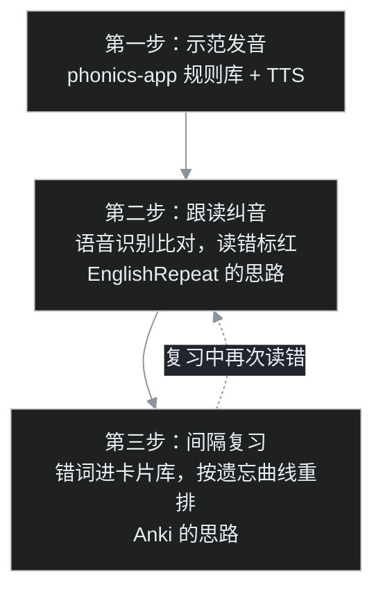

小朋友学到英语发音这一段，家长很快会撞上两个长得很像、其实完全不同的词：一个叫「音标」，一个叫「自然拼读」。校内老师让背 48 个国际音标，课外机构又在宣传「见词能读、听音能写」的自然拼读，两边都声称自己才是正道。

叶扬没急着站队，先去 GitHub 上做了一圈调研，想搞清楚开源世界里这两条路线分别有什么项目、成熟到什么程度。这篇是完整笔记。

## 一、先分清两条路线

这是整个调研里最值得先讲清楚的一件事，因为两条路线的项目几乎没有交集。

**第一条：48 国际音标（IPA）。** 中国中小学教的体系，20 个元音加 28 个辅音，学的是「符号对应发音」。孩子看到单词要先查词典、拿到音标，才能读出来。

**第二条：自然拼读（Phonics）。** 英语母语国家孩子学认字的方法，根本不碰音标符号，学的是「字母和字母组合怎么发音」。比如知道 sh 念一个音、ee 念长音，见到生词就能直接拼。目标就是那句宣传语：见词能读，听音能写。

打个程序员能秒懂的比方：音标路线像学汇编，每个符号精确对应一个发音，但得先有「反汇编结果」（词典里的音标）才能执行；自然拼读像学一套启发式规则引擎，输入单词直接跑，覆盖率不是百分之百，但日常 80% 的词不用查词典。白话版：一个精确但绕，一个直接但有例外。

下面分别看项目。

## 二、自然拼读派：一个项目断层领先

| 项目 | star | 创建时间 | 技术栈 |
|---|---|---|---|
| cocojojo5213/phonics-app | 445 | 2025-12 | 纯静态 JavaScript + PWA，MIT 协议 |
| hellodeborahuk/buzzphonics | 61 | 2022 | React，MIT 协议 |
| calda/Brainy-Phonics | 19 | — | 教育游戏 |
| yangxl-2014-fe/Oxford-Phonics-World | 3 | — | 配套资料站 |

### 2.1 phonics-app：本领域唯一的正经选手

`cocojojo5213/phonics-app` 是这一派唯一一个完成度像样的项目，star 数是第二名的七倍。叶扬看完仓库，判断它的核心资产不是页面，而是数据：仓库里有一份 `rules-master.json`，2.25 MB，装着 **16 大发音分类、100 多条拼读规则**。

每个单词都做了音素拆解，核心发音用彩色高亮。比如一个单词里哪几个字母在发哪个音，一眼分得清。发音走 Google Cloud TTS，就是谷歌的语音合成接口，所以单词、例句都能朗读，代价是仓库本身不含音频文件，音频要自己跑脚本生成。

它还有个挺时髦的设计：自带一个 Workshop 后台，接 Gemini AI 批量生成词库。定下规则，让 AI 按规则吐单词，再人工校验合并。目录里 `scripts/` 下一排脚本分工明确：`generate-words.js` 管生成、`generate-tts.js` 管配音、`merge-words.js` 管合并、`validate-words.js` 管校验。这套「规则库驱动、AI 填充内容」的玩法，本质上是把单词表当成了可生成的数据集，而不是一份死记硬背的清单。

quickstart 轻得不像话：

```bash
git clone https://github.com/cocojojo5213/phonics-app.git
cd phonics-app
npx serve .
# 浏览器打开 http://localhost:3000
```

想跑 AI 词库生成，再 `npm install` 加 `npm run studio`，后台在 `admin.html`。

两个坑叶扬标了出来：第一，前面说过，仓库不含音频，要么自己生成 TTS，要么对着没声音的页面学；第二，作者明确要求任何基于它的二次开发都必须署名，README 里专门用引用块写了这段话。

### 2.2 buzzphonics：一位爸爸的顺手作品

第二名 `hellodeborahuk/buzzphonics` 走的是英国小学的发音体系，Phase 2 和 Phase 3 两个阶段。作者在 README 里把动机写得很实在：陪刚学认字的女儿读书，经常忘了某个音该怎么读，每次都要现场 Google，烦了，就自己做了个能存手机上的发音页。

功能也简单：一整页发音，点一下就能听；翻转整页，字母会换成配图，比如 f 旁边显示一只狐狸（fox）。项目 2023 年 7 月之后停更，但思路就是典型的「自己孩子有用，就值得做」。

## 三、48 音标派：全是单页点读表，没有标杆

转到校内科班路线，景象冷清得多。这一派的项目 star 数两位数封顶，而且形态高度雷同——一张网页，48 个音标排好，点哪个读哪个。

| 项目 | star | 技术栈 | 特点 |
|---|---|---|---|
| zhen-ke/phonetic-Symbols | 14 | 单个 index.html | 本派 star 最高 |
| Ivens-Zhang/phonetic-symbol | 8 | HTML + Tailwind CSS | 查词忘了音标，顺手做的 |
| boommanpro/phonetic_symbol_web | 5 | HTML + Python | 悬停自动发音 |
| think-ing/soundmark | 4 | Android（Java） | 点按发音、长按进详情，2018 年项目 |
| resetsix/english-ipa | 2 | Astro | 多了发音方式、清浊筛选 |

叶扬看出一个有意思的细节：这一派真正在流传的不是页面，而是**音频**。

`boommanpro/phonetic_symbol_web` 里带了两个 Python 脚本，`auto_download.py` 负责自动抓取发音音频，`extract_words.py` 负责抽取示例单词，抓下来的音频存在 `words-voice` 目录。后来者 resetsix/english-ipa 直接复用了这个目录的音频，README 里写得明明白白：「音频参考 boommanpro 的 words-voice」。换句话说，这批小项目表面上各做各的，底层共享同一条音频供应链。

而这条供应链的源头有版权问题。resetsix 的 README 里同样写明：「音标内容版权归原网站所有」，原网站是 yyybabc.com。真人发音不是无主之物，这也是这批项目没人敢把音频和代码大大方方打包在一起的原因。

### 3.1 2026 年的新变量：AI 一把梭的音标站

这次调研还撞上一个明显的新趋势。2026 年冒出一批功能完整但 0 star 的音标站，全是 AI 编程工具生成的：

- `luyu-agi/ipa-classroom`：功能堆得最满，48 个音标点读、元音舌位图、最小对立对辨音练习、听音测验，还能切大字号投屏。发音全靠浏览器自带的 Web Speech API，一个音频文件都不用存；
- `BeastyZ/PhoneticsStudy`：README 里直接写明「由 TRAE SOLO 完成」，主打英美发音对比和中国学习者常见发音错误。

照例戳破这个现象的洞：页面功能高度趋同，说明「做一个音标教学站」这件事的门槛已经被 AI 编程工具打平了——舌位图、点读、测验，谁都能在一个晚上生成出来。但门槛打平的另一面是，这类项目的真正壁垒只剩两样：**靠谱的内容**和**真实的使用反馈**，而这两样 AI 替不了。

## 四、跟读纠音：思路最对，却只有十年前的 demo

还有一个项目叶扬单独记了一笔：`425296516/EnglishRepeat`，2016 年的 Android 应用，9 star。

它做的事情放到今天看依然是最完整的闭环：孩子对着手机朗读，App 调用百度和讯飞的语音识别，把实际识别出来的词标注出来——读对了、读错了、漏读了，一目了然。这就是「AI 口语老师」的核心逻辑：不是让孩子单向听音模仿，而是听完之后开口，再由机器判分。

可惜项目停在 2016 年，之后再没更新。语音识别这十年天翻地覆，当年的 demo 已经跑不动，但思路没过时。

## 五、调研完的三个判断

**第一，典型的「需求普遍、项目小而散」。** 音标派两位数 star 封顶，自然拼读派的领头项目 2025 年底才创建。给孩子找英语发音工具的家长以亿计，但开源世界里这个方向冷清得反常——可能因为最核心的发音音频有版权，也可能因为商业 App 把需求接走了。

**第二，音频既是核心痛点，也是版权雷区。** 真人发音版权清晰，机械 TTS 又有机器味，所以大家要么互相搬运，要么干脆只用浏览器合成。给孩子用，叶扬的倾向是 phonics-app 那条 Google TTS 的路子：自己生成、质量稳定、不碰别人的版权音频。

**第三，真正缺的是一个闭环。** 叶扬把理想形态画成了一张图：



示范、跟读、复习三段，目前各有项目：phonics-app 管规则和发音，EnglishRepeat 式的 ASR 管判分，Anki 管错词复习，但没有任何一个项目把三段缝在一起。孩子学完一条规则，当场读、当场判、读错的词自动进复习队列——这个闭环，就是空白点。

而这个空白点恰好卡在数据工程师的手艺上：规则是结构化数据，跟读记录是带时间戳的事件，复习队列是状态机，拼起来不复杂，难的是真有个孩子天天用、持续给反馈。又是那个熟悉的结论：工具到处都有，缺的是在真实场景里把闭环跑通的人。

## 参考链接

- phonics-app 自然拼读：https://github.com/cocojojo5213/phonics-app ，在线版 https://phonics.thetruetao.com
- buzzphonics：https://github.com/hellodeborahuk/buzzphonics
- 音标点读表：https://github.com/zhen-ke/phonetic-Symbols
- 音标学习（含音频抓取脚本）：https://github.com/boommanpro/phonetic_symbol_web
- 音标有谱：https://github.com/resetsix/english-ipa
- 英语音标教室：https://github.com/luyu-agi/ipa-classroom
- PhoneticsStudy：https://github.com/BeastyZ/PhoneticsStudy
- 英语跟读识别 demo：https://github.com/425296516/EnglishRepeat
