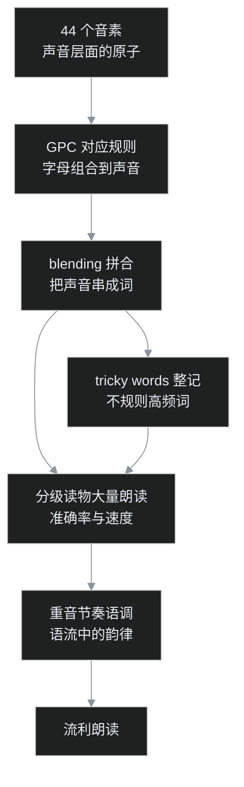

续上一篇音标项目调研。叶扬在那些项目里反复碰到同一个数字：44。

英国国家课程的原话是，孩子要在 Year 1 结束前掌握 40 个以上的 phonemes（音素）。SoundCode 44 这个网页应用则干脆以数字命名，把整个英语音系拆成 44 张卡片，每张卡一个声音。克隆下来跑起来之后，叶扬决定把这 44 个声音一次性罗列清楚，同时回答一个更实际的问题：小朋友只要掌握了这 44 个音素，读英语是不是就很快了？

这篇是完整清单加判断。

## 一、44 数的是声音，不是字母

英语单词拼写用 26 个字母，但嘴巴能区分、换一个就能改变词义的最小声音单位，在英式 Received Pronunciation（RP，英国播音与教科书采用的「标准发音」）里一共 44 个：

- **20 个元音音素**：12 个单元音（7 短 5 长）加 8 个双元音；
- **24 个辅音音素**：按发音方式分成爆破音、摩擦音、破擦音、鼻音、近音五类。

举个最小的例子，cat 和 cap 拼写只差最后一个字母，读音只差末尾一个声音，这个声音就是一个独立音素。音素是「听」和「说」层面的原子，字母只是把声音写下来的外壳。

44 是英式 RP 的数法。美式英语因为卷舌元音的分析方式不同，总数在 40 上下浮动，但教学材料里最常见的说法仍是「44 个音素」。

## 二、44 个音素和中国课本的 48 个音标什么关系

很多人记得的数字是 48。这两个数并不矛盾，因为数的东西本来就不一样。

| 对比项 | 44 phonemes | 中国教材常见的 48 DJ 音标 |
|---|---|---|
| 数的是什么 | 能区别词义的最小声音（音位） | 用来标音的书面符号 |
| 元音 | 20 个（12 单元音 + 8 双元音） | 20 个 |
| 辅音 | 24 个 | 28 个 |
| 体系出身 | 英国小学 phonics 教学与音系分析 | Daniel Jones 音标体系，标音用的符号表 |

辅音差的 4 个符号主要是 /ts/ /dz/ /tr/ /dr/。在 44 音素体系里，它们不算一个独立声音，而是两个音素前后相连的连缀，就像「光」guāng 在汉语拼音里还是 g 加 u 加 ang，不会因为常写在一起就多出一个声母。

两个体系的重合度其实很高，44 个音素几乎都能在 48 个符号里找到对应。差别更多是分类粒度和符号写法，而不是两群不同的声音。打个程序员熟悉的比方：44 音素像是一门语言实际用到的 token 集合，48 音标像是一本把异体写法也单列出来的、更细的编码手册。

结论是两套学一套即可，不必混着背。对小朋友来说，真正要建立的是「看到字母组合，嘴里能反应出声音」，背符号数量从来不是目标。

## 三、元音 20 个：单元音 12，双元音 8

下面三张表是完整清单。发音要诀都压成一句话，配合例词听一遍标准发音，比读十段文字描写管用。

### 3.1 短单元音 7 个

| 音素 | 例词 | 发音要诀 |
|---|---|---|
| /æ/ | cat | 嘴张大、下巴下拉，舌位低而靠前，短促 |
| /e/ | bed | 口半开，舌位中高，短而干脆 |
| /ɪ/ | sit | /iː/ 的放松版，舌位稍低，短促松弛 |
| /ɒ/ | hot | 嘴张大、舌低靠后，嘴唇轻圆，短促 |
| /ʌ/ | cup | 嘴微开、舌居中偏低，放松的短「啊」 |
| /ʊ/ | book | 嘴唇轻圆、舌后抬高但放松，/uː/ 的短促版 |
| /ə/ | about | schwa，最放松的中央音，只出现在非重读音节，英语里出现频率最高 |

### 3.2 长单元音 5 个

| 音素 | 例词 | 发音要诀 |
|---|---|---|
| /iː/ | see | 嘴唇向两侧拉开像微笑，舌前部抬高，保持不动 |
| /ɑː/ | car | 嘴大张像看喉咙，舌低平靠后；英式 bath、path 也读这个音 |
| /ɔː/ | saw | 嘴唇收成椭圆，舌后部抬高，保持长度 |
| /uː/ | moon | 嘴唇收成小圆并前噘，舌后部抬高，保持长度 |
| /ɜː/ | her | 嘴唇不圆、舌居中央，英式不卷舌；bird、turn 同韵 |

注意长短不是单纯把短音拖长。/ɪ/ 和 /iː/、/ʊ/ 和 /uː/ 的舌位与唇形本来就不同，ship 和 sheep、book 和 Luke 是靠这点区分的。

### 3.3 双元音 8 个

双元音是两个元音滑成一个音节，重点在「滑动」，起点准、方向对即可。

| 音素 | 例词 | 滑动方向 |
|---|---|---|
| /eɪ/ | day | /e/ 向 /ɪ/ 滑，舌位上升 |
| /aɪ/ | time | 开口的 /a/ 向 /ɪ/ 滑，下巴收拢 |
| /ɔɪ/ | boy | /ɔː/ 向 /ɪ/ 滑，从后往前 |
| /aʊ/ | now | /a/ 向 /ʊ/ 滑，嘴唇逐渐收圆 |
| /əʊ/ | home | /ə/ 向 /ʊ/ 滑，英式「长 o」 |
| /ɪə/ | ear | /ɪ/ 向 /ə/ 滑，下巴稍开 |
| /eə/ | chair | /e/ 向 /ə/ 滑 |
| /ʊə/ | cure | /ʊ/ 向 /ə/ 滑；现代 RP 里常并入 /ɔː/，poor 读 /pɔː/ 也成立 |

## 四、辅音 24 个

辅音的核心分法是清浊：发音时摸喉咙，振动的是浊辅音，不振动、只送气的是清辅音。/p/ 和 /b/、/t/ 和 /d/、/k/ 和 /g/ 都是同一个发音部位，只靠清浊配对。

### 4.1 爆破音 6 个：挡住气，再放开

| 音素 | 例词 | 清浊 | 发音要诀 |
|---|---|---|---|
| /p/ | pan | 清 | 双唇紧闭憋气后突然放开，词首送气 |
| /b/ | bat | 浊 | 同 /p/ 的部位，声带振动，不送气 |
| /t/ | tap | 清 | 舌尖抵上齿龈，憋气后放开 |
| /d/ | dog | 浊 | 同 /t/ 的部位，声带振动 |
| /k/ | key | 清 | 舌后部抵软腭，憋气后放开 |
| /g/ | get | 浊 | 同 /k/ 的部位，声带振动 |

### 4.2 摩擦音 9 个：留条缝，让气蹭过去

| 音素 | 例词 | 清浊 | 发音要诀 |
|---|---|---|---|
| /f/ | fan | 清 | 上齿轻咬下唇，气从缝里蹭出 |
| /v/ | van | 浊 | 同 /f/ 的部位，声带振动 |
| /θ/ | think | 清 | 舌尖伸到上下齿之间，送气 |
| /ð/ | the | 浊 | 同 /θ/ 的部位，声带振动；多出现于 the、this、that 等功能词 |
| /s/ | sun | 清 | 舌尖接近齿龈不接触，气从中央沟槽挤出，嘶声 |
| /z/ | zip | 浊 | 同 /s/ 的部位，声带振动；dogs 词尾就是 /z/ |
| /ʃ/ | ship | 清 | 舌位比 /s/ 稍后、嘴唇稍前噘，「嘘」的音 |
| /ʒ/ | vision | 浊 | 同 /ʃ/ 的部位加振动，多出现在 measure、beige 等法语借词里 |
| /h/ | hat | 清 | 嘴张开，喉部送气，像呵眼镜 |

### 4.3 破擦音 2 个：先挡后蹭，连成一体

| 音素 | 例词 | 清浊 | 发音要诀 |
|---|---|---|---|
| /tʃ/ | chair | 清 | /t/ 紧接着滑进 /ʃ/，一气呵成 |
| /dʒ/ | jump | 浊 | /d/ 紧接着滑进 /ʒ/；g 在 e、i 前常读这个音，giant、gem |

### 4.4 鼻音 3 个：嘴挡住，气走鼻子

| 音素 | 例词 | 发音要诀 |
|---|---|---|
| /m/ | mat | 双唇闭合，气从鼻腔出 |
| /n/ | net | 舌尖抵齿龈，气从鼻腔出 |
| /ŋ/ | king | 舌后部抵软腭、舌尖放下；这个音从不在英语词首出现，singing 中间不再加 /g/ |

### 4.5 近音与边音 4 个

| 音素 | 例词 | 发音要诀 |
|---|---|---|
| /l/ | leg | 舌尖抵齿龈，气从舌头两侧走；词首清晰，词尾偏暗（tall） |
| /r/ | red | 舌尖向后卷起但不接触任何部位，唇稍圆；英式 RP 词尾和辅音前不发音，car 读 /kɑː/ |
| /w/ | wet | 嘴唇先收成圆形再滑向后面的元音 |
| /j/ | yes | 舌前部向硬腭抬起再滑开，就是辅音 y，与 yes 同音 |

24 个齐了：爆破 6、摩擦 9、破擦 2、鼻音 3、近音 4，共 24。

## 五、SoundCode 44：把清单做成可点的应用

这次对着界面核对清单，用的是 GitHub 上的 `ericaysolomon/pwa-soundcode-44`，2026 年 6 月创建的纯网页 PWA，背后品牌是 ThriveEnglish。首页把家底列得很直接：44 个音素、20 个元音、24 个辅音、400 多个例词。

它的 IPA Chart 页面是这次最省事的一张图，上文四张表的内容一屏全览，点一下读单音，按住读例词。

每个音素点进去是一张结构统一的卡片：口型要诀、这个声音对应的拼写模式（每个例词可点读）、两个整句示范、一条小贴士、一条常见错误。

手机上也能用，布局照常自适应。

两个使用前提需要说清。第一，它是 freemium 产品：免费开放的只有引导内容、短元音 7 个音素和这张 IPA 总表，其余章节要通过 Gumroad 购买许可。第二，仓库没有附带 LICENSE 文件，代码虽然公开可见，但严格意义上不算开源授权，照搬二发需要自行联系作者。

同类的小项目还有几个：`moh3n9595/phonemes-dataset` 是一份 44 音素音频数据集，几张 star；`sumomo-ai/english-pronunciation-app` 自带 44 音素和音变说明。它们的形态都印证同一件事：44 这个数字是英语发音教学里的通用底座。

## 六、正面回答：掌握 44 个音素，读英语就很快吗

叶扬的判断是：**44 个音素是「见词能读」的地基，是必要条件，但不是充分条件。**

会读 44 个单音之后，从「能发音」到「流利朗读」中间还隔着四样东西。

**第一，GPC，字母组合与声音的对应规则。** 一个音素往往有多种写法，/iː/ 可以写成 ee、ea、ie、e；反过来，同一组字母在不同词里能发不同的音。单会声音、不掌握对应规则，见到生词还是无从下口。这才是 phonics 教学真正的主体内容。

**第二，blending，把音素拼合起来的能力。** 会读 /k/、/æ/、/t/ 是一回事，能把三个声音快速滑成一个 cat 是另一回事，这是一项需要专门练习的技能，低龄孩子尤其会卡在这里。

**第三，tricky words，不规则高频词。** the、said、was、one、because 这些词不符合常规对应规则，没法靠解码推出来，只能整词认读。这类词数量不大，但在初级读物里密度极高，绕不过去。

**第四，重音、节奏和语调。** 单词放进句子之后有轻重、有弱读（非重音大量变成 /ə/）、有连读和语调起伏。阅读研究里定义的流利度有三个成分：读得准、速度合适、带恰当的表情和韵律。44 个音素只保证第一层的准确率，后两层全在语流里。

此外还有一层朴素的限制：能读出一个词，不等于认识这个词。流利朗读最终还靠词汇量和阅读量喂。

整个进阶路径大致是这样：

用一个程序员的类比收尾：掌握 44 个音素，相当于掌握了一门语言的全部 token 与标准发音，见到任何标识符都能念出声；但念得顺不顺、有没有这个词、语气对不对，靠的是语法、词库和大量真实语料。汉语拼音也是同样的道理：声韵母全学会，只意味着见到注音能读字，文章读得流不流利，取决于识字量和朗读量。

英国小学的教学顺序恰好印证这条路径：Reception 阶段先听音辨音，Year 1 用 Screening Check 考纯解码，之后并没有「发音课」了，流利度全部交给持续的分级阅读去喂。对中国家庭来说，可执行的版本是：选定一套体系（44 音素或 48 音标皆可），配合发音应用把单音和对应规则过一遍，然后尽快进入跟读和分级读物，别在背符号这一站停留太久。

## 附：本文术语注释

- **音素（phoneme）**：能区别词义的最小声音单位。cat 换一个末尾音成 cap，换的就是一个音素。
- **单元音 / 双元音**：发音过程中口型舌位保持不动的是单元音；两个元音滑动合成一个音节的是双元音，如 /eɪ/。
- **长短元音**：不是同一声音的长短版，舌位唇形本就不同，如 /ɪ/ 与 /iː/。
- **schwa**：音素 /ə/ 的专名，最放松、只出现在非重读音节，是英语出现频率最高的音。
- **清辅音 / 浊辅音**：发音时喉咙不振动的为清、振动为浊，如 /p/ 与 /b/。
- **RP（Received Pronunciation）**：英国的「标准发音」，BBC 播音与英国教科书传统采用的口音。
- **DJ 音标**：Daniel Jones 建立的英语标音符号体系，中国大陆教材通行，共 48 个符号。
- **GPC（grapheme-phoneme correspondence）**：字母（组合）与音素的对应规则，phonics 的核心内容。
- **blending**：拼合，把连续几个音素滑读成一个完整单词的技能。
- **decoding（解码）**：见到一个词，按对应规则把它读出来。
- **tricky words**：不符合发音规则、只能整词认读的高频词，如 the、was。
- **sight words**：高频视觉词，要求练到一眼读出、不必逐音解码的程度。
- **prosody（韵律）**：语流中的重音、节奏、语调，流利朗读三要素之一。
- **PWA**：Progressive Web App，用网页技术做成、可离线安装到桌面或手机的应用形态。
- **freemium**：基础功能免费、进阶内容付费的产品模式。
- **LICENSE / 开源授权**：代码公开可见不等于开源；仓库里没有 LICENSE 文件时，默认版权全保留，他人无权随意复用。

## 参考链接

- SoundCode 44：https://github.com/ericaysolomon/pwa-soundcode-44
- 44 音素音频数据集：https://github.com/moh3n9595/phonemes-dataset
- 44 音素发音参考应用：https://github.com/sumomo-ai/english-pronunciation-app
- 英国国家课程英语科目（Year 1 phonics 要求）：https://www.gov.uk/government/publications/national-curriculum-in-england-english-programmes-of-study
- 上一篇调研：小朋友英语音标 GitHub 项目完整调研（见草稿目录）
