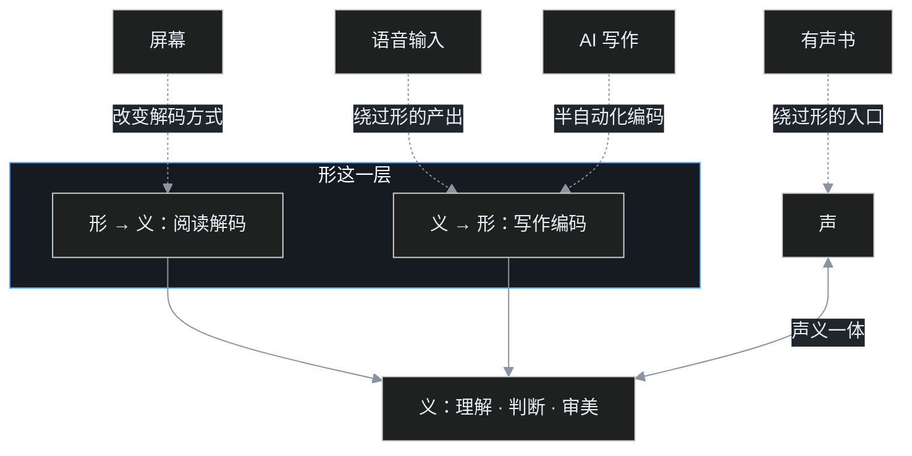

「文明与教育」话题第一篇。语言文字系列收官之后，新开一组松散文章，聊技术、制度和文明怎么改变「读书写字」这件事。

最近叶扬在家里被三个问题连环问住。

孩子戴着耳机听完了一本几十万字的小说，摘下耳机理直气壮地问：这算不算我读完了？

老师布置作文，小朋友反问：让 AI 写一篇不就行了，我为什么还要自己写？

语音输入越来越准，说话就能成稿，那一个字练十遍，还有必要吗？

这些问题放在十年前是抬杠，放在今天是每个有屏幕的家庭每天都在发生的事。要回答它们，不需要新理论，把前面聊熟的框架请回来就够。

## 一、先把旧框架请回来

复习一下：声和义是出厂配置，人在生活里自然焊死；形是唯一需要专门嫁接的一层。识字之后，语文课还有四条线：词汇扩展、书面语、反向表达、文化后台。

把这几样摆在桌上，数字产品做了什么一目了然：**它们正在一项一项绕过「形」这一层，而唯独绕不过「义」。**

图里四条虚线就是这一篇要讲的四样东西：有声书从耳朵直接进场，绕过形的入口；语音输入替你产出文字，绕过形的书写；AI 写作接下反向编码的大半工序；屏幕则改变了形被解码的方式。挨个看。

## 二、有声书：它喂的是声义，练的不是阅读

先给结论：听书当然是好事，但对不同的人，它补的东西不一样。

对一个已经读写自如的成年人，听书几乎无损。形的解码在十几年学校教育里早已自动化，听一本小说和读一本小说，吸收的是同一批情节、观点和词汇，通勤、做家务的时间被白捡回来。

对一个正在识字的孩子，事情要拆开看。听书能给的，是语文课后期四条线里的三样：词汇、理解、文学后台。孩子听着故事就知道了「犹豫」「嫉妒」「居然」这些词在什么情境里用，声义照样焊得牢牢的。更妙的是，好故事由好声音讲出来，书和快乐从此绑定，这份绑定很多人到三十岁才补上。

但有一样它给不了：见词解码这道工序本身。阅读在狭义上，是眼睛看到符号、大脑把符号还原成声音和意义的过程。这条神经通路只有靠成千上万次见到真实的词才能练粗。就像听人讲解一百道数学题，每一步都听得懂，真到自己上手还是生的。

还有一个不必避讳的差别：只听不看时，注意力更容易自己走掉。眼睛有字句可以钉住，耳朵接收到的声音没有实体，手一抖、眼一飘，思绪就跟到别处去了。检验方法也很简单：听完一节，让孩子随口复述刚才讲了什么，复述得出来，才是真听进去了。

如果孩子的「书」全部通过耳机进入，形那层就长期闲置。所以更准确的说法是：**听书算阅读生活，不算阅读训练。** 最划算的组合是听读搭配：先听过、爱上的故事，再把纸书放到手里，声义已经垫好底，形的接入又快又高兴。

## 三、屏幕阅读：同一个词，读法会变

第二个争议：在屏幕上读和在纸上读，到底差在哪？

教育心理学有个可以拿数据说话的答案。Delgado 等人 2018 年发表在《教育研究评论》（Educational Research Review）上的元分析，汇总了过去几十年数十项媒介对比研究，结果是：纸面阅读在阅读理解测验上整体小幅占优，差距在信息类文本和有时间压力的测验里尤其明显；读小说、为了消遣而读，差距很小。

更早，Liu（2005）长年观察人们在数字环境里的阅读行为，发现屏幕上的读法和纸面根本不是一种动作：扫读、跳读、锁定关键词、顺着链接四处跳转明显增多，从头到尾连续沉浸式的阅读减少。屏幕这个媒介，自带一种「觅食」姿态，总在找下一条更值得的信息；纸面则更接近「驻扎」，哪儿也去不了，只能安顿在眼前这页。

还有一个更细的差异：纸面给人空间记忆。读过的人都有这种体验，想起某段话，会记得它在书的左页还是右页、大概在全书什么位置，这个位置感本身就是回忆的线索。纸书有厚度，读着读着能看见自己走了多远；无限滚动的屏幕没有坐标，内容流过就消失，脑子难以给信息安家。

所以保守的结论不是「屏幕毁脑子」。媒介本身在提示阅读策略：通知在闪、链接可点、拇指可以无限下滑，任何意志力在这套设计面前都是昂贵的消耗。真正可操作的办法是按任务选介质：要钻研、要记住的材料，打印出来，或者主动在屏幕上放慢、给电子书分页而不是滚动；消遣和泛读，屏幕毫无问题。

## 四、AI 写作：最难的反向编码被半自动化

第三个问题最尖锐。

前面的文章讲过，阅读是从形里取义，写作是反过来把脑子里的义编码成形，这条反向链路是语文课最贵的训练：选词、造句、铺排结构、预想读者。现在一个对话框几秒就能交出一篇通顺的稿子。这件事的性质，和计算器进课堂是一样的。

计算器把算术运算自动化之后，学校没有取消数学课，因为没掌握底层过程的人，连结果对不对都判断不了。AI 写作同理：它把「草拟」的成本打到接近零，于是另外几样东西变得更贵：你到底想说什么、这篇稿子哪里不对、事实是否站得住、删掉哪段才更好。提出好问题和审出好结果，成了新的核心能力。

写作这件事拆开看，各项子能力被 AI 接走的程度其实不同：

| 写作里的活 | AI 能接多少 |
|---|---|
| 把句子写通顺、不出错别字 | 几乎全部 |
| 凑字数、铺排常见结构 | 大部分 |
| 选词、换一种更准确的说法 | 能给选项，要人来挑 |
| 判断事实真假、核对来源 | 接不了，它还会一本正经地编 |
| 决定到底要表达什么观点 | 完全接不了 |
| 形成个人的声音和风格 | 长期看仍属于人 |

但这里有个残酷的先后关系：**审得出好文章的前提，是自己亲手写过不少坏文章。** 一个人若从没完整走过从模糊意思到通顺句子的全过程，就没有「好」的内在标尺，也没有辨错的嗅觉，AI 给什么就接什么。表达课因此需要重新设计，方向不是假装 AI 不存在，而是把重心从「憋出一篇」挪到提问、审稿、改写和核实：先自己写，再让 AI 提意见，在对比里长本事。

## 五、语音输入：第五种残缺组合

《从听说到读写》里列过一张表：古代文盲、会认不会写的半文盲、不认字的外国人、哑巴英语，四种形音义的残缺组合。现在可以补上第五种：

| 人群 | 声义系统 | 形的识别 | 形的产出 |
|---|---|---|---|
| 语音输入和输入法预测时代的新半文盲 | 完整 | 尚可 | 外包给语音模型和候选词 |

说话成稿、点选成句，手不再需要把整字、整词复原。对形已过关的成年人这是效率，对还在练形的孩子，这是跳过作业。提笔忘字从前只是中年人的自嘲，正在成为一代人的常态。

顺带说一句短视频。它连「绕形」都算不上，因为它提供的是声音加画面的强刺激，连完整的声义叙事都被切成了十几秒的碎片。孩子刷短视频时既没在解码文字，也没在练习跟随一条完整的思路，收获的主要是即时情绪。它不是阅读的敌人那么简单，它是另一种食物：好吃，但单独喂大不了一个人。

## 六、绕不过去的，是「义」

把这几件事并到一起看，会发现一个整齐的格局：所有新技术都在绕过「形」。有声书绕开形的入口，语音输入绕开形的产出，AI 接下形的编码，屏幕改变形的解码方式。没有任何一项技术能替你做另外几件事：判断这段话说得对不对、美不美、该不该信；读懂一篇复杂的东西；形成自己的观点。

这些，全是「义」。

形越是被自动化，义越是成为唯一的分水岭。语文课的重心，注定要从「正确使用文字」上移到「独立判断意义」。落到教孩子，叶扬的结论有三条：

第一，**形的基本功要趁童年练够**：识字、朗读、适量手写，窗口期不等人，自动化一旦在童年建成，终身受用；

第二，**让 AI 当陪练，不当替身**：先自己写，再让 AI 提意见，差距里学到的东西最扎实；

第三，**长线只投一件事，就是意义的容量**：大量的阅读、深度的对话、围绕观点的讨论。这是所有产品都承诺不了、也替代不了的部分。

对正在读这篇文章的成年人，其实也有一句：自己的脑子也在同一套系统里。每天摄入多少完整的长文本、留下多少安静的深度思考时间，决定的不只是孩子的差距，也包括我们自己十年后会成为什么样的读者。

## 参考资料

1. Delgado, P., Vargas, C., Ackerman, R., & Salmerón, L. (2018). Don't throw away your printed books: A meta-analysis on the effects of reading media on reading comprehension. *Educational Research Review*, 25, 23–38.
2. Liu, Z. (2005). Reading behavior in the digital environment: Changes in reading behavior over the past ten years. *Journal of Documentation*, 61(6), 700–712.
3. Carr, N. (2010). *The Shallows: What the Internet Is Doing to Our Brains*（《浅薄：互联网如何毒化了我们的大脑》）.
4. 形音义框架与四种残缺组合，参见语言文字系列《从听说到读写》及发音系列《声音怎么和意思挂上》。

## 相关阅读

- [没有文字的时代，文明把图书馆放在哪里？](2026年9月26日-没有文字的时代图书馆在哪里.md)
- [从听说到读写：古代文盲也会说话，语文课到底在教什么？](2026年9月26日-从听说到读写.md)
