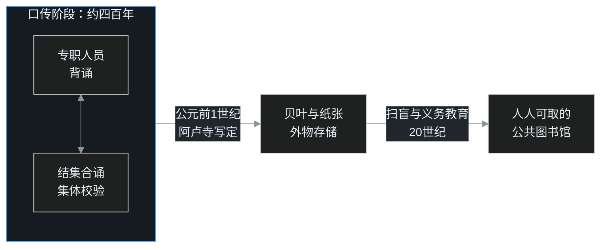

「文明与教育」话题第二篇。上一篇聊屏幕时代里「形」被技术逐项绕过，这一篇往相反的方向走：在连纸都没有的时代，文明怎么记住东西。

公元前5世纪的一个雨季，古印度王舍城外，五百个人依次走进城郊的七叶窟。他们的老师九十天前刚刚涅槃。老师讲法四十多年，自己一个字也没有写过，他说过的一切此刻只存在于几个弟子的记忆里，而记忆的主人是会死的。这场集会要抢救一整套随时可能失传的知识，佛教史称第一次结集。

## 一、记忆是一种岗位

结集由大迦叶召集，摩揭陀的阿阇世王提供护持，五百位阿罗汉参加。诵出教法的人选早有公论：阿难。阿难是佛陀的堂弟，常年随侍左右，号称「多闻第一」，老师讲过的话他记得最多。戒律部分则交给优波离，「持律第一」。

这里还有一个动人的插曲。召集之初，阿难还没有证得阿罗汉果，大迦叶坚持不许阿难参加结集，资格不够。阿难当晚发奋精进，于黎明时分证果，第二天才获准登堂诵法。为什么全教团非等阿难不可？因为「佛陀说过什么」这件事，在那个时间点上几乎是阿难的单人副本，少了这一份，很多经典永远打不开。

注意这里的分工：面对「知识存放在哪里」这个问题，口传文明给出的答案不是纸卷，而是岗位。把最稀缺的记忆力托付给专门的人，再用整个社群的供养，让这些人可以终身只做一件事：准确地记住、准确地传出。僧人、婆罗门、说唱艺人，都是人类最早的「活体硬盘」。

## 二、格式是防呆设计

七叶窟里，优波离分八十次诵出戒律条文，阿难诵出佛陀的教法。怎么保证几十年后不走样？口传文明的办法是给记忆装上格式。

佛经大量使用偈颂：整齐的音节、押韵、一段段排比复沓；每一部经都以「如是我闻」开头，先交代时间地点，再展开正文。这四个字也不是随手写的：佛陀涅槃前，弟子请示后世经典如何起首，佛说就置「如是我闻」，我是这样听老师说的，一句话同时标明来源、取信于人。这些都不是文学装饰，是声音自带的校验机制。背漏一个音节、错一处韵脚，格律立刻报错，就像程序里对不上的括号。重复句式则把记忆切成一个个标准模块，记住框架，往里填词。

## 三、结集是集体 code review

「结集」的梵语 saṅgīti，本意是「等诵、合诵」，一个人诵，大家一起核对。

第一次结集的程序分三步：诵出、审定、分类。现场以问答逐条确认：这句话是在什么地方说的、对谁说的、原文是什么，五百人全体认可，才算定稿。一个人脑子里的错漏，会被其他四百九十九份记忆纠正，这是多副本冗余加交叉校验。大迦叶同时定下一条铁律：「佛所未制不别制，已制不可改」，没规定的不许新增，已规定的不许改动，分明是一套锁版本、防漂移的发布规则。

## 四、口传的三重代价

这套系统能运转，但账单很贵，至少有三项。

**一是分叉。** 佛陀涅槃约百年后，第二次结集在毗舍离召开，起因是不同僧团对十条戒律的理解已经谈不拢。同一套经文在不同地方背了一百年，背出了不同的版本，僧团当场分裂为上座部与大众部，此后一两百年里又分出十几二十个部派。没有固化的文本，版本必然分叉，这和软件世界里无人合并的分支一模一样。

**二是昂贵。** 为了存一套经，要供养整个僧侣阶层，日复一日背诵、合诵，长达几百年。知识的存储成本高到只有王室和大施主供得起。

**三是怕断代。** 一旦战乱、疫病让传承的人断档，经文就永远消失。早期佛教经典里不少只在别处留下过一个名字，正文再也找不回来。

## 五、四百年后的存档

转机发生在约四百年后。据南传佛教记载，公元前1世纪，斯里兰卡伐多伽摩尼·阿巴耶王时期，五百位长老在中部马特莱的阿卢寺举行结集，由罗揭多主持，**第一次把口传的巴利三藏及注疏刻上贝叶**。

贝叶是贝多罗树的叶子，裁齐、压平、烫孔、穿绳，用铁笔在叶面上刻字，涂以炭粉，再擦出字迹，一套经书就是一摞可以长期保存、反复翻阅的叶片。这批写定的典籍按经藏、律藏、论藏分为三大部，卷帙浩繁，后世所称的巴利三藏至此齐整。「活体硬盘」里的数据，终于迁移到了外物之上。百度百科「巴利语」词条与这段记载互证：巴利圣典以口头传承为主，公元前100年左右首次在斯里兰卡形成文字记载。

北传佛教还保留着另一处结集的记忆。约同一时代，贵霜王朝的迦腻色迦王在迦湿弥罗（今克什米尔一带）召集说一切有部的学者编集大毗婆沙论，传说经文镌于铜牒、封入石函、藏于塔中。南传写贝叶，北传刻铜函，两个传承各自给口传知识找了一种外物载体，不约而同。

## 六、全世界的同款技术栈

别以为这是印度特有的笨拙，在文字普及之前，全世界的文明用的是同一套办法。

比佛经更早，印度的吠陀经典由婆罗门口传了两三千年才写定。最古老的《梨俱吠陀》收诗一千零二十八首，从大约公元前一千五百年起全靠声音接力。为了防止传错，他们发展出连诵、倒诵等专门的诵经法，逐字逐音地核对，甚至专门发展出一门研究发音与连音的学问，精密程度堪比校验算法。正因为有这种制度，三千年后的学者才可能按图索骥，复原出上古梵语的大致模样。

希腊的荷马史诗同样出自口头传统。《伊利亚特》和《奥德赛》各分二十四卷，合计近两万八千行，在公元前8世纪前后成文之前，已由一代代歌手口头传唱了数百年。20世纪30年代，美国学者帕里和洛德在南斯拉夫山区记录还活着的民间歌手，发现歌手并不是逐字背诗，而是掌握了大量程式化「零件」：「玫瑰色手指的黎明」「飞毛腿阿喀琉斯」「酒色的大海」，表演时用这些标准模块即兴拼装。洛德在《故事的歌手》（The Singer of Tales，1960）里把这套机制写成理论，回头一对照，荷马史诗的句式正是同款零件库。

在中国的青藏高原，《格萨尔》上百万诗行，靠一代代艺人和抄本流传至今，2009年列入联合国教科文组织人类非物质文化遗产代表作名录。汉族地区说书人一句「花开两朵，各表一枝」，也是口头叙事的标准接口。

汉族的经典也有同款历险记。秦始皇焚书之后，《尚书》一度失传，汉文帝时找到年过九十的伏生，伏生年轻时背过全书，凭记忆口授，再由学生用当时的文字记录，这部书才失而复得。汉代经学讲究师法、家法，老师怎么讲，学生怎么传，本质上就是知识写定之后仍长期保留的口传备份机制。程式、节奏、押韵、专职艺人，这套技术栈在各个文明里反复被独立发明。

## 七、从「存得下」到「用得上」

刻上贝叶不等于万事大吉。外物存储的成本仍然很高：贝叶、羊皮、竹简都昂贵稀缺，读写长期是僧侣、贵族和士人的特权，普通人依旧是上一段说的文盲。知识从「存得下」到「人人用得上」，还要再等一场国家工程。

中国1949年成人文盲率约八成，此后用几十年做三件事：1956年国务院公布《汉字简化方案》，1958年全国人民代表大会批准《汉语拼音方案》，再加上遍及城乡的扫盲班和义务教育，把认字的成本一降再降。简体字降低字形负担，拼音给初学者一座接引的桥，学校则把「接入图书馆」变成每个孩子的权利。

回看整段历史，文明的存储其实走了三级台阶：

**先靠人，把知识记在专门的脑子里；后靠物，把知识刻进贝叶、纸张和芯片；最后靠制度，让每一个普通人都能取阅。** 每一级都不是对上一级的否定：没有口传时代打磨出的格律与程式，早期经典根本熬不到被写定的那天；没有后来写定的文本，口传的分叉和断代也无从治愈。

七叶窟里那场没有纸笔的发布会，和今天每一座数据中心，做的是同一件事：和遗忘对抗，把此刻知道的东西，交给未来。

## 参考资料（已实际核查的公开来源）

1. 王舍城结集（第一次结集，佛灭后90天，大迦叶召集，阿难诵经、优波离诵律）：百度百科「王舍城结集」词条；
2. 阿卢寺结集（公元前1世纪，五百长老首次将巴利三藏刻写贝叶）：百度百科「阿卢寺」词条；
3. 巴利圣典公元前100年左右在斯里兰卡首成文字记载：百度百科「巴利语」词条；
4. 帕里-洛德口头程式理论，洛德《故事的歌手》（The Singer of Tales, 1960）：百度百科「故事的歌手」词条；
5. 《格萨尔》及2009年列入联合国教科文组织人类非物质文化遗产代表作名录：百度百科「格萨（斯）尔」词条；
6. 《汉字简化方案》（1956）、《简化字总表》（1964）、《汉语拼音方案》（1958）：百度百科「汉字简化」「汉语拼音」词条；
7. 伏生口授《尚书》、汉代经师师法家法：《史记·儒林列传》及历代经学史公开记载；
8. 1949年成人文盲率约八成：参见语言文字系列《从听说到读写》所引统计口径。

## 相关阅读

- [屏幕时代，语文课还教什么？](2026年9月26日-屏幕时代语文课还教什么.md)
- [从听说到读写：古代文盲也会说话，语文课到底在教什么？](2026年9月26日-从听说到读写.md)
