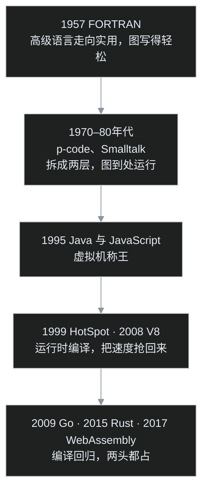

> 这是「编程底层」系列下篇。上篇讲清了一行代码怎么变成 CPU 的动作，还留下一个悬念：编程语言为什么绕着「编译、解释、再编译」兜了一大圈。这一篇叶扬就用七十年的历史，把这个圈走给你看。你不需要记住年份，只需看懂一件事：速度和省心，是怎么一次次交换的。

## 小白问题

先说个反常识的现象。

1957 年，程序员写好代码，要先编译成机器码才能跑；到了 1995 年，Java 火了，流行的是先编成一种中间码、靠虚拟机边跑边处理；可最近这一二十年，Go、Rust 这些又「退」回了编译，写完先编译、直接出机器码，反而成了潮流。

折腾了快七十年，怎么像是绕了一圈，又回到起点？难道中间几十年的虚拟机都白搞了？

叶扬先把结论撂在这：**不是绕圈，是螺旋上升**。每一次「回头」，都带着上一阶段解决不了的新问题。先把全程画成一条时间轴，再回头逐段讲。

要讲清这个圈，得回到没有高级语言的年代。

## 一、起点：人为什么要发明高级语言

最早的程序员，是真的在拨弄 0 和 1，后来有了汇编语言，用几个好记的缩写代替机器码，已经是巨大进步。但汇编依然是「贴着某一台机器」说话的：你得事无巨细地指挥，数据放哪个位置、先算哪一步，全都要操心，而且换一台机器，整段程序基本作废。

1950 年代，IBM 的工程师约翰·巴克斯（John Backus）受够了这种苦。他带头做了一门叫 **FORTRAN** 的语言，1957 年正式发布，让人能用接近数学公式的方式写程序，再由一个叫编译器的程序自动翻译成机器码。

这里要特别说严谨：FORTRAN 不是人类历史上第一个高级语言，但它是**第一个被广泛实际使用、还自带高质量编译器的高级语言**。它用铁的事实打消了所有人最大的顾虑：自动翻译出来的机器码，效率居然能逼近人手写的汇编。

FORTRAN 这一步，完成了第一次交换：**人交出一点点运行速度，换回写程序的轻松，以及不被某一台机器绑死的自由。** 此后语言如雨后春笋，1958 年麦卡锡在麻省理工做出了 Lisp，1959 到 1960 年间 CODASYL 委员会制定了商用的 COBOL。

顺带辨一个流传很广的说法：很多人讲「格蕾丝·赫柏在 1959 年主导设计了 COBOL」。更严谨的事实是，COBOL 由 CODASYL 委员会集体制定，赫柏设计的 FLOW-MATIC 是它的重要蓝本，她也参与早期讨论、担任顾问，但并不是实际执笔的人。称她一声「COBOL 之母」是敬意，却不该把集体成果记成一人之功。

## 二、为了「到处运行」，人们把翻译分成了两层

高级语言解决了「写得轻松」，但「换台机器就用不了」的心病还在。编译型语言产出的机器码，是冲着某一种具体 CPU 去的，换个体系就得重新编译。

1970 年代，有人想出一个聪明办法：**别急着一次翻到底，先翻成一种和具体机器无关的中间码。** 1977 年，加州大学圣迭戈分校的 Kenneth Bowles 牵头做了 UCSD Pascal，程序先编译成一种叫 p-code 的「通用码」，再由每台机器上各自的一个小程序去解释执行。只要给新机器配上这个小程序，同一份代码就能跑。

几乎同一时期，施乐帕洛阿尔托研究中心（Xerox PARC）的艾伦·凯（Alan Kay）团队在打磨 Smalltalk。它不只是一门语言，还自带一整套虚拟机和图形化开发环境，并且在 1980 年前后就已经会「按需把常用的中间码翻译成机器码缓存起来」，这正是即时编译（JIT）雏形的早期模样。

这两步合起来，完成了第二次交换：**把编译拆成「先翻成通用码、落地时再说」两层，牺牲一点运行时的速度，换来真正的「一次编写，到处运行」。**

## 三、Java 与互联网，把虚拟机推上王座

让「中间码加虚拟机」这套打法真正称王的，是 1995 年 Sun 公司发布的 Java，主导者是詹姆斯·高斯林（James Gosling）。

它喊出的口号传遍世界：**Write Once, Run Anywhere，一次编写，到处运行。** 你写的代码先编译成 Java 字节码，丢给 Java 虚拟机，Windows、Mac、各种服务器上都能跑。那几年互联网爆发，这种「不挑平台」的能力，正好踩在时代的点上。

同一年还发生了一件影响深远的小事。网景公司为了给刚诞生的网页加上交互，雇了布兰登·艾克（Brendan Eich），他在 1995 年用大约十天写出了一门新语言的第一版原型，这就是 JavaScript。注意，「十天」说的是原型用时，不是整门语言十天定型；它在 1995 年底随浏览器发布，最初是纯解释执行的，慢，但让网页第一次「活」了过来。

至此，省心和跨平台都拿到了，可旧问题又冒头：中间码靠虚拟机边解释边跑，**速度到底还是慢**。大型程序一复杂，就有些吃力。

## 四、为了把速度抢回来，编译又被请了回来

于是故事迎来最精彩的转折：人们没有放弃虚拟机，而是把「编译」重新请回了运行时。

Java 虚拟机开始偷偷观察程序，发现某段代码被反复执行，就当场把它编译成机器码存好，下次直接跑，跑得越多越快。1999 年，Sun 发布了 HotSpot 引擎，2000 年起成为默认虚拟机，靠这种「探测热点加即时编译」，让跑在虚拟机上的 Java，速度逼近了提前编译的原生代码。

真正让世界震惊的是 2008 年 Google 发布的 V8 引擎，它随 Chrome 浏览器一同开源。这里也要说严谨：最初的 V8 **并没有解释器，而是直接把 JavaScript 编译成原生机器码再执行**，一举让这门「慢脚本语言」的性能有了数量级的提升；分层的优化编译体系是后来才逐步加上的。V8 不仅救活了浏览器里的大型网页应用，还在 2009 年催生出 Node.js，让 JavaScript 一路杀到了服务器。

你发现没有，这是第三次交换：**保留跨平台的虚拟机外壳，只在运行时把高频代码编译成机器码，把早年让出去的速度，又一点一点抢了回来。**

## 五、螺旋的顶端：编译型语言为什么「又火了」

走到这儿，就能回答开头那个「绕一圈」的疑问了。

2009 年，Google 正式公布了 Go，背后站着 Robert Griesemer、Rob Pike 和 Unix 之父之一的肯·汤普森；2015 年，起源于 Graydon Hoare 个人项目、由 Mozilla 赞助多年的 Rust 发布了 1.0。它们都「回到」了提前编译、直接产出机器码的路子。

但这绝不是退回 1957 年。这些新语言带着虚拟机时代攒下的全部家底：自动内存管理的经验、严格的安全保证、强大的并发支持，Go 还把编译速度做得飞快，让人几乎感觉不到「要先编译」。它们要的是：**既要编译型语言的快，又要高级语言几十年进化出来的省心和安全。**

2017 年落地的 WebAssembly 则给这个螺旋画了漂亮的收束。它是一种不绑定具体机器的二进制格式，让 C、C++、Rust 编译后的代码，能以接近原生的速度在浏览器里安全运行。你看，它同时是「编译的产物」，又是「跨平台的通用码」：当年看似对立的两条路，在它身上合成了一条。

## 程序员类比时间，再自己戳三个洞

叶扬给同行打个比方：**这七十年像极了系统架构的演进。** 最早是单机裸跑，图快；后来为了跨环境、易扩展，加了一层虚拟机和中间协议，像在代码底下垫了一层容器和运行时；再后来为了性能，又在运行时做热点缓存和即时优化，JIT 就像运行时的动态加速。不写代码的朋友，记住「图快→图省心→又把快抢回来」这条主线即可。

照例戳破三个洞：

第一，**架构分层是少数工程师事先设计的，语言这几层却多是被问题逼出来的**。虚拟机不是谁高瞻远瞩一次性规划，而是「跨平台疼一次、性能再疼一次」逐步长出来的。

第二，**JIT 不像加缓存那样立竿见影且可控**。它要先观察、有启动开销，还可能猜错哪段是热点，优化了又得退回解释，并非「加上就一定更快」。

第三，**别把「编译型就一定快、虚拟机就一定慢」当成铁律**。顶尖的 JIT 能在运行时拿到静态编译器看不到的信息，局部甚至反超；性能高低取决于具体实现，而不是那句口号。

## 吵架现场：一条隐线，同一个人

讲技术史，常有人质疑：你把 JIT 说得像 Java、V8 的发明，可即时编译这思想，难道是 1990 年代才有的吗？

质疑得对。**JIT 的根子要老得多**：1960 年麦卡锡在 Lisp 里就动过运行时翻译的念头，1968 年汤普森为加速正则匹配在运行时生成机器码，1980 年的 Smalltalk、1986 年起的 Self 语言，把自适应优化这套功夫锤炼成熟。「Just-in-time」这个词借自制造业的准时制，是 1990 年代随 Java 才流行开的，但思想已经积累了三十年。

这条隐线上还藏着一个人，叫 Lars Bak。他出自研究 Self 的团队，参与过后来演变成 HotSpot 的 Strongtalk，又正是 2008 年 V8 的首席开发者。从 Self 到 HotSpot 再到 V8，同一套「运行时编译」的手艺，在他手里接力传了二十多年。所谓绕一大圈，其实是同一群人、同一类问题，在不同时代一次次给出更好的答案。

## 卡壳角：叶扬纠结过的取舍

叶扬写到这儿，反倒在一个价值判断上卡住了：**既然 JIT 这么强、能把速度抢回来，那为什么 Go、Rust 还要干脆回到提前编译，运行时不搞这套？**

琢磨下来才想通，因为 JIT 的快是有代价的：它要占额外内存，启动那一下得「热身」，对那些追求「一按下就立刻响应、内存抠门、行为可预测」的场景，比如命令行小工具、系统底层服务，提前编译那种「开机即满血、不拖泥带水」的确定性，反而更合适。

所以这几十年并不是在选「谁取代谁」，而是在丰富工具箱：要长期跑、跨平台、能从运行时信息里受益，选虚拟机加 JIT；要启动快、省内存、性能可预测，选提前编译。叶扬真正想通的是，**好的工程史从不给出唯一正确答案，它只是把「在什么约束下该交换什么」，越讲越清楚。**

## 术语表：先用大白话再记词

- **汇编语言**：用缩写代替 0 和 1 的低级语言，仍贴着具体机器。
- **高级语言**：更接近人表达习惯的语言，如 FORTRAN、C、Java。
- **FORTRAN**：1957 年发布，第一个被广泛使用的高级语言，巴克斯主导。
- **COBOL**：1959 到 1960 年 CODASYL 制定的商用语言。
- **p-code / 字节码**：不绑定具体机器的通用中间码。
- **Smalltalk**：施乐 PARC 的纯面向对象语言，自带虚拟机，JIT 的早期实践。
- **Java / JVM / 字节码**：1995 年发布，靠虚拟机实现「到处运行」。
- **HotSpot**：1999 年起的 Java 虚拟机，靠热点探测加 JIT 提速。
- **JavaScript / V8**：1995 年艾克十天写出原型；2008 年 V8 直接编译机器码，让其脱胎换骨。
- **JIT（即时编译）**：运行时把高频代码临时编译成机器码。
- **Go / Rust**：2009、2015 年登场的新一代提前编译语言。
- **WebAssembly**：2017 年落地的可移植二进制格式，是编译目标，也是跨平台通用码。

## 收尾：圈没有白绕

回到开头那个问题：七十年是不是白折腾了？

叶扬的答案是：**正因为绕了这一圈，我们今天才能两头都占。** 想轻松表达、跨平台，有高级语言和虚拟机；想要极致的快和确定，有现代化的编译型语言；而 WebAssembly 这样的新东西，正在把「编译的快」和「跨平台的自由」缝合成同一件事。

技术史最迷人的地方就在这：它表面上反复回到老问题，可每一次回头，手里都多了一副牌。CPU 始终只会那一套 0 和 1，变的是人驾驭它的方式，越来越从容，也越来越自由。

## 编程底层系列目录

[1. 你写的代码，CPU 是怎么跑起来的](/drafts/2026%E5%B9%B49%E6%9C%8827%E6%97%A5-%E4%BD%A0%E5%86%99%E7%9A%84%E4%BB%A3%E7%A0%81CPU%E6%98%AF%E6%80%8E%E4%B9%88%E8%B7%91%E8%B5%B7%E6%9D%A5%E7%9A%84.md) ｜ **2. 从 FORTRAN 到 V8（本篇·历史）**

[📚 返回博客地图](/drafts/2026%E5%B9%B49%E6%9C%8827%E6%97%A5-%E5%8D%9A%E5%AE%A2%E5%9C%B0%E5%9B%BE.md)