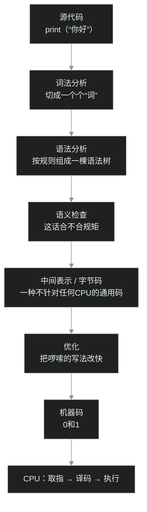
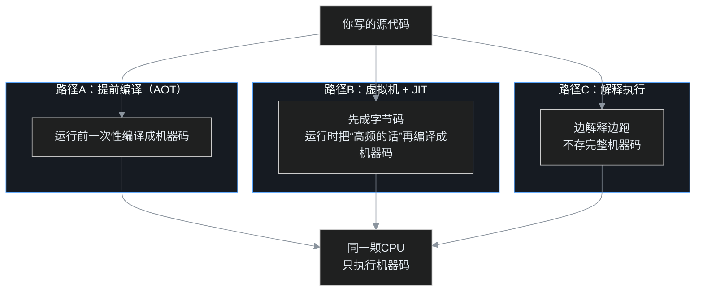

> 这是「编程底层」系列上篇，讲一件所有编程语言都绕不过的事：你写的那行字，到底怎么变成 CPU 真的去干活。下篇再聊它们为什么会进化成今天这样。全程不假设你写过代码，尽量说人话。

## 小白问题

你在键盘上敲下 `print("你好")`，按下回车，屏幕上蹦出「你好」两个字。

看起来平平无奇。但请停下来想一秒：电脑这堆铁疙瘩，它**根本不认识 `print`，也不认识「你好」**。CPU 这颗芯片这辈子只会一件事，就是摆弄 0 和 1。那问题就来了，从你认识的这行英文字母，到 CPU 能啃的 0 和 1，中间到底是谁，在什么时候，悄悄做了翻译？

更怪的是，Python 能跑，Java 能跑，C 语言也能跑，几十上百种语言，长相完全不同，凭什么最后都能让同一颗 CPU 听话？这一篇，叶扬就陪你把这一行代码按下回车之后的经历，从头走一遍。走完你会发现，五花八门的语言，背后其实是同一套剧本。

## 一、先认识主角：CPU 只会说一种「方言」

要看懂这场翻译，先得认识那个最挑剔的主角，CPU。

CPU（中央处理器，可以理解成电脑的大脑）有个特别难伺候的脾气：它只认一种语言，业界叫**机器码**，本质就是一串又一串的 0 和 1；而且不同种类的 CPU，比如电脑和手机里的芯片，还各有各的一套机器码，并不通用。比如某一串二进制位，意思可能是「把一个数搬过来」，另一串意思是「把两个数加起来」。这种话人读起来像天书，但 CPU 生来就懂，不需要任何人教。

CPU 干活还特别简单，一辈子就重复三个小动作，循环到地老天荒：

**取指**：从内存里取一条指令；**译码**：弄明白这条指令想干嘛；**执行**：真的动手干，比如算个加法、搬个数据。干完再去取下一条。这个三步循环有个学名叫**指令周期**，你手机、电脑里那颗芯片，以每秒几十亿次的时钟节拍高速运转。

打个比方，CPU 像一个手艺极快、但只听得懂一种土话、而且只会照本宣科的厨师。你给他一本法文菜谱，他一个字都看不懂；你必须先把菜谱逐字逐句翻译成他那套土话，他才能火力全开，一秒炒几十盘。

那本「翻译好的土话菜谱」，就是机器码。

## 二、第一处翻译：你写的代码，CPU 一个字都看不懂

矛盾就摆在这：你写的是 `print`、`if`、`for` 这些人能读懂的词（这叫**源代码**），CPU 却只认 0 和 1。两种语言之间隔着一道鸿沟，必须有人翻译。

而翻译这件事，有两种最根本的做法，区别只在「什么时候翻」。

第一种叫**编译**，像翻译一整本书。有个特殊的程序叫**编译器**，它在你运行之前，先把整本源代码一次性全翻译成机器码，产出一份完整的土话菜谱存起来。等你真正要运行，CPU 直接拿着现成的菜谱炒，飞快。

第二种叫**解释**，像现场口译。另一种程序叫**解释器**，它不提前准备，你运行一句，它当场翻一句、CPU 执行一句，翻一句、执行一句。灵活，你随时能改，但因为多了个「现场口译」站在中间，通常慢一些。

就这一个「提前翻好」还是「边跑边翻」的区别，已经能解释生活里一大半现象：为什么 C 语言写的游戏画面流畅，为什么 Python 写点小工具特别省心。后面会把这两条路讲透，别急。

## 三、一行代码的闯关之旅

现在，让叶扬把镜头拉近，跟着这一行 `print("你好")` 走一遍。无论哪种语言，源代码在变成机器码前，大体都要闯过下面几道关。为了不吓到你，先把全程画成一张图，然后逐关讲。

**第一关，词法分析。** 编译器先把你写的那串字母，像读句子一样切成一个个有意义的最小片段。`print` 是一个词，`(` `)` 是符号，引号里的「你好」是一段文字。这一步只负责「切词」，不管你写得对不对，类似把一篇文章先拆成一个个单词和标点。

**第二关，语法分析。** 切好词还不够，得看它们组合得合不合规矩。`print（“你好”）` 是合法的，可要是你写成 `print（你好"`，括号引号对不上，就像一句话引号开了不闭合、成分也不全，语法上根本不通。这一关会把词和词的关系组织成一棵树，叫**语法树**，谁包含谁、谁修饰谁，一目了然。

**第三关，语义检查。** 语法对，不代表说得通。「我喝了一台电脑」，每个词都对、句子也完整，但语义荒谬，人喝不了电脑。编译器在这一关专挑这类错：你是不是把文字当成数字去相加了，某个东西用之前是不是压根没出现过。

闯过这三关，你写的「人话」才算被真正读懂。注意一个有意思的细节：到这里为止，还没碰任何具体的 CPU，处理的都是语言本身的结构。

## 四、关键的中转站：字节码

读懂之后，很多语言不会直接奔着机器码去，而是先翻译成一种**中间表示**，也叫**字节码**。

这是全篇最值得停下来体会的设计。字节码是一种「不针对任何具体 CPU」的通用码，它比源代码更接近机器，又还没绑定到某一种芯片上。可以把它想成一种「世界语版本的菜谱」：先把法文、中文、意大利文菜谱统统翻成一份中立的世界语底稿，将来要送给哪个国家的厨师，再从世界语翻成那个国家的土话。

为什么要绕这一道？下篇讲历史时你会看到，这正是「一次编写，到处运行」的命根子。同一份字节码，可以拿到 Windows、Mac、手机上跑，因为差异被甩给了各自平台上那台专门的「虚拟机」去消化。

顺带一提，字节码这个阶段还常常做**优化**：你绕着弯写的啰嗦代码，被悄悄改成又快又省的等价写法，就像编辑把一句冗长的话改简洁，意思不变，读起来更快。

最后，从字节码（或直接从源代码）翻译成机器码，送到 CPU，那台只懂土话的厨师终于开火：取指、译码、执行，屏幕上跳出「你好」。

## 五、三条路径，通向同一个终点

现在可以把最开始的问题彻底回答了。所有语言，按「在哪个环节、用什么方式翻译」，大体走三条路。叶扬画一张图，你一眼就能看清它们的关系：殊途同归，最后都流进同一颗 CPU。

**路径 A，提前编译（学名 AOT）。** C、C++、Rust、Go 走这条。运行之前，整本源代码已经编译成某一颗具体 CPU 的机器码。好处是运行起来飞快，因为没有翻译官挡在中间；代价是这份菜谱只认一种土话，换个 CPU 体系往往要重新编译。

**路径 B，虚拟机加即时编译（JIT）。** 这条路不是凭空冒出的第三种原理，而是把前面说的编译和解释两种办法合起来用。Java、C# 走这条，现代 JavaScript 引擎也是。它们先编成字节码，靠一台**虚拟机**在运行时解释执行。妙的是，虚拟机会在旁边偷偷观察，发现某段代码被反复执行（这种叫「热点」），就当场把它编译成机器码缓存起来，下次直接跑。常跑的越快，越跑越快，相当于口译官发现这句话今天说了一百遍，干脆提前翻好揣兜里。

**路径 C，纯解释。** 一些脚本、早期的 Shell 这么干，没有完整的提前编译，边读边解释。最灵活、对写代码的人最省事（不用先编译），但运行起来通常最慢，因为每跑一步都得现场翻。

你看，三条路入口不同，终点完全一样，都是把代码变成机器码，喂给那个只会说土话、手却快得离谱的厨师。

## 程序员类比时间，再自己戳三个洞

叶扬打个程序员同行一看就懂的比方：**源代码是你写的高级业务代码，编译器/解释器像一套部署流水线，机器码是真正在服务器上跑的进程，CPU 就是那台物理机。** 你写的 SQL、框架代码，最终都要变成机器上实实在在的指令，跟你写的网页最终都要变成浏览器里的 DOM 一样。不写代码的朋友就记住上一句厨师的比方，够用了。

但每个类比都在撒谎，得自己戳破：

第一，**部署流水线是死的，翻译却可能发生在运行中**。你以为编译一定在上线前，可 JIT 偏偏是程序边跑边编译，「构建期」和「运行期」的墙在这里是透的。

第二，**同一份业务代码不会因为访问量大就自动变快，但 JIT 代码会**。它能根据「这段跑得勤」现场优化，这是静态部署没有的本事。

第三，**别把字节码当成某个具体格式**。它不是一种统一标准，每家虚拟机都有自己的一套字节码，更像「各自定义的中间协议」，而不是全世界通用的那一种世界语。

## 吵架现场：Python 到底是编译还是解释？

学到这，一定会有人拍桌子：你说编译和解释两条路，那 Python 到底算哪头？

这是个好问题，答案有点「拆台」：**它两头都沾**。Python 运行时，其实会先把源代码悄悄编译成字节码（你可能见过文件夹里那些 `.pyc` 缓存文件，那就是），然后再由解释器一条一条解释这些字节码。它既不是纯解释，也没有编译到机器码。

所以「编译还是解释」更像一条连续的光谱，而不是非黑即白的两个格子。真实语言几乎都在中间选位置，很多还混搭。真正铁的只有一件事：不管绕几道，最后都得变成机器指令，CPU 才肯动。拿着「三分类」去给每种语言硬贴标签，反而会错过最精彩的部分。

## 卡壳角：叶扬当初也没想通的事

叶扬自己刚学编程时，卡在一个特别朴素的问题上：**既然最后都得是机器码，那大家干嘛不直接写机器码，省得来回翻译？**

后来才慢慢想明白：机器码对人太不友好了，全是 0 和 1、地址、寄存器，写个加法都要操心数据放哪，稍微复杂点的程序根本没法维护。高级语言把这些脏活累活全包了，人只管表达意图，翻译成本交给越来越快的机器去扛。这是一笔非常划算的买卖，用一点点机器的算力，换回人能驾驭的复杂度。

真正想通这一点，才理解编程语言这几十年到底在为什么奋斗：不是让 CPU 更舒服，CPU 一直只认 0 和 1；而是让人能越来越轻松、越来越安全地，把意图交到那颗芯片手里。

## 术语表：先用大白话再记词

- **源代码**：你敲出来的、人能读懂的那部分代码。
- **机器码**：CPU 唯一直接认识的 0 和 1 指令。
- **CPU / 指令周期**：电脑大脑；它不停重复「取一条指令、弄明白、动手干」。
- **编译**：运行前把源代码整本翻译成机器码，像翻译书。
- **解释**：运行时一句句当场翻译，像现场口译。
- **编译器 / 解释器**：分别干上面两件事的程序。
- **语法树**：把代码按语法组织成的一棵树，看清词和词的关系。
- **字节码 / 中间表示**：一种不绑定具体 CPU 的「通用中间码」。
- **虚拟机**：运行时负责执行字节码的那台「软件模拟的机器」。
- **AOT / JIT**：提前编译；运行时把高频代码现场编译。
- **热点**：被反复执行、值得 JIT 专门提前编译的那段代码。

## 收尾，留个钩子

这一篇我们横着看了「空间」：一行代码怎么层层闯关，最后变成 CPU 的动作，三条路径怎样殊途同归。

但你心里大概还悬着几个「为什么」：为什么非要发明字节码绕一道？为什么 Java 当年敢喊「到处运行」？为什么这几年 Go、Rust 这些「编译型」语言又火了回来，像是兜了个圈子？

这些问题，得换一根「时间」的轴才能答清。下篇，叶扬就带你从 1957 年的 FORTRAN 一路走到今天的 V8，看看编程语言这七十年，到底在速度和省心之间，绕了怎样一个漂亮的圈。

## 编程底层系列目录

**1. 你写的代码，CPU 是怎么跑起来的（本篇·机制）** ｜ [2. 从 FORTRAN 到 V8：编程语言为什么绕了一大圈](/drafts/2026%E5%B9%B49%E6%9C%8827%E6%97%A5-%E4%BB%8EFORTRAN%E5%88%B0V8.md)

[📚 返回博客地图](/drafts/2026%E5%B9%B49%E6%9C%8827%E6%97%A5-%E5%8D%9A%E5%AE%A2%E5%9C%B0%E5%9B%BE.md)