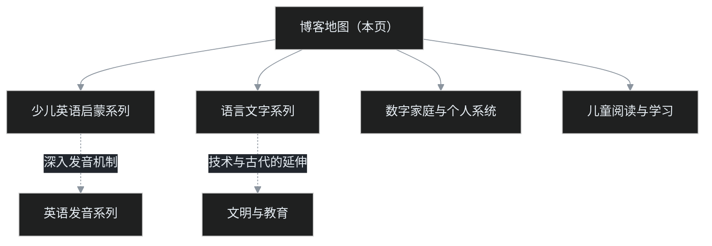

不知道从哪篇开始，就先看这篇。

这是叶扬的博客地图。文章按**主题和系列**组织，每个系列内部有自己的目录和阅读顺序；本页只负责把读者送到正确的入口，不重复搬运各系列的篇目清单，所以它会一直很短。

## 一、三条推荐路线

- **想教孩子英语、或者自己想把英语搞明白**：先看少儿英语启蒙系列，从《英语启蒙先搞懂这几件事》进门，跟着路线图往下走；想再深入发音机制，再续上英语发音系列。
- **想看语言、文字与文明的来龙去脉**：进语言文字系列，从《芬兰孩子三个月识字》一路读到《从听说到读写》；读完还想看技术和古代文明怎样改变读书写字，再看文明与教育的两篇。
- **想看一个程序员怎么用数据和工具经营家庭和自己**：进数字家庭与个人系统，两篇实操可以直接上手，五篇调研展示问题是怎么一步步发现和拆解的。

## 二、主题总目录

## 三、五个主题入口

**1. 少儿英语启蒙系列（全 5 篇已完结）**：动手前先摆正认知，再看路线图，照着一步步走。从 [《英语启蒙先搞懂这几件事》](/drafts/2026%E5%B9%B49%E6%9C%8827%E6%97%A5-%E8%8B%B1%E8%AF%AD%E5%90%AF%E8%92%99%E5%85%88%E6%90%9E%E6%87%82%E8%BF%99%E5%87%A0%E4%BB%B6%E4%BA%8B.md) 开始。

**2. 英语发音系列**：音素音标、音变、重音语调、拼读规则、声义绑定，外加一份 44 音素全清单。从 [《音素和音标是一回事吗？》](/drafts/2026%E5%B9%B49%E6%9C%8825%E6%97%A5-%E9%9F%B3%E7%B4%A0%E5%92%8C%E9%9F%B3%E6%A0%87%E6%98%AF%E4%B8%80%E5%9B%9E%E4%BA%8B%E5%90%97.md) 开始。

**3. 语言文字系列**：世界文字的格局、汉字为什么独存、双向学习者的镜像、代码与语言、语文课到底教什么。从 [《芬兰孩子三个月识字》](/drafts/2026%E5%B9%B49%E6%9C%8826%E6%97%A5-%E8%8A%AC%E5%85%B0%E5%AD%A9%E5%AD%90%E4%B8%89%E4%B8%AA%E6%9C%88%E8%AF%86%E5%AD%97.md) 开始。

**4. 文明与教育**：屏幕时代的语文课，以及没有文字的时代文明如何记忆。从 [《屏幕时代，语文课还教什么？》](/drafts/2026%E5%B9%B49%E6%9C%8826%E6%97%A5-%E5%B1%8F%E5%B9%95%E6%97%B6%E4%BB%A3%E8%AF%AD%E6%96%87%E8%AF%BE%E8%BF%98%E6%95%99%E4%BB%80%E4%B9%88.md) 开始。

**5. 数字家庭与个人系统**：博客与审稿站两篇实操，加上家庭操作系统、家庭数据、个人成长数仓、上学与音标五篇调研。从 [《18 秒零成本个人博客》](/drafts/2026%E5%B9%B49%E6%9C%8822%E6%97%A5-18%E7%A7%92%E9%9B%B6%E6%88%90%E6%9C%AC%E4%B8%AA%E4%BA%BA%E5%8D%9A%E5%AE%A2.md) 开始。

**6. 儿童阅读与学习（2 篇筹备中）**：孩子认字为什么有快有慢、阅读差距从哪里来。待写篇目：《为什么有的孩子认字这么难？》《孩子的阅读差距，其实在放学之后》。

## 四、这张地图怎么维护

- 各系列的篇目明细和完成状态只在系列内部维护，本页只放粗粒度入口，避免同一份清单两处对不上。
- 本页只在「新主题开线」或「某系列完结」时更新。
