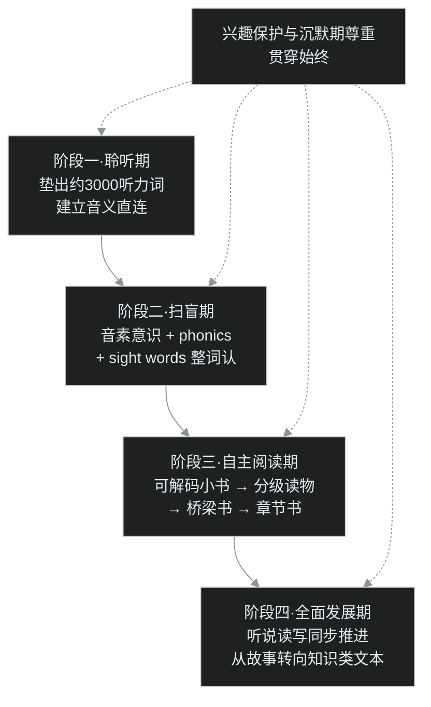

少儿英语启蒙系列第二篇，给全系列定骨架。

为什么很多家庭英语启蒙几年，孩子还是见词不敢读、听完没反应？大概率不是材料不好，而是顺序错了：耳朵还没打通，就开始学规则；规则刚学完，又没有合适的书接住。这一篇把整条路线一次讲透，年龄仅供参考，以孩子实际状态为准。

## 一、为什么「顺序」是铁律

回忆发音系列第五篇讲过的机制：母语孩子学 phonics 的时候，已经会说几千个词，规则的作用是把字形接到「早已会说的那个词」上。

零基础直接学拼读规则会怎样？孩子看到 cat，按规则拼出 /kæt/，然后呢？这个声音背后是空的，没有任何意思。等于打电话接到了空号。这就是为什么必须先让耳朵和意思连好，再让文字进场。

## 二、全景路线图

年龄参考可对照盖兆泉在《做孩子最好的英语学习规划师》（外研社，2015）里的分法：3–5 岁听力输入，6 岁自然拼读扫盲，7–9 岁全面发展，10–12 岁提高到学术英语。书里一句话说得很决绝：**「听、说、读、写」的顺序不可颠覆。**

## 三、阶段一：聆听期，给规则准备好「可接的号」

这一阶段唯一的任务：让孩子在真实情境里听懂、会说一批英语词，目标是攒出两三千个「听到就知道意思」的词。材料按四条线供给：

1. **英文儿歌和童谣**：旋律加重复，词少复现率极高，孩子边做动作边唱，意思直接挂在声音和动作上；
2. **慢速、重复的动画**：画面本身就在解释台词，apple 的声音和苹果画面同时出现；
3. **亲子共读绘本**：家长或点读笔发声，孩子看图，不需要翻译；
4. **生活里的 TPR 指令**：stand up、touch your nose、give me the ball，听指令做动作，声音和后果直接相连。

这一阶段可能持续一两年，中间孩子会经历几个月的「沉默期」，只听不说。正常，不催、不考、不强迫表演，主动开口由孩子自己决定。

怎么判断聆听期垫够了，可以进入下一阶段？看三个信号：一是熟悉的儿歌和指令不用看画面也能反应；二是能主动蹦出整句的简单表达，而不只是单个词；三是听到没学过的词，能从情境里猜出大概。数字从来不是硬指标，耳朵对英语不再陌生，才是。

## 四、比规则更早的功课：音素意识

正式学字母之前，还有一项中国家庭普遍跳过的能力：音素意识，即把一个词的发音在口头拆成单个音并重新拼合的能力。

日常全是游戏，不必碰文字：

| 游戏 | 玩法示例 |
|---|---|
| 拍手拆音 | cat 拍三下：/k/、/æ/、/t/ |
| 首音替换 | 把 cat 的第一个音换成 /h/ 是什么？hat |
| 押韵判断 | cat 和 hat 押不押韵？log 和 big 呢？ |
| 首尾音 | sun 开头是什么音？dog 最后是什么音？ |
| 拼合 | /d/ + /ɒ/ + /g/ 拼起来是哪个词？dog |

这几个游戏的难度有先后：孩子最先掌握押韵，然后是听出首尾音，再学会把几个音拼合成词，最难的是独立把整词拆成单个音。顺序玩，不必一次到位。

为什么这一步如此重要？美国国家阅读委员会（National Reading Panel）2000 年发布的报告，在海量研究基础上把阅读教学归纳为五根支柱：**音素意识、phonics、流畅度、词汇、理解**，音素意识排在首位。耳朵分不出单个音，眼睛学字母规则就是死记，因为孩子不知道每个字母对应的是语音里的哪一块。这张表也可以当阶段自检表用，五个游戏都玩得转，再进下一阶段。

## 五、阶段二：phonics 与 sight words，两条腿走路

音素意识就位，phonics 正式进场：学字母和字母组合分别对应哪个音，练「见词能读，听音能写」。百度百科「自然拼读」词条给出的口径是，英语中约 80% 的单词符合拼读规则。

规则本身也有由简到繁的学习顺序，急不得：先学单辅音加短元音，读 cat、dog 这类 CVC 单词；再学辅音连缀和长元音，读 stop、cake；之后是元音组合（ea、oo、ou）和 r 控制元音（car、bird）；最后才轮到多音节词拆分。每学一批新规则，立刻在可解码小书里读到，规则才长得住。

注意，是约 80%，不是全部。剩下那部分高频词偏偏最常用：the、said、was、have、of、you，它们不按规则出牌，要整词认读，这就是与规则平行的第二条线 sight words（常见的有 Dolch 和 Fry 两套词表）。只学规则的孩子一翻开真书，每页都被 the、said 卡住，读不成句；两条线并行，孩子才能尽快体验到「我能读一整句」的成就感。

## 六、规则会还回去：读物必须跟上

phonics 最大的坑是学完不用，三个月就退化。学规则的同时，要读对应的「可解码小书」（decodable readers）：这种小书的用词恰好只包含已经学过的规则，孩子靠自己就能整本读下来，成就感和巩固一次解决。

往后的阅读阶梯是这样的：

| 台阶 | 特征 | 代表类型 |
|---|---|---|
| 可解码小书 | 用词只含已学规则 | 各拼读体系配套读物 |
| 分级读物 | 按难度分级，句式受控 | 牛津树、RAZ、海尼曼等体系 |
| 桥梁书 | 图少字多，开始有章节 | I Can Read、神奇树屋（Magic Tree House） |
| 章节书 | 以文字为主，长篇叙事 | 各类儿童小说 |

不少家庭卡在「分级读完就没动静」：其实只要把对路的桥梁书和章节书不断供，被故事勾着走的孩子会自己往上爬。阅读量本身又会带回三样东西：流畅度、词汇量、理解力，恰好对应五支柱里剩下的三根，路线闭环。

这里单独说流畅度。刚起步的孩子是逐词解码的，读一句停三下，全部脑力都花在认字上，读完不知道讲了什么，就像刚学开车的人只顾着离合和方向盘，没心思看路。读得够多之后，认字自动化，脑力才被解放出来给理解。朗读是这一步最好的检测器：能不卡壳、有停顿、像说话一样读完一段，说明解码已经不再占用注意力。这也是为什么「朗读流畅度」被单独列为五支柱之一。

## 七、最常见的四种顺序翻车

| 翻车做法 | 后果 | 正确顺序 |
|---|---|---|
| 零基础先学字母规则 | 拼得出读音，接不上意思 | 先垫两三千听力词 |
| 规则背完不读书 | 三个月全部忘光 | 边学边读可解码小书 |
| 只学规则不认 sight words | 一翻开真书每页卡壳 | 规则与整词双线并行 |
| 启蒙期就听写默写 | 英语变成第四座大山 | 只认不写，书写后置 |

## 八、这一阶段，只认不写

最后一条纪律：整个启蒙阶段只练「听、说、读」，不练拼写，更不搞听写、默写。

中国家长最本能的冲动就是「会不会，默一个」，这一默，就把英语从有趣的新声音变成了第四座大山。书写是手对字形的回忆，难度远高于认读，应该放到听说读全部站稳、进入全面发展期之后。顺序守住，每一步都轻松；顺序打乱，每一步都痛苦。

还要允许进度反复。同一段儿歌孩子可能要求连听两周，同一本书可能连读二十遍，这都不是停滞，反而是语言内化的方式：每重复一遍，熟悉的框架里就多注意到一个新词、一个新说法。真正该警惕的不是慢，而是孩子开始躲英语、提到英语就抗拒，那说明兴趣保护出了问题，要先退回到更轻松的材料，而不是加大力度。

## 九、中国孩子走这张图，和母语孩子差在哪

路线形状完全一样，差别只有一个：输入从哪来。

母语孩子的英语是环境白送的，超市、游乐场、邻居小伙伴，一天十几个小时泡在里面，家长什么都不用做；中国孩子的英语输入不会自己出现，必须由家庭刻意安排，每天固定一段时间、固定一个场景，把英语请进生活。这件事难在坚持，不在难度，所以下一篇会专门按「父母英语好、一般、不会」三档，给出各自能落地的每日安排。

词汇上也有个省力规律可以参考：最初约 2000 个高频词靠真实场景习得，后面的词主要靠阅读自然积累，盖兆泉的规划书里也是这么分的。前期在生活里学，后期在书上学，正好和「先听说、后读写」的路线重合。

## 写在最后

整条路线图浓缩成三句话：

**先靠聆听把意思挂在声音上，再用 phonics 把文字接到会说的词上，最后靠大量阅读让一切自动化。** 中间用 sight words 补不规则，用音素意识打底，用「只认不写」保护兴趣。

年龄会浮动，顺序不能动。下一篇聊最现实的问题：父母英语不好甚至不会，这张图还走得通吗？怎么走？

## 参考资料（已实际核查的公开来源）

1. 美国国家阅读委员会 National Reading Panel（2000）报告，阅读五支柱：音素意识、phonics、流畅度、词汇、理解；
2. 盖兆泉《做孩子最好的英语学习规划师》，外语教学与研究出版社 2015 年版（四阶段划分与「听说读写顺序不可颠覆」）：百度百科「做孩子最好的英语学习规划师」词条；
3. 自然拼读「见词能读、听音能写」及约80%单词符合规则：百度百科「自然拼读」词条；
4. 音义绑定、沉默期、Ehri 正字法映射：参见发音系列第五篇《声音怎么和意思挂上》及其参考文献；
5. Kuhl 等（2003）PNAS 社会门控实验、Krashen 可理解输入：参见本系列资料库 research-bilingual-input.md。

## 少儿英语启蒙系列目录

**2. 从听到读，顺序错了全白搭：少儿英语启蒙路线图（本篇）** ｜ [延伸：发音系列第5篇《声音怎么和意思挂上》](/drafts/2026%E5%B9%B49%E6%9C%8826%E6%97%A5-%E5%A3%B0%E9%9F%B3%E6%80%8E%E4%B9%88%E5%92%8C%E6%84%8F%E6%80%9D%E6%8C%82%E4%B8%8A.md)

[📚 返回博客地图](/drafts/2026%E5%B9%B49%E6%9C%8827%E6%97%A5-%E5%8D%9A%E5%AE%A2%E5%9C%B0%E5%9B%BE.md)
