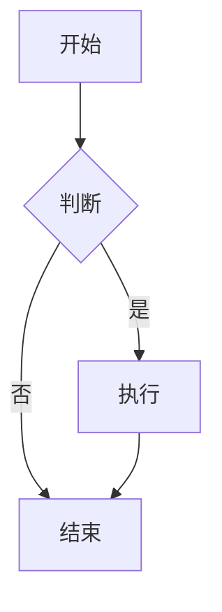
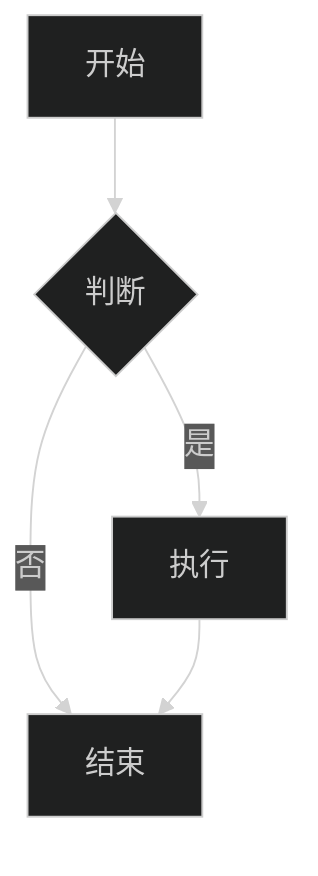

# Mermaid 渲染测试 A：最简单的图（无 init 指令）

```mermaid
flowchart TD
    A[开始] --> B{判断}
    B -->|是| C[执行]
    B -->|否| D[结束]
    C --> D
```

## 测试 B：dark 主题 + themeVariables 指定蓝底白字（验证自定义色是否生效）

```mermaid
%%{init: {'theme':'dark','themeVariables':{'primaryColor':'#1f6feb','primaryTextColor':'#ffffff'}}}%%
flowchart TD
    A[开始] --> B{判断}
    B -->|是| C[执行]
    B -->|否| D[结束]
    C --> D
```
