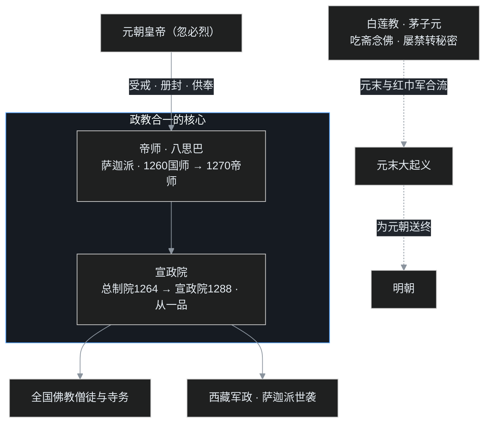

## 小白交底

上一篇讲了宋的北边三个王朝；这一篇，叶扬讲到第一个由游牧民族一统整个中国的王朝——元朝，先摊成五句话：

1. **元是蒙古人建立的王朝**：1206 年铁木真（成吉思汗）统一草原，之后蒙古灭西夏、灭金；1271 年忽必烈定国号「元」，1279 年灭南宋，结束了长期的分裂。
2. 蒙古皇室原本信萨满教，入中原后却把藏传佛教抬到极高位置：年轻的藏僧**八思巴**先受封「国师」，又晋号「帝师」。
3. 元朝专设一个叫**宣政院**的中央机构（前身总制院），既管全国佛教，又管西藏军政——这是「政教合一」在国家制度上的正式落地。
4. 制度给了藏僧空前特权，也滋生腐败：江南释教总统杨琏真迦发南宋皇陵、朝廷财政大量耗于供养，都成为元朝速亡的伏笔。
5. 汉传佛教在元代中规中矩，仍以禅宗最盛；宋以来的两个民间旁支——**白云宗、白莲教**——在元末搅动天下，白莲教更与红巾起义合流，为元朝送终。

一句话：元朝第一次让一位宗教领袖（帝师）进入帝国权力的最核心，也第一次让一个大一统王朝，尝到了「政教不分」的甜头、也吞下了苦果。

## 一、草原上来的大一统王朝

先把蒙古的时间坐标摆正。

蒙古人原本居住在更北方的草原，五代到北宋时先后依附辽、金。南宋初年，蒙古酋长合不勒曾叛金自立。到 **1206 年**，铁木真统一大漠南北，在斡难河（今黑龙江上游鄂嫩河）源头被诸部拥戴为共主，上尊号「成吉思汗」。此后蒙古铁骑横扫欧亚，先后灭掉西夏和金。

蒙古大汗的位置传到蒙哥（元宪宗）时，1259 年，蒙哥在攻打南宋四川合州钓鱼城（今重庆合川）时猝死于城下。第二年，蒙哥的弟弟忽必烈在开平（今内蒙古正蓝旗）自立为大汗；1264 年以燕京（今北京）为都，改元至元。**1271 年**，忽必烈取《易经》「大哉乾元」之意，建国号为「大元」，是为元世祖。

1276 年，元军攻破南宋都城临安（今杭州），年仅六岁的宋恭帝出降。文天祥兵败被俘；1279 年崖山海战，陆秀夫背负幼主赵昺投海，张世杰突围后亦殉于海难，南宋彻底灭亡。从唐末以来长期并立、分裂的中国，由蒙古人重新归为一统。

蒙古人本有自己的原始信仰——**萨满教**，崇拜天地山川，以祈福、占卜、驱鬼为事。成吉思汗和几代大汗在西征中见惯了各种宗教，也深谙「宗教可以帮着治天下」的道理。所以元朝对各路宗教大体宽待；而蒙古贵族自己，最终选择了藏传佛教。这条线，要从西藏先说起。

## 二、从国师到帝师：年轻的八思巴

在元朝崛起之前，西藏这片雪域已有数百年佛教传统。

### 西藏佛教的来路

佛教在公元七世纪传入西藏；到八世纪，应西藏国王迎请，印度中观学者寂护（静命论师）入藏，又建议迎请密教大师**莲花生**。莲花生以密法降伏了西藏本土的神祇信仰，佛教由此在雪域扎根。藏地尊称修行有成的僧人为「喇嘛」（意为上师），所以藏传佛教又被俗称「喇嘛教」——它在教理和修行上都带有浓厚的密教色彩。

历史走到十三世纪，西藏教派林立，其中萨迦派声势很大。1247 年，萨迦派首领萨迦班智达携年幼的侄子，在凉州（今甘肃武威）与蒙古皇子阔端会晤，达成归附，史称「凉州会盟」。这位随行的侄子，就是后来深刻影响了元朝的**八思巴**。

### 八思巴与忽必烈

八思巴出自萨迦派，自幼聪慧，被视为圣童。1253 年，年轻的八思巴在六盘山谒见正在南征的忽必烈，两人一番深谈，忽必烈对其学识极为敬服，把八思巴留在身边、执弟子之礼。

忽必烈即位的 1260 年，立即封八思巴为**国师**，授玉印，统领天下佛教。后来又命八思巴创制一套用以拼写蒙古语（也能拼写其他语言）的新文字，这就是「八思巴文」。1270 年，因制字有功，忽必烈把八思巴晋号为**帝师**、大宝法王。

「国师」之上再设「帝师」，名义极于尊崇。终元一代，帝师成为定制：新帝即位，必先就帝师受戒、颁布供奉诏书；帝师的法旨，与皇帝的诏令在西藏并行。一位宗教领袖，就此坐到了帝国权力的最核心。

## 三、宣政院：政教合一的制度落地

光有帝师的尊号还不够，忽必烈又为这套「以僧治国」的做法，配了一个实实在在的中央机构。

### 从总制院到宣政院

早在 1264 年，忽必烈就设立**总制院**，由八思巴领院事，统管全国佛教僧徒与西藏（当时称吐蕃）的军政事务。1288 年，因唐朝时吐蕃来朝曾在宣政殿接见，总制院改名**宣政院**，品级为从一品——与中书省、枢密院同级，是最高层级的中央机构之一。

宣政院一手管两摊事：

- **管僧**：全国寺院的僧尼、寺产、僧官任免、佛教事务，都归它统辖；
- **管藏**：西藏的军队、驿站、赋税、政务，也由它掌管。在地方上，宣政院派出机构直接治理西藏，并与萨迦派的世袭势力结合。

这就形成了中国历史上一套相当特殊的体制：**政教合一**。在西藏，宗教领袖（萨迦派、帝师一系）同时就是行政首脑；在中央，宣政院把「宗教管理权」和「地方行政权、军权」缝在了同一个衙门里。元朝以区区蒙古人治广大雪域，靠的正是这套「用当地最有号召力的宗教，来替朝廷治理当地」的设计。

对多民族大国的治理而言，这不失为一种高明的制度安排；西藏也由此在元代更加稳固地纳入中央政府的管辖。然而，制度的另一面很快暴露——当宗教领袖同时握有政治特权，权力几乎不受约束，腐败便随之而来。

## 四、特权的代价

课程里引用《元史》（明初宋濂主编）的记载，讲到元代藏僧阶层的种种特权与积弊。这些事今天读来，仍值得当作「权力需要被关进笼子」的活教材。

### 杨琏真迦发宋陵

最刺痛汉人的，是一位叫杨琏真迦的藏僧。忽必烈任命其为江南释教总统，掌管原南宋境内的佛教。这位总统到任后，至元二十二年（1285 年）竟组织人手盗发南宋在绍兴的历代皇陵与大臣冢墓——掘开宋六陵，掠取殉葬的珍宝，甚至弃遗骨于荒野。挖人祖坟，本是汉人眼中最痛心的大忌；此外，史料还记载其侵占财物、庇护逃税人户数以万计。一位身负宗教之名的官员，沦为横行当道的权贵。

### 财政与法度的倾斜

终元一朝，凡迎请帝师、藏僧入朝，沿途驿站供给，糜费以亿万计；藏僧出入可用官方驿马、驿馆，规格逾于诸王百官，民间和基层官吏反被挤占。皇室贵族迷信藏僧的法事，国库收入的相当部分用于供养僧团，财政一紧，便加重对民间的征敛。

朝廷中甚至有官员为讨好藏僧，向元武宗建议：凡殴打藏僧者断其手、辱骂藏僧者割其舌。幸而当时尚为太子的元仁宗力谏阻止，这道苛令才未能颁行。

至于元顺帝末年，宠信西番僧，修习所谓「演揲儿」之法（藏语意为「大欢乐」），君臣沉溺于密教修行之名而怠于政事，宫廷风气大坏，太子也随之堕落——这些都被《元史》记下，成为元朝速亡的征兆。

### 真正的教训不在密法，而在权力

需要平心说一句：元代的这些弊害，根子并不是藏传佛教本身的教理，而是**不受约束的特权**。一群质朴的人，一旦同时握住「宗教的神圣」与「政治的权力」两重地位，又缺乏监督，便极易集体腐化。后来西方讲「上帝的归上帝，凯撒的归凯撒」，主张政教分离，正是基于同样的教训：宗教领袖可以享有信仰上的尊崇，却不应同时享有凌驾于法度之上的政治特权。

元朝以「政教合一」得治藏之利，也因纵容僧权、法度失衡而埋下民怨。这股民怨，最终与汉地的两个民间教团汇合，掀翻了帝国。

## 五、汉传诸宗，与两个「旁支」

为笼络汉人、巩固统治，元朝对汉传佛教总体宽容保护，也有过几次整顿。《元史》说汉传佛教在元代中规中矩，没出什么大差错。

### 诸宗格局

仍是**禅宗最盛**，但地理上换了位置：南宋以来，临济宗重心南移，盛行于南方；曹洞宗在北方势力较大。

- 北方有临济宗高僧**海云印简**，曾受蒙古汗廷敬重，忽必烈请其讲佛法、受菩萨戒。海云的弟子**刘秉忠**更是元初重量级人物，深受忽必烈重用，参与军国大计，据说元朝的国号、大都（北京）的营建规制，都有刘秉忠的擘画。
- **天台宗**仍以浙东为大本营，杭州、天台山一带名僧辈出，如湛堂性澄、玉冈蒙润；蒙润著有《天台四教仪集注》，是天台学名著。
- **华严宗**与辽代相似，以五台山为传播中心，代表僧人有仲华文才、大林了性。

### 两个不算宗派的「旁支」

除了正统诸宗，宋以来还生长出两个信众极庞大的民间教团，元代都卷入了政治。

**白云宗**，出自华严宗的脉络，北宋末年由杭州白云庵僧人**孔清觉**创立。其主张浅显，劝人吃素、兼容三教，因在家信众也可修习、男女信众发展过快而屡遭非议。南宋一度查禁，元初复兴，到元仁宗时再禁，入明以后逐渐绝迹。严格说它没有独立的思想体系和师承法脉，算不得一个真正的宗派，靠的是门槛低、好上手，才吸引了大量底层信众。

**白莲教**，影响则要大得多。南宋初年，由苏州昆山僧人**茅子元**创立，自称「白莲导师」，倡导三归五戒、吃斋念佛——把修行简化到「吃斋念佛即是学佛」，极易在民间传播。因其信众庞大、聚众结社，朝廷心存忌惮，宋元间几度查禁、又几度复兴。

到了元代，白莲教与各类民间信仰合流，愈查禁便愈向秘密社会发展，暗中势力反而越来越大。元末，黄河泛滥、朝政腐败，白莲教与**红巾军**起义合流，「明王出世」「弥勒下生」一类口号成为号召百姓抗元的旗帜，朱元璋一辈正是从这股浪潮中崛起。一个本以「念佛」起家的教团，最终成了掀翻帝国的力量。

## 六、一张图看懂：政教如何合一

看懂这张图，就看懂了元代：皇帝通过「帝师—宣政院」这条线，把全国佛教和西藏政教一并纳入中央，这是制度上的大手笔；而在这套秩序之外，被简化、被压抑的民间信仰（白莲教）转为地下，最终从底层反卷上来，终结了王朝。

## 写在最后

元朝只维持了不到百年的大一统，却给中国佛教史留下两样影响深远的东西。

一是**制度**：从国师到帝师，从总制院到宣政院，藏传佛教第一次与中央王朝的政治结构深度结合，西藏也由此在制度上更紧密地纳入中国版图。二是**教训**：当神圣的宗教与绝对的权力叠在一起、又缺少法度的约束，再清净的信仰也可能滋养出杨琏真迦式的腐败——政教之间需要边界，权力需要制衡，这是元代用速亡换来的启示。

有趣的是，元代的两套设计后来都被明朝接住了：一方面，明初既要整顿元末以来僧团腐化、教团作乱的乱局，明太祖对佛教立下更严密的规矩；另一方面，朝廷对西藏改用「多封众建、尚用僧徒」的策略，不再独尊一派，同时又在汉地册封高僧、官刻大藏经。叶扬下一篇就讲明代：朱元璋如何整顿佛教，明末四大高僧如何在王朝暮色里重振宗风，以及天主教士利玛窦带来的那场东西相遇。

## 术语表

| 词 | 解释 |
|---|---|
| 合不勒 | 南宋初年的蒙古酋长，曾叛金自立，是成吉思汗之前的草原首领 |
| 成吉思汗 | 即铁木真，1206 年统一蒙古诸部、建立大蒙古国，后被追尊为元太祖 |
| 斡难河 | 今黑龙江上游鄂嫩河，成吉思汗被拥戴为共主之地 |
| 蒙哥 | 元宪宗，1259 年攻南宋四川钓鱼城时死于军前 |
| 忽必烈 | 元世祖，1260 年称汗、1271 年建国号元、1279 年灭南宋 |
| 总制院 | 1264 年设，统管全国佛教与西藏军政，八思巴领之；后改宣政院 |
| 宣政院 | 1288 年由总制院改置，从一品，掌全国佛教僧徒与西藏地方军政 |
| 萨满教 | 蒙古等北方民族原始信仰，崇拜天地山川，以祈福、占卜、驱鬼为事 |
| 八思巴 | 元代萨迦派领袖，1260 年封国师、1270 年晋帝师大宝法王，创八思巴文 |
| 萨迦派 | 藏传佛教重要教派，元代受皇室尊崇，世袭治理西藏 |
| 萨迦班智达 | 八思巴的伯父，萨迦派首领；1247 年凉州会盟，促成西藏归附蒙古 |
| 凉州会盟 | 1247 年萨迦班智达与蒙古皇子阔端在凉州达成的归附，西藏纳入中央管辖的重要节点 |
| 寂护 | 又称静命论师，八世纪入藏的印度中观学者，奠定西藏僧伽制度 |
| 莲花生 | 八世纪入藏的印度密教大师，以密法立足雪域，被藏地尊为重要祖师 |
| 喇嘛 | 藏语「上师」之意，藏传佛教僧人的尊称；俗称藏传佛教为喇嘛教 |
| 八思巴文 | 八思巴奉忽必烈之命创制的拼音文字，用以拼写蒙古语等，元亡后渐废 |
| 国师／帝师 | 元代封赐藏僧的最高名号，帝师尤尊，为定制，掌全国佛教 |
| 大宝法王 | 1270 年忽必烈晋封八思巴的号；后世明代亦用此号封藏僧 |
| 政教合一 | 政治权力与宗教权威结合、由宗教首领兼掌行政的体制，元代西藏为典型 |
| 杨琏真迦 | 元江南释教总统，盗发南宋绍兴皇陵（宋六陵）、掠取宝货，为权贵乱政之例 |
| 宋六陵 | 南宋在绍兴的历代皇陵，遭杨琏真迦盗发 |
| 元武宗／元仁宗 | 兄弟相承的元代皇帝；武宗时有人献「殴僧断手、詈僧截舌」之议，仁宗力谏而止 |
| 演揲儿法 | 藏语意为「大欢乐」，元顺帝末年宠信西番僧所修之法，朝纲由此败坏 |
| 海云印简 | 元代临济宗高僧，受蒙古汗廷敬重，忽必烈请其讲佛法、受菩萨戒 |
| 刘秉忠 | 海云印简弟子，元世祖重臣，参与定国号、营建大都等军国大计 |
| 临济宗／曹洞宗 | 禅宗两大支；元代临济盛于南方，曹洞偏盛于北方 |
| 湛堂性澄 | 元代天台宗高僧，弘法于杭州、浙东 |
| 玉冈蒙润 | 元代天台宗高僧，著《天台四教仪集注》 |
| 《天台四教仪集注》 | 玉冈蒙润所著，阐释天台判教的名著 |
| 仲华文才 | 元代华严宗代表高僧，以五台山为传播中心 |
| 大林了性 | 元代华严宗高僧，与仲华文才齐名 |
| 白云宗 | 北宋末孔清觉创，出华严宗脉络，倡吃素、浅显易行，元明间屡遭禁绝 |
| 孔清觉 | 白云宗创立者，杭州白云庵僧人 |
| 白莲教 | 南宋初茅子元创，倡三归五戒、吃斋念佛，元明间转秘密结社，与红巾起义合流 |
| 茅子元 | 白莲教创立者，苏州昆山僧人，自称白莲导师 |
| 红巾军 | 元末农民起义军，以白莲教、弥勒信仰为号召，最终推翻元朝 |
| 宋恭帝 | 1276 年元军破临安时出降的南宋幼帝，年六岁 |
| 陆秀夫 | 南宋末年忠臣，1279 年崖山兵败，负幼主赵昺投海殉国 |
