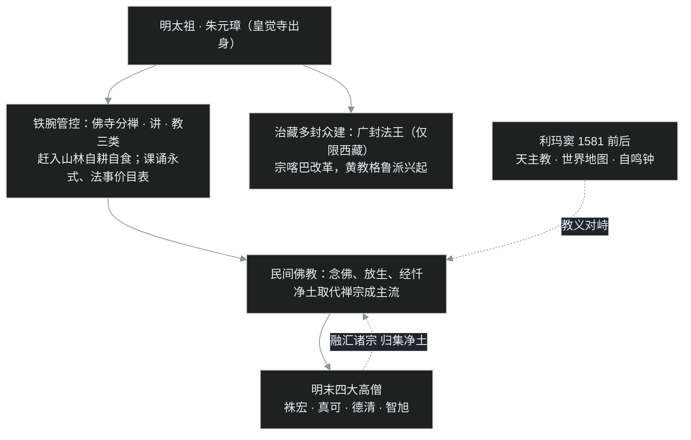

## 小白交底

上一篇，元朝用不到百年的速亡留下两道题：不受约束的僧权会腐烂，被查禁的民间教会反卷。接这张考卷的，是一位最特殊的考生——朱元璋本人就当过和尚，僧团里的门道、教团里的能量，他比谁都清楚。这一篇，叶扬讲到汉地最后一个由汉人建立的大一统王朝——明朝，看这位和尚出身的皇帝如何给佛教立规矩，也看他那剂猛药，究竟是治了病，还是伤了本。先摊成五句话：

1. **开国皇帝朱元璋本人就当过和尚**：17 岁在家乡皇觉寺出家，这段经历使朱元璋对佛教既有感情、又看得极透。即位后一手崇奉，一手用空前严厉的法规整顿、掌控僧团。
2. 朱元璋把天下佛寺分成**禅、讲、教**三类，又把僧人赶进山林自耕自食，严禁僧众结交官府、进城化缘。僧团是清净了，却也从此与社会严重脱节。
3. 明代皇家三度雕造官版大藏经——**洪武南藏、永乐南藏、永乐北藏**，刻工精美；今天寺院里的早晚课诵、法事价目表，根子也都在明太祖的几道诏令上。
4. 明朝治藏改用「多封众建」：法王封了一大堆，却只准在西藏活动；明初**宗喀巴**整顿僧团、创立黄教。到了晚明，更东边，意大利传教士**利玛窦**又把天主教带进北京，东西信仰第一次正面相遇。
5. 明末出现**四大高僧**——云栖袾宏、紫柏真可、憨山德清、蕅益智旭，大都主张融汇诸宗、归向净土，但整体格局已远不能与隋唐相比。

一句话：明代的佛教被皇帝用制度「管」了起来——它更深地渗入民间（念佛、放生、经忏），也更高地筑起了与社会之间的墙；直到利玛窦带着世界地图和自鸣钟到来，僧人们才猛然发现，门外的世界已经换了人间。

## 一、从皇觉寺走出的开国皇帝

先把元末明初的时间坐标摆正。

元顺帝在位长达 35 年，受近臣与后宫影响，长年耽于享乐、不问朝政，天灾人祸却接连不断。百姓纷纷揭竿而起，燎原之火一发不可收拾，大乱延续了十多年。在群雄之中，**朱元璋**声势最盛：先统一长江南北，再挥师北上。

**1368 年正月**，朱元璋在应天府（今南京）即皇帝位，建国号「明」，是为明太祖。同年八月，明军攻入大都（今北京），元顺帝北逃漠北，元朝正式覆亡。

朱元璋是濠州钟离（今安徽凤阳）人。17 岁那年，家乡遭逢大饥荒，无以为生，只得入**皇觉寺**出家为僧。这段僧人生涯，使朱元璋对佛教怀有很深的感情，也有一份旁人没有的考量。

即皇帝位之后，朱元璋对佛教呈现出耐人寻味的两手：**一方面崇奉**。朱元璋挑选高僧来培训、辅导诸位皇子——最有名的一位法名道衍，俗名**姚广孝**，侍奉燕王朱棣；后来燕王起兵、打下南京夺位（即明成祖），姚广孝为此深受江南亲族的指责。**另一方面，则是用政治力量整治、掌控僧团**。朱元璋心里太清楚：宗教一旦被有心人利用，足以撼动亲手打下的帝国；而皇觉寺里的岁月，也让这位帝王真切看到了僧团内部的种种问题。

第一刀，先落在元代横行中原的喇嘛身上。

## 二、铁腕整顿：禅、讲、教三分

### 把喇嘛请回高原

朱元璋首先把元代藏僧在中原留下的积弊清除干净：元代受朝廷宠信、在中原横行的藏传佛教僧人一律遣返；其娶妻、食肉、饮酒的奢靡风气，也严禁汉地僧人效仿。至于明朝自己如何对待西藏的喇嘛，那是另一条线，后面再讲。

### 佛寺分三类

朱元璋亲自撰写《御制护法集》一类文书，设立僧官管理僧众，又恢复了僧尼**考试**制度——这套试经度僧的办法，历代时断时续，到朱元璋手里重新收紧。其所定下的法规之严厉，前所未有。

核心动作，是把天下佛寺分为**禅、讲、教**三类：

- **禅**：禅师，专门习禅。只是当时禅法已经衰微，许多古老法门——四念处（观身、受、心、法的四种禅修）、大乘空观（观一切法自性空），乃至早期的如来禅（依教理次第修习的禅）、后世的祖师禅（宗门直指的禅）——多已失传，存下的寥寥无几；
- **讲**：讲僧，专门弘扬经典义理；
- **教**：教僧，专门应付佛事、经忏法会。

三类各归各位，互不混杂。

### 赶进山林的僧人

朱元璋还大力提倡**自耕自食的山林佛教**，把出家僧人往山林里赶——在朱元璋看来，最清高的僧人就该住在山林之中，自耕自食。朝廷又不准僧人到城市里化缘，更严格禁止僧众与民众频繁接触、结交官府；凡有违犯，处以重罪，毫不客气。

政策的出发点可以理解：丛林清净，僧人自食其力，便不易滋生事端。可这套做法的副作用，很快显现。

僧人一旦集体退入山林，「比丘游化人间」的古义就失去了。佛陀当年制定僧制，本是要僧人不断游行人间、教化众生，帮助世人对治烦恼、解决困惑——僧人不可离开人间。如今僧人躲进深山，便造成一种「住山林才算清高」的风气，僧团从此与社会严重脱节，对世事一无所知，甚至到了幼稚的地步。直到清末民初，还有许多居士大声呼吁出家人走出山林——僧人本就该住在人间，是明太祖的政策把僧众「请」上山的。

## 三、课诵、价目表与一张管控的网

明代佛教还有几样东西，今天的人习以为常，以为是佛门古制，其实都出自明太祖的诏令。

### 早晚课诵怎么来的

今天走进汉地寺院，早晚课诵里有大量咒语，还有蒙山施食、放焰口——这些其实都是密教的成分。它们是怎么留下来的？

百姓喜欢这些带有神秘色彩的仪式。**洪武十六年（1383 年）**，明太祖下诏：汉地本有的课诵，加上密教的咒语、蒙山、焰口，统统整理制定，成为僧团必备的功课，并定为「永式」——永远遵行的制度。今天通行的早晚课诵、经忏仪轨，骨架正是这时候立下的。

### 法事价目表

今天有些道场做佛事，明码标价。这也不是祖师留下的规矩，而是明太祖的规定。元代喇嘛动辄开口索要大量供养，成为信徒沉重负担；朱元璋干脆由朝廷订出价目，意在规范化。可如此一来，佛门清净地挂上了价目表，僧人在德性上便留下污点。供养本应随各人发心、随缘随喜，哪有规定价目的道理？

### 管控的代价

元代喇嘛肆虐，汉人知识分子本就因之对佛教大为反感。朱元璋为贯彻宗教政策，又不惜以严刑峻法对待僧众；整个明代，官吏对待僧人的手段相当暴虐。长此以往，僧团素质难以提升，百姓既不愿自家子弟出家，对佛教也无法正确理解——佛教便愈发衰败。

### 后来的皇帝们

**明成祖**朱棣即位后，对佛教也很友善：礼敬高僧，在北京雕刻《北藏》；明成祖对佛理颇有兴趣，多次为经论写作叙文——若不真懂义理，写不出那样的文字——还作过不少赞叹佛法、菩萨的歌赞。但与父亲一样，根本上以儒术治天下，宗教只是工具。

到**明宣宗**时，又下诏以考试度僧，可见私度问题始终严重；明宣宗还一度禁止妇女出家。宣宗之后，英宗、代宗、宪宗都信奉佛教，僧人渐渐增多。代宗也曾为财政需要出售度牒；到宪宗朝私度尤其严重，据说一年之间竟发出二十多万张度牒。

明武宗是最喜好佛教的一位，护持最力，但其信仰偏于迷信，本人又荒淫，并无可取。到**明世宗**（嘉靖）则转而迷信道教、排斥佛教——佛教在明代大体平顺，唯独世宗一朝受到明显打压。

## 四、三部官版大藏经

南宋末年蒙古南侵，元末又群雄并起，连年战乱使佛寺藏经毁损严重。一项延续两朝的刻藏大工程，就此展开。

### 洪武南藏

**1372 年**，明太祖下令佛教界的大德在金陵（南京）蒋山寺点校经藏——经典既已毁损，须先经整理校订。工程一直到洪武三十一年（1398 年）才完工，全藏共 678 函，收佛典 1600 部、7000 多卷。

永乐六年（1408 年），蒋山寺的雕版不幸遭遇火灾，全部焚毁。这部在南京刻成的官版大藏，后世称为《**南藏**》，或称《**洪武南藏**》。

### 永乐南藏

约在永乐八年到十八年间，明成祖以洪武南藏为底本，在南京重新雕刻，共收佛典 1625 部、6331 卷，称为《**永乐南藏**》——可说是洪武南藏的再刻本。

### 永乐北藏

永乐七年以后，明成祖常居北京；永乐十八年（1420 年）正式下诏迁都，第二年即下令在北京开雕大藏经。这一部直到英宗正统五年（1440 年）才完成，共 1621 部、6361 卷。为区别于《永乐南藏》，称为《**永乐北藏**》；神宗万历年间又有续刻。北藏虽以南藏为据，仍做了相当的调整。

这三部官版大藏，如今都有传本存世，但数量不多。皇家刻经极为精美：讲师见过《永乐北藏》，形制华丽，卷中彩绘斑斓，经文都是金字——一个王朝的富庶与皇家护法的热忱，都刻在了这些经卷里。

## 五、治藏新格局：宗喀巴与黄教

元朝覆灭后，喇嘛退回西藏高原。明朝对待西藏喇嘛的态度，依旧友善、宽大——仍然是出于政治考量：为了安抚西藏、治理西藏。

明廷延续了元代的宽大政策，但方式不同：对有影响力的著名喇嘛，一律封给「法王」名号，封得既多且广，西藏的法王多到数不清。各派法王对朝廷朝贡不断，明廷的回赐也极为丰厚。但有一条关键界线：**喇嘛的权限仅止于西藏，不得再入中原横行**。这就是后人概括的「多封众建」——不再像元朝那样独尊萨迦一派，而是广施册封、分而治之。

### 宗喀巴改革

明代前期，西藏出了一位大力提倡戒律的高僧——**宗喀巴**。当时藏地喇嘛多有娶妻者，宗喀巴认为这不合佛制，于是严格禁止僧人娶妻、重振戒律。因宗喀巴常戴黄帽，这一系后来便被称为**黄教**（格鲁派）。不过据《明史·西域传》记载，西藏喇嘛此后仍分为娶妻与不娶妻两派，一直到近代还是如此。

## 六、利玛窦来了

这是本篇最特别的一段：佛教之外，另一支世界性的宗教正式登场。

### 传教士再度东来

唐代，基督教的一支**景教**曾传入中国；唐武宗灭佛之后，诸教一并沉寂。元代西征，东西交通大开，传教士再度东来，元亡后又告绝迹。

明嘉靖三十一年（**1552 年**），耶稣会士**方济各·沙勿略**成为明代第一个试图进入中国内地的传教士，可惜当年便病逝于广东沿海的上川岛，终未踏入内地。此后传教士陆续东来——范礼安、罗明坚、龙华民、毕方济、汤若望等数十人，接踵而至。

最有名的一位，于明万历九年（**1581 年**）前后入华——**利玛窦**，意大利籍耶稣会士，以当时中国人的话说，是天主教的神父。

### 教义上的正面摩擦

天主教与佛教、道教，很快在教义上形成对峙。

在当时传教士的宣讲中，无论是旧教（天主教）还是新教，都强调信奉唯一上帝：信者得永生，不信者堕地狱。这套说法与佛、道截然不同。佛陀所教是「诸恶莫作，众善奉行，自净其意，是诸佛教」——善有善报、恶有恶报，与肤色、身份、信仰无关，任何人都在这条因果律之中。而天主教讲：报应取决于信不信上帝。这与中国传统的佛、道二教，自然摩擦不断。

讲师年轻时曾问一位传教士：孔子是圣人，却不信基督，那孔子在哪里？依佛教的说法，孔子当在善道轮回；那位传教士却回答：孔子不信上帝，所以在地狱受苦。再问：孔子比耶稣早生五百多年，那时基督教尚未传来，这难道是孔子的过错？对方答：将来上帝会派天使到地狱传福音；若仍不接受，便永在地狱。圣人在地狱、恶人在天堂——这只是那位传教士的个人讲法，却已让许多东方人难以接受。

### 但传教士赢得了尊敬

冲突之外，事实也须平心承认：这批来华传教士学问极好，除精通神学外，对自然科学、医学也十分擅长，而且人品高洁、热情真诚。

相比之下，此时的佛道二教都很衰败：许多出家人不懂法义、不明修行，只懂一些民俗信仰，如何与学识渊博、人品令人仰慕的神父们相比？据说利玛窦每到一处，都有许多人因仰慕其学问、道德而追随。后来利玛窦到了北京，受到朝廷礼遇与群臣推重（万历皇帝并未亲自接见，只收下贡物、赐居赐禄）；汤若望更在明末清初两次参与修订中国历法。

当时皇室官民受洗入教者不少：名臣**徐光启、李之藻、杨廷筠**都信奉天主教；南明永历帝的嫡母、生母、皇后、太子也都受洗；永历帝本人请求入教，却因妻妾成群、不合教规而被拒。据统计，明末奉教者有数千人，其中皇室百余人、大臣数十位——外来信仰在短短数十年间形成的力量，不容小觑。

佛教讲「依法不依人」：要依真理，而不是依说法者（传道者）个人——人都有局限，不能代表宗教的究竟真理。可孔子也说「人能弘道，非道弘人」：真理终究要靠人来弘扬。明代佛门的困境正在于此——不是佛法不行，而是承载佛法的人，一时没能撑起门面。

## 七、明末四大高僧

明末，受王阳明（守仁）姚江学派的影响——讲「致良知」「知行合一」，弟子满天下，而王氏本人年轻时出入佛老，门下弟子也多用功于佛法——这反过来刺激了佛教自身，僧人钻研佛理者渐多，晚明佛学显出复兴迹象。明代僧人本多属禅宗，万历以后，出现了**四大高僧**，思想上都带有融汇诸宗、调和三教的色彩。

### 云栖袾宏（1535–1615）

**袾宏**，杭州人，世称**莲池大师**，长期驻锡云栖山，故又称云栖袾宏。本是儒生，32 岁出家，曾随华严宗、禅宗大德学习，禅教皆通。著作宏富：讲禅修的《禅关策进》、警策僧行的《缁门崇行录》、谈净土的《往生集》，以及《阿弥陀经疏钞》等。

眼见徐光启一类士大夫皈依天主教、足以带动民间风气，袾宏特作《天说》诸篇驳斥天主教——这位高僧已敏锐感到，这股外来力量将对佛教形成强烈冲击。

### 紫柏真可（1543–1603）

**真可**，号紫柏，吴江（今苏州）人，人称紫柏尊者，17 岁游历苏州虎丘，为寺僧明觉所感，随之出家。此后行脚各大名山，沿途教化，极能吃苦。

万历二十八年（1600 年）前后，朝廷开征矿税，贪婪宦官趁机四处扰民。紫柏为此专程北上，欲向朝廷进言，却不幸卷入万历皇帝的立储之争——皇帝迟迟不立太子，朝臣为此尖锐对立。紫柏因收到朝臣书信，被奸人罗织构陷，逮捕入狱，最终在狱中安然圆寂。有深禅定力者常能自主去留；据教内记载，紫柏并非病逝，而是在静定中从容辞世。著作有《紫柏尊者全集》《别集》。

### 憨山德清（1546–1623）

**德清**，安徽全椒人，与紫柏真可是至交。其学最具明代特色：主张儒佛融合，提倡华严与禅互摄；德清兼通华严、法相，以《**大乘起信论**》的「一心开二门」（心真如门、心生灭门）义，会通华严与法相两宗。

德清一生足迹遍天下。因私建道场违制，被贬谪雷州（今广东）；在雷州恰逢大饥荒，德清亲手掩埋上万具无人收葬的尸骨——在自己最艰困的处境里，做了最慈悲的一件事。德清还与紫柏等人发起雕刻万历版大藏经，即《**嘉兴藏**》：旧藏卷轴翻阅不便，新藏改方册装（像普通线装书那样成册）、便于流通，以《北藏》为底本、参校南藏。著作有《华严经纲要》《憨山老人梦游集》，以及《中庸直指》《老子解》——后两部借解儒、道典籍融入佛法，可见其融通三教的苦心。

### 蕅益智旭（1599–1655）

**智旭**，苏州人，四高僧中最年轻，与前三位年龄相差颇远。少年习理学，曾作文章批判佛教；后来读到袾宏的著作，幡然觉悟，烧掉全部辟佛旧文。因仰慕德清而出家（当时德清已远行，实际从其门下出家），法脉属天台宗，同时兼研华严、法相与律学。智旭主张**融汇诸宗、归集净土**：诸宗可以会通，而最稳妥的修行，终究是称念阿弥陀佛。

智旭著作等身：净土类《阿弥陀经要解》、佛学目录学名著《阅藏知津》；又作《天学初征》，与袾宏一样驳斥天主教义；调和儒佛的则有《周易禅解》《四书蕅益解》。智旭曾为一位听不进佛理的儒生弟子专讲四书，在四书讲解中融入佛理，循循善诱——这也是智旭接引儒门读书人的方便。

### 该怎样看「三教融合」

明代四大高僧普遍走融合之路，但讲师提醒分寸：后人常引「东方圣人此心同，西方圣人此心同」一类话，说儒佛道理一致——这在做人处世上可以成立：学通儒家、做好君子，能成为更出色的佛弟子。但在义理、修行的根子上，儒家重现实人生，佛教以**缘起**为根本；儒家没有缘起，两教便谈不上「一致」。混同了这一层，反而模糊了佛法的核心。

### 《大明高僧传》

明末还有一部重要僧史——如惺所撰《**大明高僧传**》，共八卷，万历四十五年（1617 年）脱稿。全书记载南宋至明代的高僧，正传 119 人、附传 60 人，共保存了 179 位僧人的传记。

它最特别之处是只分**译经、义解、习禅**三科，与梁、唐、宋三部《高僧传》的十科体例大不相同。这也是时势使然：宋代以后印度佛教衰微，可译之经寥寥；而宋元明三朝佛门特出者又多是禅师。至于戒律、慈悲救济、诵经兴福诸科，或是因当时教界多走经忏路线，作者感慨「不提也罢」，便只把心中最重的三类僧人写入了史传。

## 八、一张图看懂：明代佛教的格局

看懂这张图，就看懂了明代：皇帝以僧团「过来人」的身份，给佛教编了一张严密的管控之网——网内是禅讲教三分、课诵与价目表；网外是多封众建的西藏。佛教在民间愈发壮大（净土终成主流），在义理上却愈发空虚。直到利玛窦渡海而来，这张网才第一次被外部世界轻轻叩响。

## 写在最后

明朝近三百年，给中国佛教史留下的印记复杂而深沉。

一是**制度的双重性**：朱元璋以帝王之手整顿僧团，既刹住了元代的颓风，也把僧人赶上山林、与社会隔断；课诵、度牒、僧官这些沿用至今的制度，都带着明代的烙印。二是**刻藏的财富**：从三部官版大藏到《嘉兴藏》，明人把汉文佛典的保存与传播，推上了又一座高峰。三是**一场被敲响的警钟**：利玛窦带来的不只是天主教，还有一整套自然科学与世界观——当外来信仰者以学问、品德赢得士大夫时，佛门才真切体会到「人能弘道」四个字的分量。四大高僧在王朝暮色里的努力，正是对这场冲击最好的回应。

那么，明朝把佛教「管」起来，到底是成是败？它刹住了元代的颓风，却也在僧人与社会之间筑起高墙；所以当利玛窦带着世界地图到来时，佛门几乎接不住这场相遇。这个问题，清朝要接着答。

有趣的是，下一个王朝的建立者，正是当年金朝女真人的后裔——他们的先辈就曾以断臂比丘尼刻下的《赵城金藏》，写下对佛法最虔诚的一笔。入关之后，清室一边恭恭敬敬刻出《龙藏》、大兴喇嘛教，一边却废掉度牒、敞开了出家的大门：皇家的供养越来越厚，僧团的门槛却越来越低。更出人意料的是，最后在衰微谷底撑起佛门的，竟不是出家人，而是两位在家居士。叶扬下一篇就讲清代：《龙藏》何以成为大功德，彭绍升、杨文会如何扛起佛门半壁江山，以及太平天国横扫江南时，佛寺遭遇的那场灭顶之灾。

## 术语表

| 词 | 解释 |
|---|---|
| 朱元璋 | 明太祖，濠州钟离（今安徽凤阳）人，少年曾入皇觉寺为僧，1368 年建明 |
| 皇觉寺 | 朱元璋少年出家的寺院，在其家乡凤阳 |
| 应天府 | 今南京，明初都城，1368 年朱元璋于此即位 |
| 姚广孝 | 法名道衍，元末明初高僧，辅佐燕王朱棣夺位，为明成祖重要谋臣 |
| 明成祖 | 朱棣，朱元璋第四子，初封燕王，起兵夺位；迁都北京、刻《永乐北藏》 |
| 禅、讲、教 | 明太祖对佛寺的三分：习禅、弘讲经义、做经忏佛事 |
| 试经度僧 | 以考试甄别、剃度僧尼的制度，历代时断时续，明初重新收紧 |
| 《御制护法集》 | 明太祖亲撰、申明护持与整顿佛教的文书 |
| 山林佛教 | 明太祖提倡的僧人退居山林、自耕自食的形态，使僧团与社会脱节 |
| 洪武十六年 | 1383 年，明太祖于此年下诏订立课诵永式 |
| 永式 | 永远遵行的制式，明代早晚课诵与经忏仪轨据此确立 |
| 蒙山施食 | 密教系统的施食度亡法会，明代编入汉地课诵 |
| 放焰口 | 密教系度亡佛事，焰口为饿鬼王名，明代以后广为通行 |
| 度牒 | 僧尼合法出家的凭证；明宪宗曾一年发二十多万张 |
| 明宣宗 | 明代守成之君，曾诏考试度僧、一度禁妇女出家 |
| 明武宗 | 明中期皇帝，最喜佛教但行事放纵、信仰流于迷信，不足为训 |
| 明世宗 | 嘉靖皇帝，迷信道教、排斥佛教，为明代佛教唯一受打压时期 |
| 《洪武南藏》 | 1372–1398 年在南京蒋山寺刻成的官版大藏，678 函 1600 部 7000 余卷 |
| 《永乐南藏》 | 永乐年间以洪武南藏为底本在南京重刻，1625 部 6331 卷 |
| 《永乐北藏》 | 永乐至正统五年（1440）在北京刻成，1621 部 6361 卷，刻绘华美 |
| 蒋山寺 | 南京古寺，洪武南藏点校、雕版之地，永乐六年版毁于火 |
| 《嘉兴藏》 | 明末紫柏、憨山等发起雕刻的方册大藏（像线装书那样成册），以北藏为底本，便于流通 |
| 多封众建 | 明朝治藏策略，广封各派法王、分而治之，不使一派独大 |
| 宗喀巴 | 明代藏地高僧，重振戒律、禁僧娶妻，创格鲁派（黄教） |
| 黄教 | 即格鲁派，宗喀巴创立，因戴黄帽得名，后成为藏地最大教派 |
| 《明史·西域传》 | 《明史》中记载西藏等地的篇章，载喇嘛仍分娶妻、不娶妻两派 |
| 景教 | 唐代传入的基督教（聂斯托利派），武宗灭佛后沉寂 |
| 方济各·沙勿略 | 耶稣会早期传教士，1552 年病逝于广东沿海上川岛，为明代第一个试图进入中国内地者 |
| 耶稣会 | 天主教主要修会之一，明末派遣大量传教士来华 |
| 利玛窦 | 意大利籍耶稣会士，1581 年前后入华，在北京受朝廷礼遇，携来西方科学与世界地图 |
| 范礼安 | 耶稣会远东教务视察员，推动传教士「适应中国文化」的策略，利玛窦的前辈 |
| 罗明坚 | 早期来华耶稣会士，比利玛窦稍早入内地 |
| 毕方济 | 明末来华耶稣会士，与利玛窦等先后传教于北京、江南 |
| 龙华民 | 利玛窦之后主持中国传教事务的耶稣会士 |
| 汤若望 | 德国籍耶稣会士，明末清初参与修订历法、主持钦天监 |
| 徐光启 | 明末名臣、科学家，奉天主教，译有《几何原本》 |
| 李之藻 | 明末大臣、科学家，与徐光启、杨廷筠并称天主教「三柱石」 |
| 杨廷筠 | 明末大臣，天主教「三柱石」之一 |
| 永历帝 | 南明末代皇帝，母后、皇后、太子皆受洗，本人因多妻入教被拒 |
| 也里可温 | 元代对境内基督教徒及教士的称呼，元代基督教随东西交通兴盛一时 |
| 云栖袾宏 | 莲池大师，1535–1615，杭州云栖寺高僧，禅净兼弘，著《阿弥陀经疏钞》 |
| 《禅关策进》 | 云栖袾宏所辑，开示禅修方法与警策的名著 |
| 《缁门崇行录》 | 云栖袾宏撰，辑历代僧人的高尚德行以警策缁门 |
| 紫柏真可 | 紫柏尊者，1543–1603，吴江人，行脚教化，因矿税、立储之争入狱而终 |
| 憨山德清 | 1546–1623，融通儒佛与华严法相，贬雷州时掩埋万众，倡刻《嘉兴藏》 |
| 《大乘起信论》 | 传马鸣菩萨造，以「一心开二门」（真如门、生灭门）统摄染净 |
| 《憨山老人梦游集》 | 憨山德清的诗文、开示合集，为研究其思想的要籍 |
| 蕅益智旭 | 1599–1655，天台法脉，主张融汇诸宗、归集净土，著述等身 |
| 《阿弥陀经要解》 | 蕅益智旭疏解《阿弥陀经》的名著，为净土要典 |
| 《阅藏知津》 | 蕅益智旭撰，大藏经解题、导读目录，便利学人阅藏 |
| 《天说》／《天学初征》 | 袾宏、智旭先后驳斥天主教义的论著 |
| 《四书蕅益解》 | 蕅益智旭借疏解四书融摄佛理的著作 |
| 姚江学派 | 王守仁（阳明）创立的心学派，因王氏为浙江余姚人得名 |
| 致良知／知行合一 | 王阳明心学宗旨，对晚明思想与佛教复兴影响甚深 |
| 《大明高僧传》 | 如惺撰，八卷，1617 年成书，分译经、义解、习禅三科 |
| 如惺 | 明末僧人，《大明高僧传》作者 |
| 依法不依人 | 佛教「四依」之一，谓应依真理而非依传道者个人 |
| 人能弘道 | 语出《论语》，谓道须靠人来弘扬，真理不会自行光大人 |
| 缘起 | 一切法皆由因缘和合而生起，为佛教义理的根本，儒家不谈缘起 |
| 比丘 | 出家受具足戒的男僧；佛制比丘游化人间、教化众生 |
| 四念处 | 观身不净、观受是苦、观心无常、观法无我的四种禅修，属古老禅法 |
| 大乘空观 | 观一切诸法自性本空的观法，为大乘禅修要门 |
| 如来禅 | 依经教义理次第修习的禅，相对祖师禅而言 |
| 祖师禅 | 禅宗祖师直指心性、不立文字的禅法 |
| 经忏 | 诵经、拜忏一类为信众做的佛事，即「教」僧所司 |
| 立储之争 | 万历帝迟迟不立太子引发的朝臣对立，又称国本之争，紫柏受牵连 |
