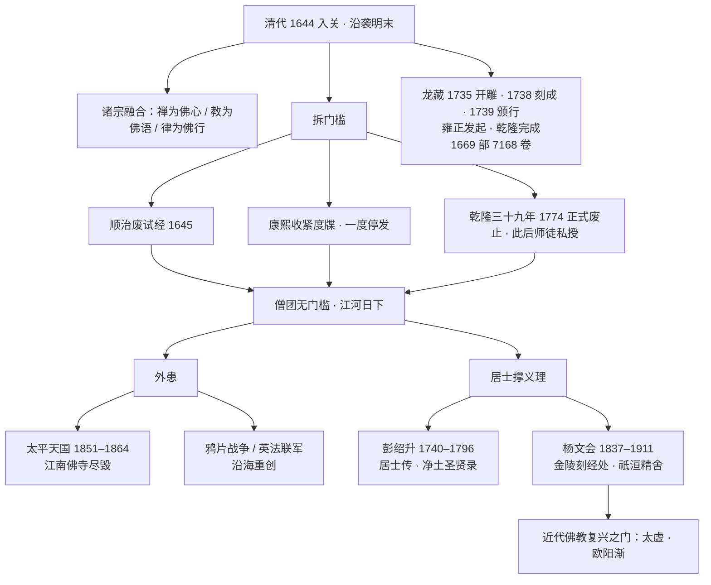

## 小白交底

上一篇，佛门在利玛窦的世界地图前，第一次看清自己与世界隔了多远。可清代佛教遇上的致命伤，不是外来的天主教，而是自己人先拆掉了门槛：清初把试经度僧、度牒制度先后废掉，出家再不需要考试、不需要审批。一个没有门槛的僧团，会走向何处？先把这一篇要讲的事摊开：

1. 时间走到最后一个王朝——清。满洲人 1644 年入关定鼎，古老的佛教也跟着走进一个步履更蹒跚的时代。
2. 清代佛教整体沿袭明代，本来就奄奄一息；更要命的是，清初把隋唐以来保障僧人素养的**试经度僧**、以及约束出家的**度牒**制度先后废掉，出家几乎没了门槛，僧团素质一路下滑。
3. 但清代也做了一件大功德：刊刻汉文大藏经《龙藏》。有意思的是，发起刻藏的是父亲雍正，最后在儿子乾隆年间才刻完颁行。
4. 祸不单行，清末内忧外患一起涌来：太平天国十余年战火横扫江南，所到之处孔庙、佛寺、道观尽毁；列强炮舰又重创沿海，佛教最富庶的两块地方双双沦陷。
5. 就在出家人普遍不学无术的时代，撑起佛教义理的反而是两位**在家居士**——彭绍升和杨文会。尤其杨文会，刻经、办学、与世界接轨，为近代佛教打开了一扇门。

一句话：**清代是佛教最衰微的一段，却也在衰微的谷底，埋下了近代复兴的种子**。这篇就把「怎么衰的、谁在撑、如何复兴」讲清楚。

## 一、明清易代：满洲入关与遗民逃禅

先说王朝更替。

建立清朝的满洲人，是当年建立金朝的女真后裔。金灭亡后，女真各部散居在今天中国东北。明神宗万历四十四年（1616），酋长努尔哈赤自称可汗，重建国号「金」（史称后金）。努尔哈赤之子皇太极，在崇祯九年（1636）改国号为「清」。

真正的转折在 1644 年。这年三月，李自成率农民军攻陷京师（北京），崇祯皇帝在紫禁城北面的万岁山（俗称煤山）自缢，明朝就此灭亡。驻守山海关的明将吴三桂引清兵入关——民间盛传是因为爱妾陈圆圆被掳，吴伟业那句「恸哭六军俱缟素，冲冠一怒为红颜」写的正是此事，真假参半，却流传极广。五月清兵进入北京，十月定都，是为顺治元年。

明朝遗臣纷纷起兵抗清，尤以江苏、浙江两省最为壮烈：江苏有顾炎武、陈子龙，以及夏允彝、夏完淳父子；浙江有黄宗羲、张国维、张煌言等人。南明先后立起福王、唐王、桂王、鲁王政权，却都挡不住清军兵锋。直到张煌言（号苍水）在杭州从容就义，这股忠义之气才暂告消隐。

这里有一段与佛教直接相关的往事，叫「**遗民逃禅**」。清初强推「剃发易服」令——所谓「留头不留发，留发不留头」，要汉人学满洲样式剃发、改穿旗装。许多不愿受此屈辱的士大夫，索性遁入空门；也有不少明朝宗室选择出家为僧。这批人学问高、声望重，却心怀故国，清廷视之如芒刺在背。所以康熙朝对佛教采取高压与怀柔并用的手段，重点之一就是防止明朝遗臣借藏身寺院，暗中从事反清复明。佛教在清初的政治处境，由此蒙上一层提防的底色。

## 二、丛林家底：诸宗融合，念佛为归

再看清初佛教自身的家底。

清代延续明代的融合趋势，各宗不再壁垒分明。这一特色，蕅益智旭一句话说得最透——**禅为佛心，教为佛语，律为佛行**：禅定是佛的心地，经教是佛的言语，戒律是佛的行持，三者本是一体，不该割裂。

从法脉上看，禅宗仍是最大的一支，临济、曹洞都有传承。但此时多数挂着禅宗招牌的出家人并不真参实究，日常只是诵经、拜忏、念佛。其余各宗也各有维持的人：

- **华严宗**：清初有柏亭续法，著述极勤，撰有《贤首五教仪》等四十余种、合计六百余卷，规模可与蕅益比肩。
- **律宗**：明清之际，宝华山三昧寂光上承明末古心律师，复兴律宗；寂光之后，见月读体继主宝华山，厘定传戒仪轨（后世传戒多依其规范），近代丛林的传戒制度由此奠定。
- **净土宗**：有行策（截流），早年研习天台教观，后来归心净土、弘扬称名念佛，被尊为净土宗第九祖（依净土十二祖旧说；后世印光改定的十三祖说中，将其列为第十祖）。
- **曹洞宗**：鼓山元贤与弟子为霖道霈，在顺治、康熙年间住持福州鼓山，除弘禅外也兼讲天台、华严教观，并有不少著述。

至于对外，清代佛教仍和明代一样，力图融贯儒家与道家：受过教育的出家人，从小读儒家典籍，君子圣贤之道早已深入生命；而老庄超脱的智慧也向来为佛门所喜。所以儒、释、道三教之间，总体互尊互敬、和平共处。这是明清佛教的共同底色。

## 三、门槛是怎么一道道拆掉的

清代佛教最大的内伤，要从「出家门槛」的拆除说起。这道门槛有两根柱子：一是**试经**（出家要通过佛经考试），二是**度牒**（政府颁发的出家合法凭证）。

先倒的是试经。明代虽衰，到底还保留考试制度，多少能保障僧人最基本的素养。可顺治二年（1645），清廷就废除了自隋代以来行之一千年的试经度僧。考试一停，出家再无学问上的要求，不学无术之人大量涌入。

接着是度牒。康熙朝为防止出家人数膨胀，一方面严禁私自剃度，另一方面对度牒大加收紧、一度停发。到了乾隆朝，专门应酬经忏法会的「赴应僧」越来越多，其中不少娶妻食肉、不守清规。乾隆一即位就下诏恢复度牒、全面清理，想对僧团做一番甄别，结果积弊难革，终于在乾隆三十九年（1774）正式废止度牒制度。此后出家再无官给凭证，度牒只能由师徒之间私下授受，流弊再难挽回。

于是清代出现了荒唐的局面：**考试与度牒两道闸门先后拆除，出家几乎没有任何门槛**。乾隆本人就十分愤慨，屡屡写诗嘲讽出家人不懂戒、定、慧三学，也谨慎地不与僧人接近，只希望僧人躲进深山、自耕自食。乾隆晚年以后，各地动乱不断，许多人为逃避兵役、赋税而投身佛门，既不学法义，言行也多不如法，越发招来社会的轻视。

乾隆曾感慨：难得遇到一个有德的僧人；就算德行尚可，也未必有学问。没有门槛的僧团，又拿什么去应对清末那场三千年未有的大变局？

## 四、龙藏：雍正发起，乾隆刊成

帝王里也有真正留心佛教文化的，雍正算一个。清代最有分量的文化工程——汉文大藏经《龙藏》，便由雍正发起。

龙藏又称《乾隆大藏经》，但刻藏的最初推动者其实是雍正，乾隆只是完成了父亲未竟的事业。缘起是雍正读明代永乐北藏本的《华严经》时，发现校勘不精、错误不少，于是召集一批真正懂禅修、通义理的比丘，在北京贤良寺设馆，先对北藏重新校对，再对历代高僧大德的著述做一番甄别取舍，最后选定书目、刻板印行。

这部藏的时间线很清楚：

- **雍正十三年（1735）开雕**；
- **乾隆三年（1738）刻成**，共收 **1669 部、7168 卷**；
- **乾隆四年（1739）六月颁行天下**。

因为年代离今天较近，经版又长期保存，不少道场至今还藏有完整的整套龙藏。在官刻大藏经的谱系上，龙藏是中国最后一部官刻木刻汉文大藏，也为两千年的译经、刻经事业画下一个庄重的句号。

## 五、四帝佛缘：礼遇、提防与一场禅门学案

清朝前期几位皇帝与佛教的关系，各有各的味道，连起来看很有意思。

**顺治**早年因藏地喇嘛朝贡，沿袭了崇奉藏传佛教的政策（顺治五年起，西宁等地藏僧陆续请求入贡，后来清廷对喇嘛入贡人数加以限制，免得耗费过巨、也防藏僧在汉地横行）。顺治后期则对汉传禅僧十分敬重，先后礼遇憨璞性聪、木陈道忞、玉林通琇等人，对汉传佛教相当友善。

**康熙**如前所述，因提防遗民逃禅而高压、怀柔并用，重心在管控而非崇奉。

**雍正**是几位皇帝中最懂禅的一位，自己也喜欢参禅，同时大力提倡念佛。对当时佛教的衰败深有感慨，尤其痛心作为佛教圣地的浙江一带丛林凋谢，想找一位兼通义理与戒律的僧人都难。可偏偏也正是雍正，制造了清代最著名的一场禅门学案。

事情起于临济宗三峰派。三峰派由明末汉月法藏创立，在江南影响很大，其后人与明末遗民士大夫多有往还。尽管汉月法藏早已圆寂，雍正仍在雍正十一年亲自撰写《拣魔辨异录》，斥责汉月法藏及其弟子潭吉弘忍一系为「魔」（潭吉曾撰《五宗救》为师门申辩），下令毁其书、罢黜其法脉传人，不惜以帝王之尊，硬把三峰一派的门庭摧毁。皇帝以世俗权力裁断佛门法统，其强硬至今读来仍令人扼腕。

**乾隆**则把更多精力放在整顿僧规上，对藏传佛教延续礼遇、对汉传僧团严加约束。康熙、雍正、乾隆三朝总体上更尊崇儒家，佛教更多处在被管理、被整顿的位置。

## 六、烽火中的江南：太平天国与列强

如果说制度的废坏是「内忧」，那么清末接连不断的战火就是「外患」，刀刀都砍在佛教最富庶的地方。

最惨烈的是太平天国。道光三十年（1850）末，洪秀全在广西起事，次年建号「太平天国」，自称上帝次子、称耶稣为天兄，直到同治三年（1864）天京（南京）陷落，前后历时十余年，战火遍及十余省。太平军所到之处，拆孔庙、焚佛寺、毁道观，不遗余力。而中国佛教的精华地区恰在江南——江南整片沦为战区，经像、文献遭到空前摧残，本已衰微的佛教更是雪上加霜。

列强的炮舰也接踵而至。道光二十年（1840）鸦片战争，英军沿海北上；咸丰十年（1860）英法联军攻陷北京。富庶的沿海一带本是佛教相对兴盛之地，在炮火中同样遭到重创。

到了同治、光绪年间，因慈禧太后笃信佛教，京畿（北京及其周边）一带的佛教又一度兴盛，算是衰世中一点微光。

## 七、两位大居士：在家信众撑起义理

清代中叶以后，有学养的出家人越来越少，真正讨论、护持佛教义理的，竟多是**在家居士**。其中以彭绍升、杨文会最为杰出——居士懂义理、多数出家人反而不懂，这种局面一直延续到民国。

### 彭绍升：由儒入佛的进士

彭绍升（1740–1796），法名际清，故世称「彭际清」，苏州人。年纪轻轻就考中进士，精通宋明理学。二十九岁那年，因读明末四大高僧的著作深受感召，皈依三宝、发心学佛，结莲社、以称念阿弥陀佛为功课，还组织放生会。

彭绍升著作等身，有《居士传》《善女人传》《无量寿经起信论》等，并资助其侄彭希涑辑成《净土圣贤录》、亲自校订作序，为历代在家信众立传、为净土法门存史。其思想主张三教合一、禅净融合，正是明清佛教的典型气象。不过平心而论，这一时期的佛教撰述，在义理的广度与深度上，已难与两宋以前的著作比肩。

### 杨文会：为近代佛教开大门的人

另一位贡献更大的，是杨文会。

杨文会（1837–1911），字仁山，安徽石埭（今安徽石台）人。因病中读到《大乘起信论》而皈依三宝。同治五年（1866），杨文会与同道在南京创办**金陵刻经处**，发愿雕版、印行佛教典籍。

后来，杨文会追随曾国藩之子曾纪泽出使欧洲。这一趟远赴英伦，深刻改变了中国佛教后来的走向：杨文会在英国看到欧洲人研究佛教已蔚然有成，结识了赴英留学的日本僧人南条文雄并结为终身好友，也接触到与英国佛教界往来的锡兰（今斯里兰卡）佛教徒。伦敦一行让杨文会看清一件事——**中国佛教必须与世界接轨**。

回国后，杨文会一面继续主持刻经处，一面多方搜求国内已经散佚的经论：托南条文雄在日本代为搜集（许多唯识、华严古疏就此从日本传回中国），自己也帮南条在中国搜集日本所缺的典籍。金陵刻经处先后刻印、流通的佛教经典多达百万余册，影响极为可观。

光绪三十三年（1907），杨文会在金陵刻经处创办**祇洹精舍**，亲自教授佛教典籍，兼授梵文、英文——开设梵文、英文的苦心，是希望中国的佛教研究能追上欧洲人、追上日本人。此后杨文会又发起佛学研究会，栽培后进。

杨文会门下及受其影响者，几乎撑起了整个近代中国佛教：倡导佛教革新的**太虚**、继主刻经处并创办支那内学院的**欧阳渐（竟无）**、唯识学者梅光羲，以及由欧阳渐一系开出的熊十力等人，都与这一脉渊源深厚。

杨文会本人特别推崇《大乘起信论》，归心称名念佛，著作辑为《杨仁山居士遗著》。若论单部著作的义理深度，杨文会或不及古德；但若论对近代佛教的整体贡献，堪称「为混沌贫乏的中国佛教开启了一扇大门」，是公认的近代佛教复兴奠基人。

## 一张图看懂清代佛教

## 写在最后

清代这一篇读下来，心情是复杂的。一面是制度崩坏、战火连绵，佛教跌进两千年里最低的谷底；可另一面，恰恰在谷底，出现了龙藏这样庄重的文化工程，更出现了杨文会这样放眼世界、刻经办学的人物，为近代复兴埋下种子。所谓**衰到极处，往往也是转机**，这条历史的规律，在清代佛教身上看得格外清楚。

还有一个现象值得琢磨：当出家僧团整体不振时，是在家居士扛起了义理的大旗。彭绍升是进士、杨文会是随使欧洲的开明士绅，两位居士以世俗之身、用社会资源护持佛法，说明佛教的命脉从来不只系于寺院的围墙之内。

谷底虽埋下了杨文会这粒火种，可大厦将倾，一个人的刻经办学，救得整个佛教吗？这道题，要留给一位身披袈裟的改革者。

下一篇是整个中国佛教史系列的收官篇。叶扬会先看清末民初「庙产兴学」如何把寺院逼到墙角，再看太虚大师怎样以「三大革命」回应杨文会留下的题目——教理、教制、教产，三剂猛药；最后回过头，对两千年的中国佛教做一次总回顾与告别。长夜将尽，路在人间。

## 术语表

| 词 | 解释 |
|---|---|
| 后金 | 努尔哈赤 1616 年建立的政权，国号金，为清朝前身 |
| 皇太极 | 努尔哈赤之子，1636 年改国号为清 |
| 遗民逃禅 | 清初不愿剃发易服的明朝士大夫、宗室遁入佛门的现象 |
| 剃发易服令 | 清初强迫汉人依满洲样式剃发、改穿旗装的政令 |
| 张煌言 | 号苍水，南明抗清志士，兵败后在杭州就义 |
| 试经度僧 | 以考试佛经来决定能否出家的制度，顺治二年（1645）废除 |
| 度牒 | 政府颁发的出家合法凭证；康熙收紧，乾隆三十九年（1774）正式废止，此后师徒私授 |
| 赴应僧 | 专门应酬民间经忏法会的僧人，清代数量大增 |
| 禅为佛心，教为佛语，律为佛行 | 蕅益智旭语，概括禅、教、律一体的融合思想 |
| 柏亭续法 | 清初华严宗高僧，著述四十余种、合计六百余卷 |
| 三昧寂光 / 见月读体 | 宝华山律宗祖师，奠定近代丛林传戒仪轨 |
| 行策 | 号截流，净土九祖（十二祖旧说；十三祖说列十祖），由天台教观归心净土 |
| 鼓山元贤 / 为霖道霈 | 清初曹洞宗高僧，住持福州鼓山，禅教兼弘 |
| 龙藏 | 中国最后一部官刻木刻汉文大藏经，雍正发起、乾隆刻成颁行 |
| 贤良寺 | 清代设馆校勘、编刻龙藏的所在（位于北京） |
| 玉林通琇 / 木陈道忞 | 顺治帝礼遇的汉传禅僧 |
| 汉月法藏 | 明末临济宗三峰派创立者，法脉后被雍正取缔 |
| 《拣魔辨异录》 | 雍正亲撰，斥汉月法藏、潭吉弘忍师徒为魔、毁书罢脉的著作 |
| 太平天国 | 洪秀全 1851–1864 年建立的政权，战火中大量毁坏佛寺 |
| 金陵刻经处 | 杨文会 1866 年在南京创办的刻经、弘法机构 |
| 南条文雄 | 日本净土真宗僧人，杨文会挚友，协助自日本找回大量佚典 |
| 祇洹精舍 | 杨文会 1907 年创办的佛教学堂，兼授梵文、英文 |
| 彭绍升 | 法名际清，清代居士，著《居士传》《善女人传》等，助其侄彭希涑辑《净土圣贤录》 |
| 杨文会 | 字仁山，近代佛教复兴奠基人，门人有太虚、欧阳渐等 |
| 欧阳渐 | 字竟无，杨文会传人，继主刻经处、创办支那内学院 |
