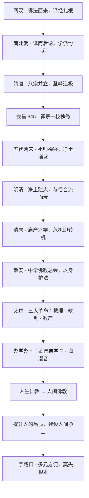

## 小白交底

上一篇，杨文会在两千年的谷底刻经办学、放眼世界，为近代佛教点燃了火种——可火种要燃成大势，需要一整套全新的纲领。收官篇先看一位身披袈裟的改革者怎样接下这道题：太虚大师以「三大革命」给病了千年的佛教开出三剂猛药；再回过头，向两千年的长河作别。先把这收官一篇要讲的事摊开：

1. 时间走到清末民初，古老的佛教撞上三千年未有的大变局。朝廷衰败、列强环伺，整个社会都在求新求变，佛教也被推到了风口浪尖。
2. 第一波冲击叫**庙产兴学**：以张之洞为代表的新派人物，主张把寺院的田产房舍收走、改成新式学堂。寺院失去产业，等于被逼到墙角。
3. 最先站出来护教的是八指头陀**敬安**；而真正把「改革」变成整套纲领的，是**太虚大师**——提出著名的「三大革命」：教理革命、教制革命、教产革命。
4. 太虚一生办学、办刊、组建团体，核心思想是「**人生佛教**」；这条线索后来发展为「人间佛教」，主张立足人间、建设人间净土，影响一直延续到今天。
5. 站在系列的终点回望，佛教既有庶民的、士大夫的、修行者的多个面相，也走到了一个更复杂的十字路口。万变不离其宗——**绝不能舍弃佛陀的根本教化**。

一句话：这一篇既是近代佛教的自救史，也是对两千年中国佛教的总告别。**长夜将尽，路在人间**。

## 一、两千年长河，一眼看遍

讲近代之前，先沿余论把整条长河过一遍，给三十二篇的旅程收个口。

- **两汉：佛法西来。** 自汉武帝在公元前二世纪打通西域，佛教便随使节、商队缓缓东来。真正扎根要到东汉桓、灵之世——安世高译出声闻禅法，支娄迦谶译出大乘般若经典。此后三国、西晋都是翻译的年代，中国人如饥似渴地汲取印度来的养分。
- **东晋：高僧奠基。** 西域高僧络绎东来，汉地高僧也不断成长。竺法护的译经、道安的僧团、鸠摩罗什的译场、庐山慧远的领众，佛陀的法身慧命就此在中土延续。
- **南北朝：译而后论。** 这一时期的中国不只是能译经，还能从经论中生出自己的见解、为之作注。涅槃、毗昙、成实、摄论等学派纷纷成立，一面吸收，一面融贯。
- **隋唐：登峰造极。** 八宗并立，高僧辈出，如百花盛放，是中国佛教最灿烂的盛夏。然而高峰之后，因宗派门户渐立，也悄悄埋下走下坡的伏笔。
- **会昌以后：禅净交替。** 唐武宗灭佛（845）之后，禅宗成了一枝独秀，经五代到两宋，禅者行脚于江西、湖南，在初传达摩禅的基础上，发展出大大丰富了的「祖师禅」。两宋禅者为度化没有读过书的平民，大力提倡称名念佛，到了明清，净土信众之广终于超越禅宗——法脉上仍以禅为大，修行上却以净土为归。
- **明清：与俗合流。** 受密教及民间信仰影响，佛教与世俗宗教、鬼神迷信结合日深，高僧罕出，禅修、戒律、义理俱衰，戒、定、慧三学真正懂的人极少，僧团素质长期受人鄙夷。

一路看下来，是一条清晰的曲线：**从翻译到消化，从鼎盛到独盛，再从独盛走向与俗合流的衰微**。而故事并没有结束——否极泰来，真正的转机，恰恰在最深的谷底出现。

## 二、庙产兴学：寺院被逼到墙角

近代佛教遭遇的第一波大冲击，是「庙产兴学」。

背景还是僧团自身的衰败。清末僧人素质低下、缺乏活力，许多寺院实际已沦为游览场所，靠应酬经忏香火度日，宗教性与教育性都很低。一批锐意革新的知识分子认定，国家要图强，必须重整教育，而占着大量田产房舍却「无用」的寺院，就成了这批革新者眼中现成的资源。

最早系统提出这一主张的是**张之洞**。张之洞在光绪二十四年（1898）写成的《劝学篇》里，标举「中学为体、西学为用」，并具体建议把天下寺院的大部分改成新式学堂、以庙产充作办学经费。这一年戊戌变法，康有为在变法中多次奏请把不在祀典的民间祠庙改为学堂，朝廷也确有「庙产兴学」的诏令。

进入民国，冲击并未停止。1915 年，北洋政府颁布《管理寺庙条例》，以法律形式明确官府对寺产拥有处置权；1919 年五四运动高呼「打倒迷信」，浪潮也波及宗教，教育界「改庙产为学款」的呼声在此起彼伏的会议上屡屡出现。对在长期「睡梦」中的佛教而言，这无异于被猛然摇醒——延续千年的寺院经济，第一次面临被合法征用的危机。

但危机同时也是转机。正是这步步紧逼的威胁，逼得佛教不得不自救：先有敬安挺身而出，后有太虚开出整套改革方案。

## 三、八指头陀：以身护法的寄禅禅师

改革之前，先要记住那位最早用生命护教的老人——敬安。

敬安（1851–1912），号寄禅，是近代著名诗僧。因早年在佛前燃去二指供佛，世人尊称「**八指头陀**」。敬安长期住持浙江天童寺，道行与诗名并重。

1912 年民国初立，各地侵夺庙产之风愈演愈烈。敬安以六十二岁之龄奔走，在上海发起组织「**中华佛教总会**」，被推为会长，并代表全国寺院赴南京、北京，向临时政府请愿，要求依法保护寺产。就在这一年冬天，敬安为护教事北上，圆寂于北京法源寺。

一位得道高僧为保全寺院、护持佛法而鞠躬尽瘁，此事震动了整个佛教界，也直接促成了官方对寺产的保护表态。长夜中的第一声呐喊，是敬安以命相搏发出的。

## 四、太虚三大革命：把改革变成纲领

敬安走后，接过改革大旗并把它推向全新高度的，是太虚大师。

太虚（1890–1947），俗姓吕，法名唯心，字太虚。一个极具象征意义的史实是：**1913 年初，在敬安和尚的追悼法会上，年轻的太虚当众提出了著名的「三大革命」**——

- **教理革命**：重新诠释佛法教理，把那种专谈鬼神、死后世界与迷信的「死的佛教」「鬼的佛教」，转变成立足现世人生、利益人群的「人的佛教」。
- **教制革命**：改革僧团制度，革除子孙庙、山头林立的旧弊，建立民主、统一、重教育的现代僧团制度。
- **教产革命**：变革寺院财产的归属与使用，反对庙产私相授受、为少数住持把持，主张寺产归僧团公有、用于弘法与教育。

这三条，从教理、制度到经济，对积弊千年的汉传佛教做了一次全面的现代化改造，堪称近代佛教的「总纲领」。

为落实改革，太虚一生投身于**办学、办刊、组团结社**：

- 1922 年创办**武昌佛学院**，成为近代规模与影响最大的佛学院之一、现代僧教育的重镇；此后又参与推动闽南佛学院、汉藏教理院等，培养了大批新式僧才。
- 1924 年发起组织佛教联合机构，并在庐山召开世界佛教联合会，积极推动中国佛教与世界对话。
- 1920 年在杭州创办并长期主持《海潮音》等刊物，借杂志、文章流通佛法——佛教经典的传播，也从单纯的大藏经，扩展到了期刊与大众读物。

《海潮音》一名，取「人海思潮中之觉音」之意，正是那个大时代里佛教自我更新的缩影。

## 五、人生佛教：从「鬼」回到「人」

太虚所有改革中，影响最为深远的，是「**人生佛教**」思想。

为什么特别要强调「人生」二字？因为在太虚看来，当时的佛教已经严重跑偏：以度亡送死为主、以鬼神为中心、与封建迷信深度捆绑。这样的佛教，在科学与民主的新时代必然被淘汰。所以太虚主张，看佛法的角度必须整个转换过来——**以「人」为中心，对佛法重新做一番诠释**：先做好一个人，再由人道的修学趋向佛道。太虚有一句名言：「仰止唯佛陀，完成在人格；人成即佛成，是名真现实。」

这条「以人为本」的线索，后来被发扬光大：

- 太虚的学生与后辈**印顺导师**（1906–2005）从学理上深化，明确倡导「**人间佛教**」，主张继承佛陀本怀、立足现实人间。
- 此后，无论是台湾的佛光山、法鼓山、慈济，还是大陆当代佛教的主流方向，「人间佛教」都成为最有活力的思潮，共同的理想是「**提升人的品质，建设人间净土**」（这八个字最常系于星云大师与佛光山的提倡）——净土不必远求，就在人间的善行善业之中。

1930 年，太虚还与**弘一大师**（李叔同）合作了一首《三宝歌》：太虚作词，弘一作曲，旋律庄严，被尊为近代佛教的「教歌」。歌声里传达的，也正是那股在变局中重振人心的气象。

## 六、十字路口：多元时代，莫失根本

回望之后还要正视当下。今天的佛教，正站在一个比以往任何时代都复杂的「十字路口」，甚至是多重入口。

随着交流日益频繁，南传佛教、藏传佛教纷纷进入汉地视野，各类新兴宗教、附佛外道也混杂其间。许多人没有读过佛教的历史，不了解印度佛教、也不了解中国佛教的来龙去脉，面对五花八门的法门便不辨真伪，对某些附佛外道趋之若鹜，甚至把这些外道的说法误当成佛陀的言教。这是当下值得警惕的一种乱象。

其实佛教历来就有多个层面：**庶民的佛教**（祈福消灾、与民间生活结合）、**士大夫的佛教**（读书人借之以论理、安心）、**修行者的佛教**（真正禅修、持律、深入义理），三者在深度与广度上各有不同。众生根基不同，佛教势必多元化，也势必开出种种方便法门。

但余论里那句话分量极重，值得每个学佛人记取：**万变不离其宗，方便再多，也绝不能舍弃佛陀的根本教化**。净土的盛行若导致禅修、戒律、义理全面萎缩，「方便」就会沦为「究竟」的替代品；没有定，慧无从生起，戒定慧三学便成了虚谈。所以越是多元，越要回到根本、读懂历史，方能在信仰的抉择上不致迷失。

## 七、两千年长河的归处

## 写在最后：寄往未来的四句话

三十二篇的中国佛教史，到这里就要画上句号了。临别，余论里有几句寄语，叶扬原样转送给每一位同行的读者。

**关于担当。** 日本的中国佛教研究曾长期领先，但汉文对日本学者终究是外文，随着其汉文能力衰退、西化加深，研究中国佛教的重任，势必要由中国人自己承担。不要妄自菲薄、盲目崇拜外人，也不必再对域外「马首是瞻」——只有中国人，才能做横跨中国文学、历史、哲学与佛学的综合融通之学。近代的太虚、印顺，学界的梁启超、陈寅恪、胡适、陈垣、吕澂、汤用彤，都是这样的人物。

**关于方法。** 保持先辈做学问的好传统：先求博大，而后精深；先建立根基，而后成家建树。研究如此，修行亦如此。

**关于四个「莫」。** 莫逐名利，莫尚豪奢，莫以方便为究竟，莫以迷信为正信。这四条，恰是针对明清以来佛教种种病痛开出的解药。

**关于初心。** 愿所有同道都能谦卑地正视汉传的不足，努力充实自己，既无愧于佛陀，也无愧于历代高僧。读这部历史，最深的收获其实是一颗**感恩心**——饮水思源，知恩报恩；有了感恩，修行才有了着力点。

佛说「诸法因缘生」。两千年来，佛教从陌生的异质文明，彻底长成了中国文化血肉的一部分；它走过高峰，也历过谷底，却总能在最深的黑暗里，转出崭新的生机。这条长河并未在今天停住——**它正经由每一个愿意了解它、护持它、实践它的人，继续向前流去**。

## 术语表

| 词 | 解释 |
|---|---|
| 庙产兴学 | 近代主张没收寺院田产房舍、改办新式学堂的社会思潮与政令 |
| 张之洞 | 清末洋务派代表，1898 年著《劝学篇》，系统提出庙产兴学 |
| 《劝学篇》 | 张之洞著作，标举「中学为体，西学为用」 |
| 敬安 | 号寄禅，世称八指头陀，近代诗僧、护法先驱，1912 年创中华佛教总会 |
| 八指头陀 | 敬安因燃二指供佛而得的尊称 |
| 中华佛教总会 | 1912 年成立的全国性佛教团体，敬安任首任会长 |
| 太虚 | 近代佛教改革领袖，提出三大革命、倡导人生佛教，创办武昌佛学院 |
| 三大革命 | 太虚 1913 年提出的教理革命、教制革命、教产革命 |
| 教理革命 | 把重鬼神死后的佛教转为立足现世人生的佛教 |
| 教制革命 | 改革僧团制度，建立统一、民主、重教育的僧团 |
| 教产革命 | 寺产归僧团公有、用于弘法教育，反对私相把持 |
| 武昌佛学院 | 太虚 1922 年创办的现代佛教学院，近代规模与影响最大的佛学院之一 |
| 《海潮音》 | 太虚 1920 年创办并长期主持的近代佛教核心期刊 |
| 《管理寺庙条例》 | 1915 年北洋政府颁布，以法律形式明确官府对寺产的处置权 |
| 人生佛教 | 太虚倡导的以人为中心、由人道趋向佛道的思想 |
| 人间佛教 | 经印顺等深化、立足现实人间的佛教思潮 |
| 印顺导师 | 太虚后辈，深化人间佛教学理的近代佛学大家 |
| 人间净土 | 人间佛教的理想，主张在人间善业中建设净土 |
| 《三宝歌》 | 1930 年太虚作词、弘一作曲，被尊为佛教教歌 |
| 弘一大师 | 李叔同出家，近代律宗高僧，《三宝歌》作曲者 |
| 庶民／士大夫／修行者的佛教 | 观察佛教的三个层面（现代分析框架，非古人原有分类），深度广度各有不同 |
| 附佛外道 | 依附佛教名义、实则偏离佛法根本的教法 |
| 戒定慧三学 | 佛陀教导的三无漏学，三者相因而成 |
| 吕澂 / 汤用彤 | 近代研究中国佛教的著名学者 |
